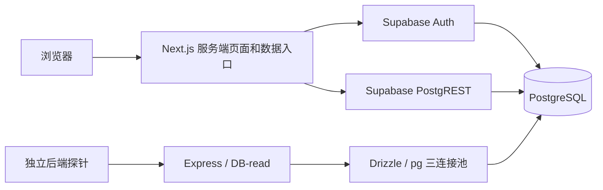

# 100 会话验收后的免费后端优化方案

状态：P0/P1/P3 代码已实施，P2 已完成认证 deadline 与首页 in-flight 生命周期；
持续并发复测完成：业务校验零失败，但延迟和资源门槛未通过。
2026-09-12 按用户“先部署，然后制定下一轮策略”的指示，已发布到正式域名；
发布成功与容量验收分开记录，仍不能认定 100 会话通过。下方各轮“未部署”
保留为当时的历史状态，当前发布及后续策略见文末 2026-09-12 章节。
原始方案依据源码 `844ee20a` 与
[完整本地验收](2026-09-07-free-concurrency-review.md#2026-09-11真实网站auth-与业务数据完整本地验收)。
目标是在现有服务和资源预算内，通过减少每次页面读取的工作量，让 100 个
独立会话通过既有持续读取门槛。结果必须由复测证明，方案本身不代表容量达标。

## 为什么失败：事实和证据边界

| 已测事实 | 能确定什么 | 不能由此断定什么 |
| --- | --- | --- |
| Home 完整读取 p95 11,783.94ms；Status p95 11,395.81ms | 验收定义的页面与业务读取耗时超过 1,500ms 门槛 | Home 包含 GET 和两个顺序 action；Status 包含响应体校验，不能直接视为纯 GET 或 SQL 耗时 |
| Dashboard / timeline / status 校验失败 512 / 545 / 984 次，各自分母 1,553 | HTTP 层成功不足以证明业务成功 | 未记录细分原因，不能直接归因为 Auth、SQL、串号或响应解析 |
| Express 三连接池等待峰值 44，334 个采样中 1 个存在等待 | 出现短时排队和池满 | 不能把这一瞬时峰值当作整个五分钟一直排队 |
| Express DB-read 1,553 次、无慢 SQL；全库连接峰值 17/100 | 该探针没有慢 SQL，全库没有达到本地连接上限 | 探针主要执行 SELECT 1，不能代表 PostgREST 业务 SQL 的速度 |
| 100 个会话同时证明时 96 个失败，接口内部 1.5 秒 Auth 超时 | 突发身份检查在该本地条件下失效 | 不是 100 人同时密码登录的测试，也不证明生产失败率相同 |

最终 100 worker 全部完成，稳定阶段 308.79 秒。四类 GET 共 6,212 次，额外
dashboard/timeline POST 共 3,106 次；整体约 27.31 HTTP 请求/秒。100 会话
表示用户会停顿并交错访问，不等于持续每秒 100 个请求。此前测试没有采集
Next 的事件循环、CPU、每次认证/REST 的分段耗时和失败类别，唯一根因尚未闭环。
这次失败是延迟、业务数据断言和连接池门槛未通过；最终运行没有进程崩溃，
原门禁 6,212 个 GET 也没有 HTTP 失败。

普通页面的关键数据路径如下；Express 的三连接池不是所有页面读取共用的池：



## 已确认的代码改点

下列问题是源码中可直接定位的额外开销；它们对本轮 11 秒 p95 各自贡献多少，
仍需 P0 的分段数据验证。路径以仓库根目录为基准，行号对应本方案基线。

| 位置 | 当前行为 | 选定的改动 |
| --- | --- | --- |
| `viza-fe/internal-website/app/api/client/session/route.ts:36-55`；`viza-fe/internal-website/lib/supabase/fetch-with-timeout.ts:228-268` | session fallback 的 1.5 秒限制是每次请求，包装器默认还有 1/2/4 秒重试等待；客户端三秒后放弃时，route 没有传递取消信号；有效 cookie 分支仍同步写 continuity identity | 为认证设置总 deadline、禁用重试并传递取消；成功 fallback 复用既有签名会话机制；continuity 刷新移出普通读请求或设明确冷却 |
| `viza-fe/internal-website/app/client/home/page.tsx:327,398-429`；`viza-fe/internal-website/app/client/status/status-data.ts:1747-1810,1899-2002` | 先读取紧凑 dashboard，再用完整状态 action 生成时间线，重新读取 profile、申请、套餐、支付、文件与详情；dashboard 的 in-flight 标记未覆盖后续时间线工作 | 建立复用已授权申请和已读数据的首页读取服务，只取当前时间线所需信息；dashboard 与 timeline 一起纳入取消及并发控制 |
| `viza-fe/internal-website/app/client/status/status-data.ts:1773-1810,1900-1909` | profile 之后串行读取套餐与 owner applications；取得应用集合后串行读取 live submission 和支付 | 分别并行这两组独立读取，保留 package-linked fallback 的依赖次序和 `partialData` 语义，不额外增加查询 |
| `viza-fe/internal-website/lib/submission-live-status.ts:368-372` | 主流程已经读到申请的 country/visa_type，live helper 再查询相同字段 | 向 helper 传入来自本次授权读取的产品信息，省掉重复查询；不相信客户端提供的产品/owner 信息 |
| `viza-fe/internal-website/app/layout.tsx:21-29` | 向客户端 provider 传入完整翻译 messages | 按路由需要裁剪 namespace，完成语言回归后比较响应大小及序列化耗时 |

以下路径均位于 `viza-fe/internal-website/`：已经存在的优化继续复用，包括
`app/actions/client-home-dashboard.ts:106-117,169-193` 的 profile/application
与 documents/payments 并行；`app/client/home/page.tsx:497-513` 的可见页面
刷新控制；`app/client/status/status-data.ts:1920-2002` 的详情并行。
有效的 `client_session` 已有本地签名校验快路径，不能声称当前每次读取都远程
访问 Auth。上述认证改动针对缺少该 cookie 的 fallback、重试及 continuity
分支；现有压测没有逐请求记录这些分支，尚不能确认其占失败的比例。
仓库根目录下的 `viza-be/agent-backend/drizzle/0131_client_bootstrap_concurrency.sql`
的目的地选择 RPC 已在前端 `app/actions/user-package.ts:186-220` 使用，
它解决的是写入路径，不应当作
Home/Status 已有的聚合读取接口，也不重复添加相同索引。

## 实施顺序

### P0：先补足分段证据和错误分类

这是首个实施批次，用来决定后续优化落点，不添加收费观测服务。

- 在 Next 请求边界和 Supabase fetch 边界记录认证、profile、applications、
  documents、timeline、序列化/响应完成的耗时、调用次数、响应字节数和安全
  错误码；记录缓存命中、取消、重试及降级分支。一个请求内复用独立随机
  request ID，不记录 cookie、token、邮箱、申请内容或原始 SQL 参数。
- 补采 Next 进程的事件循环/CPU/RSS，区分业务进程和负载发生器的资源。
  分别观测 Auth、PostgREST 与 Express 的取连接等待和执行耗时；全库观察
  补充事务年龄与等待事件，不能把瞬时 idle-in-transaction 当作事务泄漏。
- 验收适配器增加有界枚举计数：非预期 HTTP、未认证、上游超时/不可用、
  缺少本人记录、出现他人记录、缺少文件、协议解析失败、响应超限。只保存
  脱敏结构摘要，保留原始 HTTP 结果和所有业务断言。
- 分别记录纯 GET、dashboard action、timeline action、响应体检查与完整
  页面读取耗时。纯 GET 对照是诊断结果，不能替代原有完整业务读取门槛。
- 先观测当前返回分支，确认无登录、无数据、依赖不可用是否被混用；本阶段
  不通过改超时、换测试数据或改变失败响应来改善基线数字。

Express 的 `/ready` 经 Supabase REST HEAD，已有五秒成功缓存和 single-flight；
它不使用 `pg.Pool`，应保留现有优化。另用有界的均匀流量与同步短突发对照，
记录 DB-read 的请求到达、checkout 等待和 SQL 执行时间，解释一次采样中
出现 44 个等待的原因；不能据此推断 PostgREST 业务池也只有三个连接。

验收：每个失败可归入明确阶段/类别；一次正常页面访问的 Auth/REST 调用数
可测；观测开关关闭时保持当前行为，开启时数据有界且不包含用户资料。

### P1：减少一次页面访问的认证与数据库往返

- 优先修复 session fallback：总认证预算必须短于调用方放弃时间；入口有
  `request.signal` 时向下传递，与服务端 deadline 合并；认证调用显式关闭
  包装器的默认重试。当前四次 1.5 秒尝试加 1/2/4 秒等待，理论工作时间可达
  约 13 秒，不能把单次 1.5 秒配置当作请求总预算。Home fallback 也需明确
  deadline，而非使用没有显式截止时间的原始 fetch。
- `/api/client/session` 成功验证 Supabase 身份及客户 scope 后，复用现有
  签名 cookie 的签发流程，防止下一次 Home/Status 再重复执行 fallback；
  直接使用 `lib/client-session.ts:28-47` 的 `createClientSession()`，已有
  fallback 结果包含 profile ID、email、Auth UUID，无需再查一次 profile。
  保持 Auth UUID/profile 冲突检查及七天有效期，不在每次 probe 时滑动续期；
  cookie 保持 HttpOnly、生产 Secure、SameSite=Lax。通用会话不承载申请授权，
  各 loader 继续验证申请归属。
  对 `cacheContinuityIdentity()` 明确新建/刷新时机，保留恢复需要的身份
  数据，但不让每次有效会话 GET 都等待额外 gateway 写入。
- 修正 P0 确认的错误契约：必需读取失败不得变成成功的空数组或新用户状态；
  无登录与依赖不可用分别处理，API 返回适当 401/403/503，Server Action/
  SSR 保留明确错误结果及对应语言的可重试状态。
- 为首页建立一个 server-only 聚合读取函数，统一提供当前身份、申请列表、
  文件摘要及选中申请的进度。优先在现有页面结构中接入一个只读数据入口，
  减少 dashboard 完成后再取 timeline 的浏览器往返。时间线只读取选中申请
  必需的状态；不把完整 Status action 原样搬进聚合函数再执行一次。
- 聚合函数创建一次请求上下文，复用已经确认的身份、Supabase client 和
  本请求内已读取的 profile/application/documents。必须重新检查客户端
  传入的 application ID 属于当前身份；不得用客户端提供的 owner 信息授权。
- 先消除重复查询，再对无依赖的剩余查询做有界并行。复用现有公开元数据
  缓存和既有索引。先完成上表的 Status 两组并行及 live helper 参数复用，
  避免一轮优化同时增加每个用户的查询扇出。
- 首选同一请求内的认证去重。是否采用 `getClaims()` 快路径必须先核对签名
  算法、当前库行为及撤销要求：非对称签名可通过缓存 JWKS 校验；对称签名
  仍可能请求 Auth。敏感写操作、管理员能力及要求实时撤销的入口维持相应
  强校验。不得用 `getSession()` 或未验证的 JWT 内容作为授权依据。
- 普通 GET 不承担创建/修复账户、分配邮箱或刷新持久恢复数据的职责；若审计
  发现这些工作处于读请求路径，应在保持幂等与兼容回退的前提下移至明确的
  登录/初始化流程。申请人数据不加入公共 CDN 或无身份边界的进程缓存。

验收：以 P0 基线证明每次正常读取的调用数和串行等待减少；跨身份、过期/
伪造 token、profile 冲突、管理员与普通客户边界均通过回归；缺少真实数据时
显示明确错误，而非返回伪造的成功结果。首次 fallback 后签名会话确实建立，
后续有效 cookie 的 Home/Status 不再调用远程 `getUser`；认证超时没有默认
1/2/4 秒重试链，调用方取消后不会继续新增尝试。

当前签名 cookie 没有服务端撤销表，不能将本地签名校验描述为实时撤销校验。
保留现用 `app/actions/client-auth.ts:138-148` 的 `userSignOut()`：尝试退出
Supabase 后，无论远程结果如何均清除本地 cookie。需要实时撤销的敏感入口
继续相应强校验；本方案不以扩大该 cookie 的授权范围换取性能。

### P2：控制超时后的工作和连接预算

- 将请求的总体 deadline/取消信号传入内部读取；请求取消后停止新增子查询
  和重试。底层操作实际结束前不能提前释放并发名额，防止超时工作继续占用
  资源而新请求不断进入。
- 审计 SDK、包装器和 UI 的重试叠加。只对幂等且可恢复的读取，在剩余时间
  和总尝试次数内重试；认证无效/权限错误不重试，避免慢请求形成同步重试波次。
- Express 先保持每实例 pool=3。若证据证明取连接等待占主导且 DB 有余量，
  才在隔离环境小步 A/B 调整，同时计入实例数、Auth、PostgREST、Storage、
  后台任务和保留连接。此前生产观察的 max_connections=60 与本地的 100
  不同，发布前必须核对实际预算，不能套用本地数字。
- 对昂贵读取设置有界 admission/等待队列，超预算时明确返回可重试结果。
  该保护用于防止过载蔓延；在 100 会话验收中返回 429/503 仍算失败，不能
  通过拒绝请求、少完成用户或增加用户停顿来冒充容量提升。

验收：取消、超时、异常、迟到成功/失败均释放一次；无持续增长的等待队列；
既有池利用率、等待、慢 SQL 和零错误门槛保持不变。

### P3：按测量结果缩减 SQL 与响应体

- P0 若发现业务 SQL 占主导，仅对相应查询运行隔离数据下的
  `EXPLAIN (ANALYZE, BUFFERS)`；评估字段裁剪、批量读取、聚合或必要索引。
  复用既有 bootstrap/RLS 优化，不批量改策略或加索引。新增 RPC 默认保持
  调用者权限和 RLS，不以 `SECURITY DEFINER` 或 service-role 绕过权限来提速。
- 根布局原先向 `NextIntlClientProvider` 传入完整 messages；实测 Status
  document 约 410 KB。CPU 采样证实 Flight JSON 编解码是热点后，将完整的
  当前语言目录移至 SSR-enabled client chunk，减少每次响应的序列化。
  根布局会跨客户端导航保留，因此不能仅按首次路由裁剪 namespace。
  不修改翻译目录内容；需要验证首次 SSR、hydration、语言 refresh、跨路由
  namespace 和独立语言 chunk。DTO 继续保留页面必需字段。

验收：改动前后 SQL/业务结果一致、RLS 不退化；响应字节数下降且已有语言
无缺失文案；不以隐藏页面必需信息或取消权限检查换取性能。

## 验证与发布

1. 先用 10/25/50 worker 的明确诊断模式找出开始恶化的负载点；这些结果不
   能判为 100 会话 release gate 通过。保持数据规模、资源、路由、停顿及
   业务断言一致；记录本机负载发生器和 Docker 网络造成的环境限制。
2. 同资源下运行 100 个真实独立 Auth 会话、30 秒 ramp、至少五分钟 steady、
   每周期后五秒 pacing。Home 必须计入获得完整数据的时间；不能将优化后的
   空页面 GET 与原来的完整读取复合耗时直接对比。
3. Home/Status p95 <1,500ms，后端 ready/DB-read p95 <500ms；请求和业务数据
   校验均零失败；两个页面各覆盖 100 个身份。原有连接池、慢 SQL、事件循环
   和内存门槛原样保留。突发身份校验与同时登录另测、另报，不能与持续读取
   的结论混用。
4. 按修改包运行 type-check/lint、鉴权/取消回归和真实浏览器 smoke。保留失败
   结果、源码哈希和清理证明。通过后再发布相关服务；Vercel 继续核对组织
   `nananviza2016-8879` / `viza-gmail-s-projects` / `viza-internal` 身份与项目。
   发布后仅做低流量 smoke，生产不作 100 用户压测；不达标时保留失败结论。

实施范围是现有代码、请求组织和测量，不新增付费 Redis、实例、数据库规格
或常驻 runner。AI、支付和官方门户提交仍需独立容量验证。

## 2026-09-12 实施记录

已完成的产品改动：

- `lib/client-session.ts` 新增只读的认证结果契约，区分 authenticated、
  unauthenticated、unavailable。认证与 profile 解析共用总 deadline，
  关闭认证重试，并传递入口取消信号；普通读取不创建或修复 profile。
- `/api/client/session` 成功 fallback 后签发既有七天签名 cookie，直接复用
  已核验的 profile/Auth 身份；有效 cookie 分支不写 continuity。可选的
  fallback continuity 写入由 `after()` 执行，不延迟会话响应。不可用返回
  503、固定错误码、private/no-store；原 impersonation 分支保留。
- `getClientHomeDashboardWithTimeline()` 合并 Home 的 dashboard 与 timeline，
  server-only reader 一次授权后复用申请、文件和支付数据。时间线仅装配当前
  owned application 所需的投影，省掉重复身份/申请/支付查询、详情事件和
  Storage 签名。有效数据、必需读取失败和部分时间线失败分别表示。
- Status 并行 package/application 与 live/payment 两组独立读取；live helper
  使用本次服务端授权查询的 country/visa_type，不重新查相同申请字段。
- Home 保持 Action 实际结束前的 in-flight 防重，卸载后忽略迟到结果并取消
  尚未开始的重试；统一使用服务端授权选择，异常映射为本地化提示。
- 新增默认关闭的 `VIZA_PORTAL_READ_METRICS`。日志只有固定阶段/资源标签、
  随机 request ID、计数和时长；采集 Next CPU/事件循环/RSS。真实 HTTP 尝试
  包括重试，SDK stage 包括 body 解析。HTTP 时长截至 headers，不是 SQL
  checkout 或浏览器绘制时间；不记录 URL、参数、cookie、token、邮箱或资料。

当前实现限制：Home 保留 Server Action，浏览器 AbortSignal 无法穿过该协议；
因此此次完成的是认证总 deadline、fetch 取消能力和 Action 生命周期防重，
尚未实现整个 Home/Status 读取的统一 deadline。进程观测不等于各服务的 SQL
连接池内部观测。未增加付费基础设施、连接池上限或数据库规格；未应用新的
SQL/RLS 迁移。翻译传输优化以实测 CPU 热点为依据，详见下方记录。

代码验证：15 个相关 Vitest 文件、129 项测试通过，覆盖身份冲突、owner scope、
失效/不可用状态、真实 SDK 重试与流式取消、数据查询预算和页面一致性。
完整类型检查通过（本地 Node 检查进程使用 6 GiB heap，默认 2 GiB 曾 OOM）；
完整 Lint 零错误。持续负载结果和发布状态以本节后续验收记录为准。

### 同资源诊断与 P3

本地 PostgreSQL 固定 1 CPU / 512 MiB、Express pool=3、Next 单进程；
未对生产施加并发负载。每轮都建立 100 个独立真实 Auth 会话并通过
`/api/client/session` 获取签名 cookie；不能把本次基线描述成无 cookie。
100 worker 按请求轮转使用这些会话，并非 100 个真实浏览器或每 worker
固定身份。保持 30 秒 ramp、至少 300 秒 steady、每周期 5 秒 pacing。

| 本地运行 | Home 完整路径 p95 | Status p95 | 业务校验 | 结论 |
| --- | ---: | ---: | --- | --- |
| baseline（原归档源） | 14,725 ms | 10,637 ms | Dashboard 610、timeline 694、Status 1,207 失败 | 不通过；该轮 PG observer SQL 有误，数据库观测无效 |
| candidate（合并读取） | 10,073 ms | 10,268 ms | Status 1,613/1,613 成功；Home adapter 仍要求已移除的 countryKey，全部 protocol_parse | 不通过；不得追认 Home 通过 |
| candidate-profile（修正 adapter，CPU 采样） | 8,894 ms | 14,438 ms | Home 1,552/1,552 成功；Status 23 次 body timeout | 不通过；采样轮只用于诊断 |

修正 aggregate adapter 为验证实际 DTO 的 `country`，保留所有 owner、申请、
文件、步骤和 partial-data 断言；旧 timeline 仍验证其原 `countryKey`。
新增真实浏览器捕获结果的完整 classifier preflight。未改变任何延迟、
错误率、池利用率、等待或事件循环门槛；失败证据保留，所有轮次种子已清理。

candidate 的 Next 事件循环 p95 峰值约 852 ms、单核 CPU 峰值 84.66%；
PG 340 个有效采样中峰值连接 17/100、active 1、最长事务 6.4 ms，
无锁等待或死锁。短暂 idle-in-transaction 峰值 6、最长约 1.5 ms；这不能
认定为事务泄漏，但仍使现有零 idle 验收条件不通过。

CPU 采样于 2026-09-11 23:01:55–23:02:56 UTC，采样间隔 10 ms，
共 5,259 样本。Flight JSON parser 自耗时约 5.87%，Flight serialization
约 2.37%；签证目录正规化、目录扫描与 Status 排序也反复出现在热点。
采样百分比不是整次请求耗时归因，不能相加推导延迟改善。

据此实施：完整翻译按当前 locale 拆入可缓存的客户端 chunk，保留 SSR
和外层 Intl 格式配置；目录生成只读公共索引，Status 每组预计算一次排序
优先级。用户数据不进入进程共享缓存。新候选需生产构建、浏览器和原始
100 会话门槛验证；在通过前不发布，也不宣称支持 100 人。

### 最终候选功能验证

冻结候选构建 `PKPJxxcMoWZyDv2Q8ux3j`，源码树 SHA-256
`ffb6336da0baca82fa2099618b43d99305fc1fe6ed9aecdba28730e468411916`。
源码来自 `acf4a571` 后的工作区；构建和证据位于忽略的
`.dev-logs/website-optimization-20260911/candidate-final` 与
`candidate-verified`，后者复用同一哈希绑定的构建，未修改产品源码。

- Status document 从约 410 KB 降为 189,647 bytes，减少约 54%。这是 HTML
  响应的减少，不是首次访问总下载量；首次访问还需当前语言 chunk。en/zh
  chunk 的 Brotli 估算约 47/50 KB，vi/es 约 28/28 KB，此后可缓存复用。
- 四种语言的真实登录页 SSR、hydration、当前语言 chunk 和 inactive chunk
  检查通过。原 JSON 内容完全保留，包括 `t.raw()` 使用的数组；未补写原有
  vi/es 缺失或占位翻译。登录页 en→zh 切换保留输入草稿。
- Home↔Status 跨 namespace 导航与语言 refresh 通过。菜单项通过真实 DOM
  事件触发 React 路由，不能描述成所有步骤均由用户可见点击完成。浏览器
  setup 为一个已通过 identity proof 的本地 synthetic account 暂建单条
  alias consent fixture，finally 精确删除后才启动压测；无邮件/外部调用。
- 真实阻断一次 en chunk 后显示本地化恢复提示，未自动重试；点击 Retry
  产生第二次 chunk 请求并恢复登录页。预期 chunk 错误单独计数 1，非预期
  page error 为 0。只缓存四个公开目录；失败 Promise 仅在显式重试时清理。
- 目录索引相关 22 项、Status 列表 9 项、i18n 10 项聚焦测试通过；最终
  类型检查通过。全包 Lint 0 errors / 62 existing warnings，最后修改文件
  的补充 Lint 无错误。此前身份、查询隔离和取消等 129 项回归仍保留通过记录。

两个较早的浏览器诊断失败也已保留：catalog marker 使用裸字符串造成 vi/es
误判为 en、移动导航选中了后面的 SVG 按钮、现有 consent dialog 遮挡，以及
把故障注入产生的预期错误当普通 page error。修正测试定位/分类后重新实际
运行，不追认旧运行通过，也未降低持续负载的任何门槛。

### 最终 100 会话结果：业务通过，容量验收不通过

Run ID：`9d503a87-b485-4237-ba21-687339a9129f`。
100 worker、100 独立 Auth 会话、100 人均完成；steady 308.92 秒，
总运行 341.11 秒。四类 GET 共 9,484 次，加上真实 Home aggregate Action
2,371 次；没有替代响应或减少请求。Home 和 Status 各覆盖全部 100 个身份，
每个页面的 2,371 次业务断言全部通过，零超时、零业务缺失、零串号。

| 完整路径 | 本轮 p95 | 原门槛 | 结果 |
| --- | ---: | ---: | --- |
| Home GET + aggregate Action | 6,081.57 ms | <1,500 ms | 未通过 |
| Status GET + 内容校验 | 6,017.38 ms | <1,500 ms | 未通过 |
| Express readiness | 345.98 ms | <500 ms | 通过 |
| Express database read | 329.11 ms | <500 ms | 通过 |

相同资源和用户 pacing 下，相比本轮 baseline，Home p95 降低约 59%，Status
降低约 43%；每场景完成次数从 1,637 增至 2,371。基线 PG observer 有错误，
上述仅比较其有效的路径延迟/完成次数，不能扩展为数据库指标的完整 A/B。

仍失败的门槛与观察：

- Express pool=3，峰值占用 100%，峰值等待 40；333 个采样中 3 个有等待。
  慢 SQL/失败 SQL 增量均为 0。峰值事件循环 p95 151.39 ms、max 221.51 ms。
- Next 进程峰值 CPU 59.15%，事件循环 p95 峰值 541.07 ms、max 1,119.88 ms，
  RSS 峰值约 642 MiB。4854 个 server read trace 全部成功；记录的 Auth HTTP
  调用为 0，数据库 REST 调用无失败/重试。CPU 峰值低于上一非采样候选的
  84.66%，但请求积压仍存在。
- PG 339 个有效采样：峰值 17/100 连接、active 2，最长事务约 4.3 ms；
  无锁等待/死锁。短暂 idle-in-transaction 峰值 3、最长约 4.3 ms；原零 idle
  条件仍失败，这类毫秒状态不是长事务泄漏的证据。
- Home Action 自身 p95 4,067 ms；HTML body 读完 p95 约 4,923 ms（Home）/
  5,069 ms（Status）。这些时间包括框架输出/传输/客户端消费，不能当作 SQL
  执行时间。本轮尚不能把残余问题单独归因于数据库连接池或 SQL。

因此严格 gate 保持 `passed=false`，不发布此候选、不宣称生产支持 100 人。
已保留完整证据和原门槛。后续应继续测量 Next 响应生成/传输与多次 REST
往返，评估在既有授权范围内批量读取；不能仅凭三次短暂等待增加连接池，
也不能通过放宽延迟、缩短 steady、延长 pacing 或拒绝请求改成通过。

清理：runtime 已终止本轮 Next/Express，seed cleanup 成功；额外 SQL 检查
确认 synthetic Auth users、profiles、consent fixtures 均为 0，deadlocks=0。
本轮六个本地 Supabase 容器已停止，数据卷保留；3000/3002 无遗留监听。
未执行生产压测、未新增付费资源、未改变生产 SQL/RLS 或账号配置。

## 2026-09-12：减少关联查询往返

本轮保留上一候选的冻结源码和构建做 CPU 诊断（`candidate-residual-profile`）。
62.51 秒样本中，之前显著的 Flight 解析和目录匹配热点已下降，剩余开销分散在
网络读写、Next fetch/追踪、React 渲染等路径。采样本身有明显额外开销，诊断运行
出现超时，不能用它代替无采样的容量结果，也不作前后延迟 A/B。

实现 `app/client/status/status-related-rows.ts`：利用现有外键，通过 PostgREST
一次读取申请对应的 consent、signature、answer、packet，以及 Status 所需的
document。Home 继续复用聚合入口已读取的 documents。只有完成原有用户归属
检查后才传入申请 ID；嵌套结果再次检查父记录/子记录的申请 ID，未知记录被排除
并标记 partial。无跨请求用户缓存，无新增 RPC、数据库迁移或付费服务。

Home 的四项关联读取由 4 次 HTTP 降至 1 次，并与 live queue 并行；Status 的
五项由 5 次降至 1 次，与 payment/live/必要的详情读取并行。嵌套请求失败时只
降级一次到原有逐表读取，保留可用结果与 partial 标记，继续使用现有请求取消、
重试和熔断保护。SGAC 邮件关联兼容查询用途不同，未作为重复查询删除。

验证：真实 SDK + loopback HTTP 的 7 个测试已通过；两个独立本地 Supabase
测试用户的实测证明 Home/Status 各一次关联 HTTP、自己的 answer/document 可见、
另一用户数据未混入、空关系保留。测试账户及其关联数据已清理。整合后共
8 个相关测试文件、60 项测试通过，全量 TypeScript 检查通过；全量 lint 的
两项新增 type-only import 规则错误修正后，所有本轮修改文件 lint 通过，
其余 62 项为既有 warning。

### 仅合并查询的无采样复测

`candidate-batched`，构建 `TOVwR8LAZ9wnHJ3o-WUit`，source hash
`cfb36942d64dbe53bd49f13fdea7e71c29ae4d7ea79bf66ec6ce65646e1e3fe3`，
run `487b9f72-dd97-4256-847d-088cdde37d03`。100 个独立登录会话全部完成，
steady 308.80 秒，总运行 341.64 秒，9,336 次 GET 和 2,334 次 Home Action
全部成功；Home/Status 各 2,334 次业务检查成功，无超时、串号或缺失数据。

但 Home p95 **7,633.37 ms**、Status **8,348.26 ms**，高于上一无采样候选的
6,081.57/6,017.38 ms，不能据此声称页面提速。readiness p95 583.47 ms
也未通过，DB read p95 368.28 ms 通过。原 gate 仍失败，未部署。

实际 server trace 共 Home 2,340、Status 2,337，记录 30,399 次 REST；与相同
页面次数按旧常规路径计算的 46,767 次相比，少 16,368 次，约 **35%**。
没有发生嵌套查询失败后的额外回退。查询工作量下降是真实收益，但未转化为本次
完整页面延迟的改善。Next CPU 峰值 62.64%，事件循环 p95 峰值 932.71 ms；
Express pool=3，327 个样本中 1 个有等待，峰值等待 42、占用 100%。PG 峰值
连接 17、active 2，最长事务 3.37 ms，零慢/失败 SQL、零死锁/锁等待；
短暂 idle-in-transaction 仍使原零 idle 条件失败。

清理已成功，无 runtime fault。后续继续检查页面 HTML/SSR 工作量，并增加
压测进程本身的轻量 CPU/事件循环观测；不会把 SQL、网络、框架和测试端的时间
混为数据库执行时间，也不会用降低门槛来放行。

### 延后公共目的地目录渲染

原完整目录移入 `add-destination-content.tsx`；逐字比较确认除导出名称和换行
外，目录逻辑与 `candidate-batched` 一致。`add-destination-section.tsx` 成为
`next/dynamic` 的 `ssr:false` 客户端入口，提供使用现有语言目录的加载占位。
所有 startedKeys、筛选、排序和选择行为仍由内容组件处理，已授权申请列表继续
随 Status 服务端页面返回。新增边界不代表浏览器免去了目录下载/渲染工作。

9 项既有目录/列表交互测试通过；全量类型检查、全量 lint（quiet）通过。
`candidate-light-ssr` 将额外验证初始响应无目录卡片、hydration 后完整目录、
搜索/地区筛选及恢复，并继续执行原四语言/重试检查与 100 会话 gate。
压测进程另加轻量 CPU/事件循环观测，未启用 CPU profiler，也未调整响应处理、
身份断言或原 gate 的任何阈值。最终结果以本轮 runtime-summary 为准。

### 本轮最终结果：延迟改善，严格验收仍未通过

最终证据目录 `candidate-light-verified`，使用 `candidate-light-ssr/source`
的冻结构建 `5A0Crd_3gTa7r5ULaIQGa`，源码 hash
`83c8d4d151120d562fe849c43e2cd9330cf3e380e81cb457cd8d6f96013dc1de`。
首个 `candidate-light-ssr` 运行在浏览器目录检查通过后，由于新测试 callback
未返回 fixture helper 需要的结果对象而终止，未进入负载阶段；测试数据已清理。
修正仅涉及测试脚本返回值，之后复用同一 hash 对应构建重新完整执行，不追认
该失败运行通过。

最终 run ID `05272970-325c-407c-bf2c-3fb195909e0f`：100 独立 Auth 会话，
全部 100 worker 完成，steady 308.85 秒、总运行 341.05 秒。GET 11,488 次，
加 Home aggregate Action 2,872 次；零 HTTP/业务失败、零超时、零串号。
Home/Status 各 2,872 次内容检查成功，覆盖全部 100 个身份。

| 完整路径 | 上一轮候选 | 本轮最终 p95 | 原门槛 |
| --- | ---: | ---: | ---: |
| Home GET + aggregate Action | 6,081.57 ms | **3,943.97 ms** | <1,500 ms |
| Status GET + 内容校验 | 6,017.38 ms | **4,275.57 ms** | <1,500 ms |
| Express readiness | 345.98 ms | 254.78 ms | <500 ms |
| Express database read | 329.11 ms | 160.89 ms | <500 ms |

相同本地资源和 workload 设置下，Home/Status p95 相比上一轮分别下降约
35%/29%，每场景完成数从 2,371 增至 2,872。相对于本轮中途仅合并查询的
7.63/8.35 秒，最终进一步下降约 48%/49%。这些是本地运行观察，不能等同于
生产容量承诺。

浏览器原始初始 Status HTML 为 **28,476 bytes**，没有目的地卡片；hydration
后显示完整 **71** 个目的地。搜索清空/恢复、地区筛选（5 个结果）/恢复、
四语言、登录草稿保留以及翻译 chunk 故障后的显式重试均通过。旧报告的约
190 KB 是 hydrated DOM 字节数，和本次 raw 初始 HTML 不是同一测量口径，
因此不据此给出精确的传输降幅。浏览器仍需下载和渲染目录。

剩余门槛与诊断：

- Express pool=3；335 个样本中 1 个有等待，峰值等待 43、占用 100%，原
  pool 条件仍失败。事件循环 p95 峰值 133.17 ms、max 221.25 ms，原条件仍失败。
- Next CPU 峰值 53.79%、事件循环利用率峰值 0.85，事件循环 p95 峰值
  350.49 ms、max 821.56 ms。RSS 峰值约 713 MiB，高于仅合并查询时约
  633 MiB，未提高配置额度。5,857 个 server read trace 全部成功/无 partial，
  含预热共观察到 1 次 Auth HTTP，无失败。
- 压测进程平均 CPU 11.74%、峰值 16.10%，事件循环利用率峰值 0.229，
  p95 峰值 49.91 ms、最大延迟 312.74 ms。未见测试进程 CPU 饱和，尚不能将
  剩余数秒延迟归因于纯分类计算；Next 请求生成、连续 REST 往返与输出仍需优化。
- PG 340 个有效样本，峰值连接 17、active 2，最长事务 7.50 ms；无慢/失败 SQL、
  无死锁/锁等待。短暂 idle-in-transaction 峰值 3、最长 2.45 ms，原零 idle
  条件仍失败；不是长事务泄漏的证据。

最终 `passed=false`，本轮**未部署**。Home/Status 的 1.5 秒目标仍未达标，
不能用零业务错误替代全部容量门槛通过。后续优先减少 Next 热路径的连续读取
和页面生成等待；P2 的整条 Home/Status 请求 deadline 仍未全部实现。

清理复核：runtime `seedCleanup=true`、无 runtime fault；额外 SQL 确认
synthetic Auth users、profiles、consent fixtures、临时验证 answers 均为 0，
3000/3002 无残留监听，6 个本地验收容器已停止并保留数据卷。全部变更保持本地验证范围，无生产压测、无生产 SQL/RLS
变更、无新增付费资源。

## 2026-09-12：缩短 Home/Status 读取依赖链

继续优化以上 `candidate-light-verified` 基线。本轮只调整已认证读取的调度，
不增加缓存、付费资源、数据库配置、查询范围或新的权限入口。

- Home：选定已授权的 application 后，提前读取 timeline 的 related rows/live
  summary，与 documents/payments 并行；组装阶段仍使用同一次 Home 请求的
  documents/payments。基础读取失败时保留原错误优先级，并收尾已启动的读取。
  dashboard-only 调用不预取 timeline。
- Status：非 scoped 列表在 profile 解析出完整 ownerEmails 后，启动 SGAC
  email 答案读取，与 owner applications/user packages 并行。scoped 请求保留
  找不到目标后才进行邮箱兼容查询的行为。SGAC 类型、已提交状态、去重、QA
  过滤和 partialData 规则保留。
- 独立代码审计未发现当前 Supabase fetch 封装重复克隆/缓冲响应的证据，未
  绕过 Next fetch 或添加自定义 HTTP 连接池。翻译目录继续使用上一轮的稳定
  locale chunk 缓存。

正常测试 fixture 仍预期 Home 6 次、Status 7 次 REST；改善目标是减少串行
等待，不把本轮描述为额外减少查询数。

静态与定向验证：完整 type-check、完整 lint 零错误通过；8 个文件共 63 项
测试通过。其中新增 deferred 查询测试证明 Home timeline 在文档/付款未完成
时已经启动、必需付款读取失败时会等待 preload 结束、Status 非 scoped SGAC
查询与 package/owner 读取重叠。独立复核确认 Home 的 `try/finally` 也覆盖付款
过滤器构造异常；未发现本轮已确认的权限或收尾缺陷。

冻结候选为 `candidate-overlapped`，生产 build
`omqXibErvEaLSbHwTewfp`，source tree hash
`b1a952f1d61987fd91819688786b222f3101be411147bd57402c2d6b3ab6be32`。
冻结后只补充 focused tests/module guide；本轮两个生产 TS 文件的工作区 SHA
与冻结副本逐字节一致。负载仍使用上一轮原始 gate/adapter 与相同资源配置。
### 本轮持续负载结果

run ID：`7ba404ad-942a-429d-b24f-b39644da0174`。100 workers、100 独立真实
Auth 会话全部完成，30 秒 ramp、5 秒 pacing；steady 305.23 秒，wall 337.48 秒。
共 12,484 次原始 GET 请求，另执行 3,121 次真实 Home aggregate Action；
Home/Status 各 3,121 次业务校验全部成功，覆盖所有 100 个身份，零缺失/串户/
partial/协议错误、零最终 HTTP 失败、5xx 或超时。

| p95 场景 | 上一轮 | 本轮 | 原门槛 |
| --- | ---: | ---: | ---: |
| Home 完整路径 | 3,943.97 ms | **4,083.30 ms** | <1,500 ms |
| Home aggregate Action（诊断） | 2,912.14 ms | **2,464.80 ms** | 不替代完整路径 |
| Status 完整路径 | 4,275.57 ms | **3,042.68 ms** | <1,500 ms |
| Express readiness | 254.78 ms | 214.23 ms | <500 ms |
| Express database read | 160.89 ms | 129.06 ms | <500 ms |

Status p95 下降约 29%，Home Action p95 下降约 15%；每场景完成次数增加约
8.7%。Home 完整路径 p50 从 3.30 秒降至 2.83 秒，但 **p95 上升约 3.5%**，
不能声称 Home 整页尾延迟已改善。该现象仍指向页面生成/输出与数据接口之间
的剩余成本；单次本地运行不构成生产容量保证或因果归因。

细项与剩余门槛：

- Express 原事件循环条件此次通过：p95 峰值 69.07 ms、max 72.88 ms。池仍为
  3，333 个有效样本中 2 个有等待，峰值等待 34、占用 100%；原连接池条件失败。
  3,121 次数据库探针零失败/慢查询，readiness/DB read 延迟条件通过。
- Next 39 个运行时样本，CPU 峰值 86.45%、事件循环利用率峰值 0.81、事件循环
  p95 峰值 311.95 ms、max 521.14 ms，RSS 峰值约 729 MiB。不能将 Express
  事件循环条件通过解释成所有 Node 服务都已消除阻塞。
- Next 共 6,354 个成功 read trace，零 partial/error，包含预热 Home 3,127 次、
  Status 3,124 次；本次 trace 中没有 Auth HTTP。正常 6/7 REST 预算对应
  40,630 次读取，实际记录 40,650 次尝试，额外 **20 次失败后恢复的尝试**。
  applications/documents/payments/queue 各有 5 次失败尝试，最终各阶段
  全部成功，无 per-table related fallback。聚合指标未记录失败的详细原因及
  预热/持续阶段分界，不能声称内部全程零重试。
- 额外只读核查同一候选运行时间段的本地 Kong 日志，共 41,404 条访问记录，
  全部可解析，其中 41,403 个 200、1 个 204，没有 4xx/5xx。PostgREST 容器
  此时间段无访问日志输出。该证据未能确认上述 20 次客户端尝试失败的根因，
  未将其归因为数据库超时或权限错误。
- PG 340 样本，峰值连接 17、active 2，最长事务 3.31 ms；无死锁/锁等待。
  短暂 idle-in-transaction 峰值 3、最长 1.57 ms，原零 idle 条件仍失败。
- 压测进程平均 CPU 18.20%、峰值 30.32%，事件循环 p95 峰值 35.36 ms、max
  163.45 ms，未见其 CPU 饱和。诊断仍保持原 adapter、原始 Response 和业务校验。
- 浏览器复核 Home/Status、四语言、登录草稿保持、翻译 chunk 显式重试均通过；
  Status 原始 HTML 仍为 28,476 bytes，hydration 后 71 个目的地，搜索和地区
  筛选恢复通过，没有执行目的地选择 mutation。

最终 `passed=false`，**未部署**。保留本轮已测得的 Status/数据接口改善，同时
明确 Home 整页尾延迟与连接池门槛仍未达标；P2 的整条 Home/Status deadline
仍未全部实现。没有提高资源配置、生产压测或生产 SQL/RLS 修改。

清理：`seedCleanup=true`，无 runtime fault；额外 SQL 核查 synthetic Auth users、
profiles、consent fixtures、临时 answers 均为 0，3000/3002 无残留监听。
6 个本地验收容器已停止并保留数据卷。

本轮证据目录为忽略的
`.dev-logs/website-optimization-20260911/candidate-overlapped/`，含 runtime summary、
comparison、load-generator observation、local HTTP status observation 和浏览器记录。

## 2026-09-12：读取总预算与签名密钥复用

本轮继续补齐 P2 的 Home/Status 聚合读取总预算。在认证开始前创建同一个
8 秒 AbortSignal，传给认证回退及后续 Supabase 读取，退出时释放计时器与
监听器。预算耗尽时取消正在接收的 HTTP body，并阻止同一读取继续发起
HTTP 或重试。沿用原有 unavailable/partial/error 与权限检查，不把超时
解释成用户已退出登录。8 秒是资源收尾上限，**不替代 1.5 秒性能门槛**；
它覆盖数据读取，不是整个 Next SSR/HTTP 输出的强制截止时间，事件循环
阻塞也可能延迟计时器执行。

另将当前 session secret 的 HS256 CryptoKey 复用在签发与验证中。并发调用
只导入一次，secret 轮换切换到新 key，导入失败可重试，旧 Promise 完成或
失败不会覆盖新缓存。缓存不保存 token、身份或验证结果；每个 JWT 仍执行
签名、过期和 payload 检查。非 HS256 的历史 HMAC 验证保留原 raw-secret
路径，应用签发仍限定 HS256。缺失或过短的 secret 继续拒绝。

本地实际 jose 微基准（Node v24.11.1，每轮 20 批 × 100 次验证）记录 raw
key 两轮总耗时 136.54/96.15 ms，预导入 key 为 61.38/51.48 ms。该结果仅
支持减少重复导入成本，不能等同于网站延迟或 100 人容量改善。

真实 Supabase SDK 的本地慢响应测试确认：预算到期后 response closed、
请求被中止、body 未完成，HTTP 请求总数仍为 1。预算、Home/Status 定向
测试与 SDK cancellation 覆盖取消、错误状态及 timer 清理。冻结候选的
6 个定向测试文件共 53 项通过，包含 9 项真实 JWT 回归测试。

最终静态候选 `candidate-budget-key-verified` 完整 type-check 通过；完整
lint 通过，修正可选 signal 的类型收窄后定向 lint 再次通过。冻结工具补齐
原副本缺少的、未修改的仓库级 `scripts/doctor-env.ts` 导入依赖，没有排除
该文件或关闭类型错误。独立密钥缓存复核未发现阻断问题。冻结 source hash：
`79ec6bf0bfe8e7a161468f91144c696a6ebd3706236b5bc6617467bacfde4d4a`。
生产构建 `LbCsTuROcuiKrFd5Y2B42` 与隔离 backend 构建通过；100 个独立
Auth 会话建立成功。浏览器 Home/Status、四语言、目录加载失败后的显式
恢复检查均通过，随后运行原持续负载验收。

本轮另做了一次带 HTTP 阶段观测的诊断运行
`2416946d-57f4-4a91-9f17-f8fb25ecfdc2`，复用上一轮 build
`omqXibErvEaLSbHwTewfp`。100 个真实会话、每场景 2,455 次业务校验零失败，
Home/Status 完整路径 p95 分别为 6,220.00/5,083.10 ms。服务器最后一次
定时快照的 Home GET 首次 write/完成 p95 为 1,803.96/5,803 ms，压缩响应
约 6.7 KB、11 次写入。它说明服务器完成响应前已有明显等待，不能把整段
耗时归因于客户端读取或大响应；观测开销与本机运行波动尚未排除，不能
直接与正常运行作性能比较，也不能据此断定压缩或 SSR 调度是单一根因。
Status 最后一个定时快照尚有在途响应，但最终业务校验全部完成；不将
快照缺少尾部样本当作业务失败。

本机 3000 端口随后出现其他任务的开发服务。本轮验收改用独立的 3300
端口，保留 backend 3002、相同本地 Supabase、数据库限制、100 会话、
30 秒 ramp、300 秒 steady、5 秒 pacing 及所有原门槛。未停止其他开发
服务。候选将从上一轮冻结源码叠加本轮明确文件，避免包含同时进行的
Travel/i18n 等产品改动。

3300 上的旧版本基线 `candidate-transport-baseline` 在持续负载结束阶段
抛出 `fetch failed`，未生成完整 acceptance 报告。该运行保留为失败证据，
不能用于有效的前后 p95 比较；100 个独立会话的前置验证、浏览器检查
通过，runtime 记录 `seedCleanup=true`、`runtimeFaults=[]`。单条 fetch
错误不足以证明数据库崩溃或确定网络故障原因。

只读审计发现原 gate 的 telemetry monitor 在中途或最终 snapshot 请求
失败后会直接抛出，发生在 observations 汇总之前；外层只会保存独立的
进程/PG 观测。业务场景 fetch 则已有失败 observation 捕获。当前记录
缺少失败请求地址和 cause，无法区分中途或最终 telemetry fetch，尚未
改动 gate 行为。本次 Next trace 另有 299 个 partial、240 个 error，
事件循环 p95 峰值达 5,637.14 ms，不能把报告缺失视为纯报告问题而忽略
实际读取失败。本地 Kong 时间窗口内 22,972 条请求均为 200/204；PG 观测
没有采样错误或死锁，仍不足以确定这些客户端失败的根因。

### 第一次候选持续负载：失败证据保留

`candidate-budget-key-verified` 的 run ID 为
`cc8c9e01-777f-4c16-9695-d99eb970dd09`。100 workers/独立会话全部完成，
steady 324.38 秒，每场景 2,291 次，原始 GET 共 9,164 次，另有 2,291 次
Home aggregate Action。最终 `passed=false`：

| 检查 | 本次结果 | 原门槛 |
| --- | ---: | ---: |
| Home 完整路径 p95 | 13,401.68 ms | <1,500 ms |
| Status 完整路径 p95 | 11,519.93 ms | <1,500 ms |
| Express readiness p95 | 286.59 ms | <500 ms |
| Express database read p95 | 273.71 ms | <500 ms |
| Home GET body 额外校验失败 | 94 次 timeout | 0 |
| Home Action 额外校验失败 | 110 次：97 timeout、13 unavailable 分类 | 0 |
| Status body 额外校验失败 | 103 次 timeout | 0 |

以上是不同校验事件，不能相加解释为独立失败用户数。原始 GET 全部返回
成功并不等于业务验收通过；附加 body/Action 完整性条件确实失败。没有
检测到 foreign identity、missing self、missing documents 或协议解析错误。

Express 池仍为 3，326 样本中 1 个有等待，峰值等待 43、占用 100%；
2,291 个数据库探针零失败/慢查询。原池等待/占用、Express 事件循环条件
及 Home/Status p95 条件失败。Express loop p95/max 峰值 456.65 ms，利用率
87.1%；Next CPU 峰值 95.68%、loop p95 3,185.57 ms、max 4,158.65 ms、
采样间隔最长 20.31 秒。读取预算不能中断阻塞中的 JavaScript 或强制
整个 SSR 响应在 8 秒内完成。

Next trace 有 93 个 partial、107 个 error，不能称为内部零错误。PG 334
样本无采样错误、死锁或锁等待；峰值连接 17，最长事务 15.79 ms，短暂
idle-in-transaction 峰值 2、最长 6.33 ms，原零 idle 条件仍失败。Kong
29,940 条访问记录均为 200/204，无法据此排除客户端超时。

压测进程平均 CPU 12.51%、峰值 26.09%，但 loop max 也达到 3,844.08 ms。
运行后只读进程检查发现同机另有运行中的大型 Node 进程，其中一项在
负载阶段启动并累计约 180 CPU 秒、占用约 2.1 GiB 内存。该证据表明存在
主机竞争，不能证明所有停顿均由它造成，也不能可靠归因于本轮代码。
因此保留失败报告，在该高 CPU 进程退出后复测同一构建；另一个大型
进程经核查是其他任务的开发服务器，保留运行。复测不改源码、
负载、门槛、错误分类或资源配置，不覆盖第一次结果。

### 同一构建复测：仍未通过，未部署

`candidate-budget-key-recheck` 复用上述 build/source，原 harness 文件逐字节
复制，不修改门槛或请求。run ID：`b7cd0147-d127-4a66-936a-8a8f7e6c33fd`。
浏览器预热时一次 Home aggregate 响应体读取失败，随后用同一捕获的
Action 成功重验；这是正式负载前的证据恢复，不清除持续负载中的失败。

100 workers/独立会话全部完成，steady 306.72 秒、wall 339.65 秒。每场景
1,032 次，原始请求共 4,128 次；Home GET 178 次超时，Status GET 100 次
超时，共 278 次原始请求失败。另执行 Home Action 962 次，其中 429 次
超时；取得响应头的 932 个 Status body 校验中 413 次超时。Home body
962 次校验中 537 次失败。不同层次的事件不得相加当作独立失败用户数。

| p95 场景 | 同构建复测 | 原门槛 |
| --- | ---: | ---: |
| Home 完整路径 | 16,003.86 ms | <1,500 ms |
| Home aggregate Action（诊断） | 12,802.65 ms | 不替代完整路径 |
| Status 完整路径 | 15,837.59 ms | <1,500 ms |
| Express readiness | 1,808.93 ms | <500 ms |
| Express database read | 1,612.56 ms | <500 ms |

原 gate 的请求错误/超时、页面延迟、readiness/DB 延迟、连接池、慢查询及
事件循环条件均未满足。池为 3，峰值占用 100%，累计峰值等待 24（即使
离散采样没有捕获到非零 waiting，原累计峰值条件仍失败）；1,032 个 DB
探针零最终查询失败，但有 5 个慢查询，原 SQL 指纹 p95 872.15 ms。

Next loop p95/max 峰值 4,613.73 ms，CPU 峰值 33.42%，RSS 峰值约 824 MiB；
trace 为 1,542 个 ok、334 个 partial、211 个 error，零 unauthenticated。
本轮累计有 1 次 Auth HTTP，不能将所有请求都描述为仅本地签名验证。
压测进程平均 CPU 5.17%、峰值 8.74%，loop max 1,564.48 ms。
这些聚合指标无法确定停顿的单一根因，尤其不能因为原高 CPU 进程已退出
就把此次复测称为完全独占、无主机干扰的环境。

PG 318 个样本，峰值连接 17，最长事务 1.49 ms；没有死锁/锁等待。
idle-in-transaction 峰值 1、最长 1.17 ms，原零 idle 条件仍失败，未把
短暂状态直接解释为事务泄漏。Kong 12,655 条记录包含 12,650 个 200、
1 个 204、4 个 499；保留客户端中止证据，未将其归因为特定业务请求。

**本轮没有证实并发容量改善，两次候选验收均失败，因此未部署。**
读取取消与密钥复用已通过定向、类型和构建验证，仍保留为未发布候选。
先前旧版本的本轮基线报告缺失，也没有充分证据把劣化单独归因于代码或
其他进程。下一轮需要进一步定位 Next 请求等待/事件循环停顿并控制主机
竞争；不能靠放宽超时、忽略 partial、降低会话数或只统计 HTTP 200 来过关。

清理复核：两次候选均 `seedCleanup=true`、`runtimeFaults=[]`；额外 SQL
确认 synthetic Auth users、profiles、consent fixtures、临时 answers 均为 0。
3300/3002 无残留监听。验收使用的 6 个本地 Supabase 容器停止并保留数据卷；
其他任务的开发服务未被主动停止。没有生产负载、生产 SQL/RLS 变更、付费
资源增加或部署动作。

证据目录：忽略的 `.dev-logs/website-optimization-20260911/` 下
`candidate-budget-key-verified/` 与 `candidate-budget-key-recheck/`；包含原
runtime summary、comparison、浏览器/进程/PG 观测、构建绑定和静态检查结果。
首次诊断与失败旧基线也保留，未用复测覆盖旧证据。

## 默认读取在 Next 重试释放时的等待（2026-09-12）

本轮先验证诊断日志假设，再选择有直接复现证据的请求封装修复。
使用实际 `portal-read.ts`、Windows 子进程 stdout pipe 和与验收相同形状的
305 项合成敏感值过滤器，800 次合成 trace（每次 6 个假 REST 读取）产生
约 847 KB、800 行日志。开启指标耗时 182–247 ms，关闭为 143–156 ms；
最大一次事件循环 yield 等待约 5.2 ms。该实验没有外部请求或真实凭据，
说明日志有开销，但没有复现上轮多秒停顿。未关闭、抽样或削减验收指标。

确认的故障位于 `lib/supabase/fetch-with-timeout.ts`：默认未传 timeout /
requestSignal 的 GET/HEAD 会进入已安装 Next 的 `createDedupeFetch`，
它把响应流拆成两份，其中一份留作请求内复用。项目遇到 503/520 后等待
返回分支的 `body.cancel()`，可能一直等待未读取的缓存分支，因而无法
执行下一次请求；相同请求的重试还可能复用旧失败响应。

采用实际 Next helper 和实际 transport 的小型复现中，旧版本默认路径
仅发起 1 次请求，在 250 ms 观察窗结束时仍未完成；显式 signal 路径
发起 2 次请求并成功恢复。修复后两种入口均实际发起 2 次请求并读取成功
JSON。这个观察窗只用于复现等待，不是业务超时或容量门槛。

修复为每次逻辑调用补齐并传递独立的 signal，让重试封装管理该读取的
生命周期；已有调用方的取消原因、请求范围信号、超时、只重试 GET/HEAD、
重试次数及熔断规则保持原语义。没有跨请求缓存用户信息，没有新增依赖。
代价是默认 transport 读取不再由 Next fetch 自动去重；业务层已有的
请求内 `React.cache` 仍可复用已授权结果，本轮没有引入跨请求结果缓存。
本地安装的 `postgrest-js@2.93.3` 尚无 SDK 内置 GET/HEAD retry，故本次
不是在删除两层自动重试。也没有将默认请求变成带业务截止时间的请求。

**适用边界：** Home/Status 上轮已经传入 requestSignal，原本就绕过这条
Next memoization 路径。这项修复改善其他默认服务端读取的临时故障恢复，
不能作为上轮 Home/Status 全部超时的根因解释或 100 会话容量提升证明。
另一个已确认缺口是单次 `requestTimeoutMs` 目前仅覆盖响应头；无独立
requestSignal 的调用仍需进一步处理慢响应体的生命周期，本轮未扩大修改。

新增 5 项真实 Next helper + Supabase SDK + loopback HTTP 集成测试，
包含 100 个不同 owner filter 的并行读取（每个先 503、后 200，恰好
200 次真实 HTTP，全部成功，并保留全部 100 个 trace 的 attempt 计数）、
成功 chunked body、失败流的取消与最终 503、Request 信号取消、mutation
不重试。另增加独立 signal 与原 Response 不被提前读取的单测。
这 100 个合成 SDK 读取不是 100 个真实登录会话，不能替代正式验收。

首轮多测试文件并行执行出现 5 项超时/连带失败；保留此事实，未据此
更改实现或放宽测试超时。改为逐文件运行后，全部 44 项通过，100 读取
用例约 397 ms。此前 38 项既有定向测试也单独通过。没有足够证据将首轮
超时归因于特定外部进程。

隔离候选 `candidate-next-retry` 仅从上轮冻结源码叠加本轮 transport、
两个测试文件及模块说明。完整 type-check、Lint 与生产构建均通过。
构建 ID `zcKrV6JQIenC60Cn1Kk2a`，源码 SHA-256 为
`de0f7237c131750c31167c081b5bf02468292c51354e09f10076b0cb47a7cfec`。
9 个验收 helper 与上轮逐字节一致；未修改会话、负载、超时、门槛和指标。
构建 trace 总耗时 1,399.05 秒，上轮为 212.41 秒；本机并非独占环境，
无法把这类差异或本轮负载的改善单独归因于代码。

正式 run `4f1715b0-9816-4887-8c34-ab8b9a9f6bf0`：100 个 worker、
100 个独立 Auth 会话全部完成，30 秒 ramp，5 秒 pacing，稳态 308.92 秒。
会话仍按请求 round-robin 分配。Home/Status、语言切换、目录恢复的
浏览器 smoke 通过。四个 GET 场景各 2,976 次，合计 11,904 次，零 HTTP
失败、零超时；另有 2,976 次 Home aggregate Action、Home/Status 各
2,976 次完整 body 校验，全部成功，全部 100 个身份均参与两条业务路径。

| p95 场景 | 本轮 | 原门槛 |
| --- | ---: | ---: |
| Home 完整路径 | 4,496.23 ms | <1,500 ms |
| Home aggregate Action（诊断） | 2,895.44 ms | 不替代完整路径 |
| Status 完整路径 | 2,870.38 ms | <1,500 ms |
| Express readiness | 212.68 ms | <500 ms |
| Express database read | 151.61 ms | <500 ms |

**严格验收仍失败，未部署。** 原 strict gate 的四个失败项为 Home/Status
p95、连接池等待、连接池利用率。Express 池大小 3，峰值等待 45、占用
100%，334 个采样中 2 个样本有 waiting；2,976 次 SQL 探针零失败、零慢查询。
PG 341 个样本，无采样错误、死锁或锁等待，峰值连接 17；idle-in-transaction
峰值 4、最长 15.08 ms，另使原 PG 零 idle 条件失败。最长事务 52.07 ms。
这些短暂状态不等同于事务泄漏，本轮没有修改事务判定。

Next trace 为 6,064 个 ok，零 partial/error/unauthenticated；27 次内部
HTTP attempt 错误最终恢复，不能将其当作 27 次最终业务失败。Next CPU
峰值 69.06%，事件循环 p95/max 峰值 384.04/915.93 ms，RSS 峰值约
650 MiB。Kong 39,518 条记录均为 200/204。虽然本轮没有重现上轮
278 次原始 GET 超时，但 Home/Status 已有 signal，不能声称本次修复
独立消除了这些超时；当前完整页面延迟和连接池等待仍需继续优化。

清理：`seedCleanup=true`、`runtimeFaults=[]`；额外 SQL 复核 synthetic
Auth users、profiles、consents、answers 均为 0，3300/3002 无残留监听。
本轮使用的 6 个本地 Supabase 容器已停止并保留数据卷，未停止其他任务
的开发服务。最终再次确认本轮 3 个代码/测试文件与冻结候选字节一致。
本轮没有生产压测、生产数据库变更或付费资源增加。证据保存在忽略的
`.dev-logs/website-optimization-20260911/candidate-next-retry/`，包括完整
runtime summary、comparison、浏览器/数据库/进程观测、构建绑定、静态
检查和源码/验收脚本 hash 对照。前后小型复现和日志实验也保留于父目录。

## Home 资料与申请合并读取（2026-09-12）

本轮将 Home 首段的 profile/application 两次并行 REST 读取合并为一次
`applicant_profiles` 父行读取，以已有的
`applications_applicant_id_fkey` 左嵌入申请列表。父行和子关系都限定当前
已认证的 profile ID，返回后再次检查父子归属，并只复制原投影中的字段。
只有一个父行，因此子关系行数上限与原顶层申请读取一致；排序仍为
`created_at DESC`，不增加分页、缓存或数据省略。

正常 Home dashboard 从 4 次 REST 读取降到 3 次（减少 25%）；包含选中
申请时间线时从 6 次降到 5 次。文件、付款的所有者及 package 兼容条件、
时间线关联资料和实时队列保持原有读取。合并查询错误或形状不合法时最多
回退一次原 profile/application 并行读取；保留 profile 优先的错误处理和
部分结果。共享八秒预算过期后不启动回退。

profile 和 applications 逻辑阶段现在覆盖同一个 GET，其时长重叠，不能相加；
HTTP attempt 仍由传输层按真实请求记录。本轮不改变任何容量门禁或采样规则。

本地 PostgREST 已验证完整字段与原两次读取一致、申请倒序、不同用户隔离、
无申请仍返回 profile、不存在 profile 返回空。测试使用两个独立本地合成用户，
测试数据已清理；这项查询验真不是 100 个真实 Auth 会话的容量通过证明。

隔离候选 `candidate-home-profile` 基于上一轮 `candidate-next-retry/source`
加五个明确归属的文件构建，避免混入工作区中其他正在进行的功能修改。
41 项相关测试（包含 100 个不同合成 owner ID 的 SDK 读取）、完整类型检查
和 lint 已通过。九个验收辅助脚本与上一轮逐字节一致。仅复制上一构建的
webpack/SWC 编译缓存；不复制 BUILD_ID、运行时响应缓存或已编译服务输出，
仍要求新生产构建及原严格 100 会话验收。

### 完整验收：请求减少，未证实并发提速

- 新构建：`mHU3AFtL-DWH4JPCic7Cc`。
- 源码 SHA-256：`623ffbe649abcd1edf0b3c47e73beac81c19cd24813011ed0cb8d804f329cbe1`。
- Run ID：`77f504c5-d23b-4ba7-8052-6b11be1920b9`。
- 100 个独立真实 Auth 会话，逐请求 round-robin；30 秒爬升、306.501 秒稳态、
  5 秒 pacing。四类原始 GET 各 2,857 次，共 11,428 次，HTTP/业务失败及超时均为零。
  Home Action、Home GET body、Status body 各校验 2,857 次，均零失败；两个业务
  路径都使用了全部 100 个身份。Home/Status、语言切换和目录恢复浏览器冒烟通过。

| 完整请求指标 | 上一轮 next-retry | 本轮 home-profile | 门槛 |
| --- | ---: | ---: | ---: |
| Home p95 | 4,496.23 ms | 7,265.00 ms | < 1,500 ms |
| Status p95 | 2,870.38 ms | 6,761.85 ms | < 1,500 ms |
| Readiness p95 | 212.68 ms | 282.15 ms | < 500 ms |
| DB read p95 | 151.61 ms | 150.18 ms | < 500 ms |

Home Action 单独完整读取 p95 为 4,080.40 ms；严格 Home 指标包括 GET 和
对应聚合 Action 的完成等待，不能用 Action/headers 的较短耗时替代完整指标。
本轮 Home/Status 比上一轮更慢，不能把 REST 请求数减少称为容量或速度验收通过。

传输计数确认新代码实际生效：包含冒烟准备在内的 Home 2,863 次、Status
2,860 次，profile GET 共 5,723 次，applications GET 共 8,583 次，分别精确
等于 `Home + Status` 与 `Home + 2 × Status`。正常 Home 少发 2,863 个独立
applications GET；传输层所有表的 attempt error 均为零，没有观测到额外回退。

严格失败项为 `database_pool_waiting`、`database_pool_utilization`、
`runtime_event_loop_delay`、`client_home_latency_p95`、`client_status_latency_p95`。
原三连接池等待峰值 30，328 个采样中 2 次出现等待，峰值使用率 100%；
2,857 次 SQL 零失败、零慢查询。Backend 事件循环延迟峰值 576.72 ms。
Next 采样的 CPU 峰值 85.85%、事件循环 p95 峰值 1,574.96 ms、单次延迟
峰值 3,212.84 ms；负载生成器事件循环也有 1,468.01 ms 峰值。这些数据说明
还需检查执行与调度延迟，不能只根据一次运行把变慢归因于某条 SQL 或宿主机。

此外，PostgreSQL 零 idle-in-transaction 条件也未满足：332 个样本，连接
峰值 17，idle-in-transaction 峰值 8、最长 17.232 ms，事务最长 24.020 ms。
这些短暂采样不能证明存在事务泄漏。结构化诊断事件丢弃、未知进程事件、
格式异常和 runtime faults 均为零；另外有 4,988 行 frontend 原始日志因
有界尾部保留而被截断，不能把保留的原始日志尾部当作完整日志。

**最终 `passed=false`，本轮未部署。** 候选及失败证据保留；发布协调已明确
要求其他语言修正发布排除此处未验收的容量候选。合成 Auth 用户、profile、
consent、answer 均清零；3300/3002 无监听，六个专用测试容器已停止，保留
数据卷和其他任务服务。五个明确归属文件与冻结候选逐字节一致。

证据目录：`.dev-logs/website-optimization-20260911/candidate-home-profile/`，
包括 `runtime-summary.json`、`comparison.json`、`local-query-parity.json`、
`home-query-count-verification.json`、`quality-checks.json`、
`harness-integrity.json`、`source-integrity.json`、`cleanup-verification.json`。

## 2026-09-12：按用户指示发布，然后制定下一轮策略

### 正式发布结果

用户已知上一轮严格验收 `passed=false`，本轮明确要求“先部署，然后制定下一轮策略”。
因此发布经过功能验证的改动，同时保留容量未达标结论；这不是一次新的 100 会话验收。

- 正式域名：`https://app.viza.it.com`。
- 新部署：`dpl_CiuLpXxosNWaj9Vsb52USQ4tr7S8`，状态 `READY`，运行区域 `bom1`。
- 部署 URL：`https://viza-internal-hl73tab2i-viza-gmail-s-projects.vercel.app`。
- 发布前通过 CLI `/v2/user` 验证 `nananviza2016-8879` /
  `nanan.viza2016@gmail.com`；项目 `viza-internal` 属于 `viza-gmail-s-projects`。
- 先以 `--prod --skip-domain` 构建并检查，再 promote 同一构建。
  `/v4/aliases/app.viza.it.com` 已确认正式域名指向新部署。
- 上一正式版本及回滚目标：`dpl_9z2Xqme9XiZHYzqm4LTG2NeRiKvK`，是同日语言修复版本。

发布源位于独立目录 `D:/Temp/viza-capacity-release-20260912`，以语言发布的
1,715 个已校验文件为基线，叠加 13 个容量运行文件。115 个语言 overlay 文件
全部保持原哈希，`next.config.ts` 保持语言版本；layout 人工合并
`LocaleMessagesProvider` 与 `LocalizedToaster`。本轮没有上传整个脏工作区。
Home profile/application 正常路径合并、共享读取预算、Status 关联读取、
传输取消、签名密钥复用和目录索引等改动随本次 Next 应用发布。
此次没有部署 Express/runner 服务、执行数据库迁移或增加付费资源。

发布验证：

- 13 个测试文件共 142 项测试通过，完整 type-check、lint 通过，远端构建成功。
  第一次类型检查缺少发布目录外的测试 fixture，恢复三个验证专用文件后通过；
  这些文件仍被上传规则排除。没有修改现有构建的 TypeScript 配置。
- `vercel deploy --dry --json`：1,727 个文件、95,510,804 bytes，危险文件命中零。
  环境文件、MCP/凭据配置、日志、浏览器证据、缓存和其他服务均未上传。
- 部署 URL 的中英文登录页均 HTTP 200，HTML 语言和对应标题正确。
  正式域名登录页 HTTP 200；未登录 Home、Status、`/api/client/session`
  均 HTTP 307 至 `/client/login`，符合现有 `proxy.ts` 的入口保护。
  会话接口被 proxy 拦截，不能把这个结果写成 route handler 的 JSON 验证。
- 正式域名浏览器：登录页中文→英文→中文切换成功，邮箱输入保留，通知区域语言同步。
  仅输入合成邮箱，未提交登录。公共 `/travel-map` 的英文及中文 SDK 分别为
  `en`、`zh-CN`，两张地图均显示；英文截图已目视核对。
- 本次没有验证生产登录后的 Home/Status 业务数据，也没有进行生产压测。
  之前本地独立 Auth 会话的通过项与失败项仍以上一章节为准。

验证命令的初次失败另有两点，均已查明：Vercel CLI 59.16.0 的 `curl`
把 `--global-config` 传给了原生 curl，最终仅 HTTP 冒烟改用已安装的 50.32.4，
仍指定同一个组织账号配置；原先按 route handler 预期会话入口返回 200，
核对实际 proxy 后改为断言现有 307。部署及 promote 始终使用 59.16.0。

发布证据：`.release/capacity-home-20260912/` 下的 `capacity-overlay.json`、
`locale-preservation.json`、`quality-checks.json`、`upload-dry.json`、
`deployment.json`、`staged-http-smoke.json`、`promoted-alias.json`、
`production-http-smoke.json`、`production-browser-smoke.json`。
截图位于 `viza-fe/internal-website/output/playwright/capacity-release-map-{en,zh}.png`。
这些本地证据不进入生产上传。

如本次发布出现功能回归，使用同一组织配置将域名恢复至上一语言版本：

```powershell
npx --yes vercel@59.16.0 rollback dpl_9z2Xqme9XiZHYzqm4LTG2NeRiKvK --scope viza-gmail-s-projects --global-config "$env:LOCALAPPDATA/VizaVercelCodex" --yes
```

执行前再次检查账号，执行后通过 alias API 和登录/地图冒烟确认结果。
该命令是回滚预案，本次没有执行。

### 下一轮：优先解决执行和排队成本

首要依据是 Home/Status 完整 p95 仍为 7,265.00 / 6,761.85 ms，而 DB probe
p95 为 150.18 ms；Next 事件循环出现秒级停顿，负载生成器也出现停顿。
这些事实支持先定位耗时，但不证明 Next、宿主机或 SQL 中任何一项是唯一根因。
本轮合并语言文件后的正式源码也未重新完成严格负载测试，必须建立自己的基线。

| 顺序 | 下一轮工作 | 交付与进入下一步的条件 |
| --- | --- | --- |
| 1. 固定并复现基线 | 冻结本次合并发布的源码、依赖和构建；恢复独立本地合成数据环境，保持原有 100 Auth、30 秒爬升、至少 5 分钟稳态、5 秒 pacing。记录后台任务及主机资源，分别采集 Next、Express、负载生成器的 CPU、事件循环和 RSS。先做两次相同基线。 | 给出两个完整报告及波动范围、身份覆盖、源码和 harness 哈希。若出现生成器停顿或共享主机干扰，原结果仍保留，暂停因果结论；诊断复跑不能覆盖原始严格结果。 |
| 2. 找到最大耗时阶段 | 在独立诊断运行中，用本地合成请求短时采集 CPU profile，并关联已有 Auth、REST、Action、完整 body 时序；区分服务端计算、上游等待、响应传输与校验成本。追踪 Express checkout wait 与 SQL 执行，单独核对 PostgREST 业务请求及数据库侧耗时。 | 给出最主要耗时阶段及对应调用栈/请求计数证据。Express `SELECT 1` 和三连接池不能代表所有业务 SQL；共享 join 的重叠阶段不能相加。不能观测到的排队阶段明确标为未知。诊断采样开销与正式验收分开。 |
| 3. 只改一个已测热点 | 若同步渲染/序列化占主导，减少对应重复计算和首屏不需要的数据处理；若 REST 传输或查询占主导，只针对已证实的重复请求或查询优化；若 checkout wait 占主导，再核对总连接预算与释放路径。 | 一次只形成一个候选，与相同基线交替配对运行至少两组；同时展示完整 Home/Status p95、目标阶段 p95、请求数、fallback/retry 和资源门槛。改善须跨配对重复出现，并超出基线波动；无证据的缓存、更多 join 或盲目扩大 pool 不进入实现。 |

CPU profile 和事件循环观测使用已有 Node 工具，不引入付费服务。
方法依据 [Node 性能测量](https://nodejs.org/api/perf_hooks.html) 与
[CPU 火焰图诊断](https://nodejs.org/learn/diagnostics/flame-graphs)；工具能帮助
定位同步热点，不能仅凭某个 CPU 峰值判定瓶颈。

保持原验收口径：100 个独立身份全部覆盖、完整业务结果和错误分类、零 HTTP/业务
失败；Home/Status 完整 p95 `<1,500 ms`，readiness/DB `<500 ms`，原有 pool
waiting/utilization、事件循环、内存、SQL、事务和零 idle-in-transaction 条件全部保留。
不降低并发、缩短稳态、放宽 deadline、删减 DTO 校验或用 headers 耗时替代完整响应。
地图外部 SDK 的 60 秒冒烟等待只用于地图功能检查，不改变上述容量门槛。

下一轮完成的定义是：给出可重复的热点证据、一项对应改动及完整配对结果。
只有原严格门槛全部通过，才称为“100 会话验收通过”；阶段改善但门槛仍失败时，
只记录具体改善与剩余问题。继续使用本地独立测试环境，不向唯一生产数据库施加
持续负载；清理合成用户并停止专用测试服务后结束验收。

### 2026-09-12：当前发布基线与时区解析复用

本轮从已部署的 `dpl_CiuLpXxosNWaj9Vsb52USQ4tr7S8` 冻结前端源码，
使用独立本地 Supabase 和合成数据，继续保留 100 独立 Auth 会话、30 秒爬升、
300 秒稳态和 5 秒 pacing。没有执行生产压测、修改数据库结构或增加资源费用。
证据目录：`.dev-logs/website-optimization-20260912/`。

**先记录失败和基线。** `baseline-a` 在持续负载前停止：旧语言冒烟脚本把
语言按钮的 accessible name 固定为英文，而当前发布已将该名称本地化。
只调整测试选择器，按页面当前 locale 的 `common.selectLanguage` 查找唯一按钮；
保留所有语言切换、表单状态、目录恢复断言和原超时。该次失败证据仍保留，
不计入容量对照。`baseline-b/c` 与后续配对均使用完全相同的九个 harness 文件；
严格负载、DTO 校验及资源门槛未变。哈希见 `harness-integrity.json` 和
`candidate-timezone-provenance.json`。

| 正式基线 | Home 完整 p95 | Status 完整 p95 | Home Action 完整 p95 | 业务结果 |
| --- | ---: | ---: | ---: | --- |
| baseline-b | 2,470.19 ms | 1,983.03 ms | 1,555.87 ms | 每场景 3,864 请求；Home Action/Status body 均零错误 |
| baseline-c | 2,705.71 ms | 2,884.44 ms | 1,845.87 ms | 每场景 3,724 请求；Status body 有 1 次超时 |

两次使用相同构建 `blpgY0XWZ6XrzEwrnsBzf`，源码 SHA256 为
`01d283bdc67f295f44818cb25e18e2b63204a18f799c9261b319c6121ab807d7`。
两次都未通过严格门槛；B 的失败包括 Home/Status p95、pool waiting/utilization，
C 另有 runtime event loop 失败。Postgres 的零 idle-in-transaction 条件也须单独保留，
不能用通过项覆盖。不同轮次曾测得的约 7 秒不能用来声称本次代码已经改善。

**诊断口径。** `diagnostic-profile` 单独采集 60 秒 CPU profile（10 ms 采样间隔），
该运行发生 99 次 Home Action 错误；采样有开销，不作为正式容量验收或改善幅度。
CPU 样本主要落在网络、调度和 Next 内部处理。调用栈的 inclusive 时间包含下游调用，
不能将 fetch/tracer 的 inclusive 占比直接当作它们自己的 CPU 成本。
进一步核对 native 写入祖先：`writeLatin1String` 中约 2,570 ms 来自 Undici
outbound，274 ms 来自 Next 响应；`writeUtf8String` 的 699 ms 和 `writev` 的
1,283 ms 来自 Next HTTP 响应。没有 stdout/Console/metrics 祖先证据。
zlib `write` 自身累计 2,465 ms，其中 660 ms 明确带 Next compression 祖先，其余
异步栈丢失调用方，不能全部确定归属。native `connect` 的 1,572 ms 在 nextTick
边界失去调用方，不能据此确定具体 endpoint；也没有 Next internal proxy 主因证据。
在可定位的同步重复工作中，next-intl 默认时区解析自身累计约 474 ms / 60.89 秒
（0.78% 样本权重）；安装版本每请求通过 React.cache 复用，但跨请求仍会重新构造
`Intl.DateTimeFormat()`。

另外，实际初始 Status HTTP HTML 为 **28,449 bytes**；原浏览器摘要中约 176 KB
来自 hydration 后的 `page.content()`，不是初始响应体，不能据此归因于 SSR 带宽。
Home 观察器的 `bodyRead` 同时包含等待 Home Action 的时间，不能解释成纯传输耗时。
Agent 的三连接池承载的是容量检查的 `SELECT 1`：B 的 3,864 次 SQL 恰好等于
DB probe 请求数，不能代表 Supabase/PostgREST 的业务 SQL 连接池。峰值 waiting=60
而仅 1/337 周期样本排队，是每次 query dispatch 的峰值与一秒快照口径不同；
目前没有时间戳证据将其确定归因为冷连接。

**测试候选（已撤下）。** 候选中的 `i18n/request.ts` 惰性保存运行时默认时区，按模块实例复用，
避免每请求构造相同 Intl formatter。未固定 UTC，cookie、locale、目录仍逐请求选择，
没有缓存会话或申请人数据。`i18n/request.test.ts` 覆盖 100 混合语言并发、缺失/无效
cookie、系统默认值和非 UTC 时区；模块重新加载时重新解析时区。
这个改动针对已测重复开销，不将 0.78% 样本权重解释成同等幅度的响应时间收益。

配对顺序为 baseline-c → candidate-timezone-a → baseline-d → candidate-timezone-b，
候选源码 SHA256 为 `5a2b3a0842a6d6569f3ef7739e1aa7e2f839c8db3e8f5396ad26a954c55725b5`。
以下为已完成的配对结果，所有运行均覆盖 100/100 独立身份，稳态不少于 300 秒。

| 配对顺序 | 每场景请求数 | Home 完整 p95 | Status 完整 p95 | Home Action 完整 p95 | Status body 错误 |
| --- | ---: | ---: | ---: | ---: | ---: |
| 1：baseline-c | 3,724 | 2,705.71 ms | 2,884.44 ms | 1,845.87 ms | 1 |
| 1：candidate-timezone-a | 1,861 | 10,412.01 ms | 12,076.17 ms | 5,824.61 ms | 5 |
| 2：baseline-d | 2,539 | 5,292.27 ms | 6,337.71 ms | 4,291.40 ms | 0 |
| 2：candidate-timezone-b | 2,620 | 5,327.03 ms | 5,506.73 ms | 3,761.21 ms | 0 |

两组候选均未通过严格门槛。全部正式运行仍有 Home/Status p95、pool waiting 和
pool utilization 失败；除 baseline-b 外还有 runtime event loop 失败，候选 A 和
baseline-d 另有 readiness p95 失败。Postgres 的 idle-in-transaction 峰值按
baseline-b/c、候选 A、baseline-d、候选 B 顺序为 7/9/2/3/3，零值条件均未通过。
这些是采样到的短事务状态，不等于已经证实有长期悬挂事务，但不能删除该失败条件。
候选 A 的服务端读取另有 47 次 partial；其他四次正式运行均为 0。

**结论与处置：拒绝把该候选作为已验证的并发改善发布。** 第二组 Home 没有改善，
Status/Action 的较低 p95 没有跨配对重复；同一旧版构建的 Home/Status p95 也从
2.71/2.88 秒变为 5.29/6.34 秒，说明环境存在明显时间波动。本轮无法可靠区分
候选回归与主机/传输调度变化，因此既不声称时区改动导致全部变慢，也不挑选第二组
结果宣称提速。候选及测试完整保存在 `candidate-timezone-source/`，生产源文件
`i18n/request.ts` 已恢复，本轮新增的候选测试从工作区移除；原有语言工作保留。

功能正确性与性能结论分开：候选的 3 个 i18n 测试文件共 15 项测试、完整 type-check、
lint 和构建均通过；所有完成负载的运行都通过实际登录、Home/Status 浏览器读取、
语言切换与目录恢复冒烟。workspace lint 为 0 errors、58 条既有 warning。
功能检查通过不抵消上面的容量失败。

发布目录曾从上一正式版校验 1,727 个文件，只叠加候选和测试说明；dry run 为
1,729 个文件、95,518,287 bytes，敏感文件/缓存/其他服务命中零。该准备目录
`D:/Temp/viza-timezone-release-20260912` **没有部署或 promote**。2026-09-12
18:16 UTC 的 alias API 仍指向 `dpl_CiuLpXxosNWaj9Vsb52USQ4tr7S8`。
身份和项目读取仍使用 nananviza 组织账号。质量及未发布证明在
`.release/capacity-timezone-20260912/`；预备目录不能当成已通过性能验证的发布源。

本轮所有合成 Auth 用户、profile、测试 consent 和答案均确认剩余 0；六个专用
Supabase 容器已停止，3300/3002 无监听，保留数据卷和其他本地服务。
清理结果见 `cleanup-verification.json`。配对完整对照见
`comparisons-baseline-b-baseline-c-candidate-timezone-a-baseline-d-candidate-timezone-b.json`。
候选 A / baseline-d / 候选 B 的 runId 分别为
`5168d52f-7a2e-466c-be9a-9db415aa5fc3`、`0487223e-1c6c-4e88-a834-5e8f5d2c7be0`、
`28551077-9c06-450f-966c-aa1643dacd35`。

**下一项免费工作：先测出 HTTP 连接行为，再决定是否限制连接或减少请求。**
源码核对确认 Supabase wrappers 最终调用 `globalThis.fetch`，Node 24.11.1 的
内置 Undici 7.16.0 已共享进程级 Agent 和按 origin 的 Pool；仓库安装的
undici 7.29.0 不在这条默认请求路径使用。默认 H1 `pipelining=1`、连接数没有显式
上限，空闲超时默认 4 秒且受服务端 Keep-Alive 提示影响。新建 Supabase client
不等于新建独立 HTTP 池，不据此引入全局用户 client 或盲目增大 pool。

后续诊断只订阅内置 `diagnostics_channel` 的 `undici:request:create`、
`client:beforeConnect/connected/connectError/sendHeaders`、`request:trailers/error`
对应事件，按已配置 Supabase origin 在内存中过滤；统计建立/复用 socket 数、
每业务读取请求数、create→sendHeaders 的分位数。不得记录 payload、URL/path、
headers、错误原文或用户信息。create→sendHeaders 包含调度与建连，不能称为纯队列。
这些观测先在独立诊断运行验证开销，同时记录主机资源；只有基线可重复后，再形成
一个连接预算或业务读取合并候选，沿用原门槛配对测试。当前证据不足以直接更改
连接上限、扩容或将 Windows 单进程结果当成 Vercel 生产容量。

## 2026-09-12 持续优化：读取合并与传输诊断

用户要求持续检查明显收益。本轮继续使用同一已部署源码、独立本地 Supabase、
100 个真实登录身份和原始 30 秒爬升 / 300 秒稳态 / 5 秒节奏；不压测生产数据库。
证据目录为 `.dev-logs/website-optimization-20260912-transport/`。

独立诊断 `diagnostic-a` 的 Node 24.11.1 / 内置 Undici 7.16.0 观察到
36,340 次 Supabase 请求、8,429 次新 socket 首次发送、27,911 次复用发送，
request:create → sendHeaders 的 p50 为 0.02 ms、p95 为 388.81 ms。
观测错误、请求错误和连接错误均为 0。统计覆盖启动和浏览器校验直到
19:18:56 UTC，负载在 19:19:04 完成，因此不是仅稳态或最后 8 秒的完整统计。
该时长包含事件循环调度及连接建立，不代表已经证明纯连接池排队 389 ms。
带诊断观察器的性能数据单独存档，不混入正式 A/B 性能结论。

三次间隔 5.5 秒的本地轻量连接实验确认默认 Agent 建立 3 个连接，而
`keepAliveTimeout=30000` 建立 1 个。响应没有 Keep-Alive timeout 提示。
延迟未改善；这只证明连接保留行为有差异，不能据此宣称网站提速。
`keepalive-probe-v2.json` 是有效结果；第一版 probe 使用不存在的 origin 属性，
其 0 连接计数无效且不用于判断。生产连接设置仍须单独验证。

读取候选保留全部原有归属和部分失败规则，做了三处改动：

- Status index 的主要 profile-ID 路径复用 Home 的 profile/application
  左关联读取。完整详情、旧 profile identity、package link 和提交后的 SGAC
  email link 保留原有查询条件，缺失 profile 不等于没有关联申请。
- Home 和 Status 恰好只有一个 live target 时，把其 queue 加入既有 related
  rows 读取，按精确 application_id 过滤、created_at 降序并限制 500 行。
  多 live target 保留原始全局 500 行查询，避免每申请 500 行改变选择语义。
- Queue 摘要不再读取没有使用的两个 encrypted reference 列；runner/manual
  action 的查询、provider 判断和最新状态选择保持原状。预取失败或形状/归属
  无效时回到原查询，请求取消后不得产生新的网络尝试。

该候选的正常 Home/Status 循环预计由 5+7 次 HTTP 读取减少到 4+5 次。
这属于减少工作量，仍须以实际 SDK、独立身份、完整 DTO 和负载结果验证。
首次冻结源码 SHA256 为 `4f3a35fd68c26adef812439db9c34d22dbd78703dd29f8747ee5ef194d8ff7a7`，
本地 build ID 为 `LPnN-q_96PGU7dsnp4Ptk`。7 个针对性测试文件 69 项通过；
type-check 通过，lint 为 0 errors、58 条既有 warnings。

首轮交替结果如下，所有运行均完成 100 个独立身份校验，Home Action 和 Status
body 错误均为 0，服务端 partial/error 均为 0，合成数据清理成功。

| 顺序 | 每场景请求数 | Home p95 | Status p95 | Home Action p95 |
| --- | ---: | ---: | ---: | ---: |
| baseline-a | 3,261 | 3,763.26 ms | 3,207.60 ms | 2,223.12 ms |
| candidate-reads-a | 3,871 | 2,263.58 ms | 1,677.71 ms | 1,480.54 ms |
| baseline-b | 3,693 | 2,670.72 ms | 1,942.87 ms | 1,688.37 ms |
| candidate-reads-b | 2,709 | 6,947.00 ms | 6,878.64 ms | 4,777.88 ms |

两次候选确认正常循环约 9 次 HTTP 读取，独立 queue GET 为 0；但第二次性能
没有复现第一次改善。不能声明稳定降低尾部延迟，也不能仅因减少请求数就宣称
容量验收通过。全部运行仍未通过原始严格门槛。candidate-reads-b 的 Next
事件循环 p95 峰值为 808.98 ms、最大延迟 1,825.57 ms；baseline-b 分别为
197.66 / 371.98 ms。Postgres 短事务、Agent 三连接池等待与页面时延门槛分别保留，
不混为同一个数据库瓶颈。

独立代码复核另发现：合并关系读取失败后，队列 GET 原本会等待其他 child
fallback 完成，健康队列可能因此错过共享时限。下一候选须在开始 child fallback
之前通知队列读取恢复，并验证慢 child 不阻塞队列/runner/manual-action 恢复。
最终读取候选已修复该异常路径：一次性队列回调在 child fallback 之前交接，
包括失败、取消和意外异常的 finally 路径。针对性测试用被挂起的 child 请求
确认健康队列不再等待它。

第二项合并限定于 Home 只有一个已授权申请时：既有 related rows GET 同时
取得完整文档投影，省去单独的 documents GET。每行校验归属和字段类型，
关系查询显式上限 1,000 行；达到上限、响应缺失或错误时保留原始文档 GET，
多申请也保留原查询。文档回退通过独立回调先启动，不等待其他慢 child；
不重复执行窄文档回退和完整文档回退。保留空时间戳、文档/支付错误优先级及
全部用户归属规则。正常 Home/Status 预期为 3+5 次 HTTP 读取，待完整负载核验。

30 秒 keep-alive 候选已撤下，默认 Supabase transport 保持原样。
诊断 runId `cab605d7-796d-478c-87d9-aaa03adcc6ce` 完成 100 个身份、
每场景 3,882 次请求，Home Action/Status body 错误及 partial 均为 0；
Home/Status p95 为 2,264.22/1,896.26 ms，原严格门槛仍失败。
但底层 HTTP 产生 1,369 次错误，由既有重试恢复；此前默认 transport 对照为 0。
诊断最终观察到 3,263 个新 socket、33,572 次复用发送，调度/发送等待 p95
152.50 ms。减少建连不足以抵消新增请求错误，不能凭这一组尾延迟选择发布。
错误原因仍按实际错误证据判断，不能把诊断 request:error 自动解释为用户取消。
实验源码和测试保存在本地证据目录，生产源码已移除新增 Agent 及其接入。

最后的本地组装检查还移除了每个申请的无效 async/Promise.all 包装，
并将同国家分组从每次展开复制数组改为请求内 bucket.push，避免同组历史申请
较多时的二次方复制。保留全部排序及调用方 async 错误契约；这是减少分配，
不单独声称端到端时延改善。其他支付/旧申请/email 关联查询承担既有归属与
兼容性语义，当前未发现可直接安全删除的额外网络读取。

最终冻结候选源码 SHA256 为
`bb937155cad0933a2f077c71ee09e92e8c24662f6c9ac9e6064250869b2caa47`。
8 个针对性测试文件共 81 项通过，完整 type-check 通过，lint 为
0 errors / 58 条既有 warnings。类型检查使用 8 GiB 编译器 heap，未调整
生产运行时内存。原测试与初次编译器默认 2 GiB OOM 的证据均保留，未覆盖失败记录。

最终候选第一轮 `8c7ed540-4ddc-473f-834b-98003fcf428a` 使用本地 build
`EtBqNyyd0ANZcjPI6M5Mr`，每场景 3,759 次，Home Action / Status body 错误为 0，
全部 7,630 次服务端读取 outcome=ok。HTTP 读取共 30,105 次，错误为 0；
独立 documents / queue GET 均为 0，核实正常单申请循环约 8 次读取。
Home / Status / Home Action p95 为 2,416.46 / 1,944.73 / 1,510.61 ms。
原严格门槛失败项完整保留：数据库 probe pool waiting/utilization、runtime
event-loop delay、Home 和 Status p95。Next CPU 峰值 95.30%，事件循环 p95
峰值 217.71 ms；Postgres 连接峰值 17/100，最大观察事务年龄 0.008048 秒，
死锁新增 0。没有证据说明扩大数据库连接数能解决这次时延门槛。

最终候选 A → 旧版 C → 同构建候选 B 的完整对照如下。三次均完成原始
100 身份 / 30 秒爬升 / 300 秒稳态 / 5 秒节奏；每场景所有请求成功，
Home Action、Status body、底层 HTTP、partial/error 均为 0 错误。

| 运行 | 每场景请求数 | Home p95 | Status p95 | Home Action p95 | HTTP 读取数 |
| --- | ---: | ---: | ---: | ---: | ---: |
| candidate-final-a | 3,759 | 2,416.46 ms | 1,944.73 ms | 1,510.61 ms | 30,105 |
| baseline-c | 3,477 | 2,700.20 ms | 2,099.76 ms | 1,787.98 ms | 41,775 |
| candidate-final-b | 3,597 | 2,571.09 ms | 2,150.68 ms | 1,596.68 ms | 28,809 |

两次候选均确认每个正常单申请 Home/Status 循环约 8 次读取，对照约 12 次，
减少约三分之一。绝对请求总数还受完成循环数量影响，因此不能直接用表中总数
作等量请求的降幅。Home p95 比中间对照低约 4.8%–10.5%，Home Action p95
低约 10.7%–15.5%；Status p95 一次改善、一次增加约 2.4%，不宣称稳定改善。
前面首轮读取候选出现过更大的机器波动，也完整保留，不能用最后三次推导
生产吞吐或保证 100 个真实用户的所有业务都达到门槛。

三次严格验收仍均失败：pool waiting/utilization 与 Home/Status p95 均未通过；
候选 A 和对照 C 还未通过 runtime event-loop delay，候选 B 通过该项。
这些 pool 指标来自 Agent backend 的三连接 SELECT 1 probe，不等同于
Supabase/PostgREST 业务连接池。保留原门槛，不用 probe 调参代替网站改善。
最终候选第二次 runId 为 `a86f2547-1d5c-4e95-a296-9fc80f8d7757`，
对照 runId 为 `37c7e9bd-c432-4cd6-a5e6-e2de25a07625`。

发布范围限定于四个服务端运行时文件及测试/模块说明共 11 个文件，未增加依赖、
付费服务或数据库迁移。独立复核 1,728 个上传文件哈希全部一致，
1,717 个非本轮文件与上一生产版本完全一致；没有环境变量、密钥配置、日志、
缓存或诊断产物。组织 CLI 账号为 `nananviza2016-8879`，项目/团队/rootDirectory
均按仓库规则核验。暂存部署 `dpl_7jsZNxo5UBjwBLhYN7h4P3fPxbHY` 已 Ready，
中英文登录页 200、未登录 session/Home/Status → login 的 307 均通过。
发布这批降低请求量的改动，不表示严格容量验收已通过。

2026-09-12 21:04:36 UTC 已将同一暂存产物 promote 到
[app.viza.it.com](https://app.viza.it.com)，并通过 CLI alias API 确认部署 ID
`dpl_7jsZNxo5UBjwBLhYN7h4P3fPxbHY`。切换前再次验证组织账号及旧 alias 未变化。
上线后真实浏览器验证中文→英文→中文、邮箱输入保留、Home/Status 登录跳转，
pageErrors=0，未提交登录或发送邮件。首次脚本在 DOMContentLoaded 后立即点击
语言菜单超时；加入等待页面加载空闲后通过，期间未改生产代码。该结果与初始化
时序有关的解释一致，不能视为已修复首屏极早点击体验；失败和成功证据均保留。
没有生产登录后数据验证或生产负载测试，相关功能依据本地 100 个独立身份验证。

三次运行的合成数据清理均成功；最终再次查询确认合成 Auth 用户、profile、
consent 和 answer 记录均为 0。六个专用本地 Supabase 容器已停止、数据卷保留，
3300/3002 端口无监听，其他开发服务未动。发布证据位于
`.release/capacity-continuous-20260912/`，最终完整对照、严格失败项和清理证据位于
`.dev-logs/website-optimization-20260912-transport/`。

本轮已完成有直接证据支持的免费请求合并及分配优化，并撤下引入错误的连接方案。
现有本地结果仍不足以确认生产 100 人容量；下一阶段应先在更接近部署运行方式的
隔离环境中区分页面渲染、传输和业务查询开销，再决定更大的服务拆分或 RPC 方案。
当前没有证据支持直接扩大 pool、放宽超时或引入跨用户数据缓存。

压缩项已核对官方 Vercel 构建器：现代 Next server build 生成运行时配置时
强制 `compress: false`，然后由 server launcher 交给 NextServer。按当前 Next 16
项目使用该构建路径推断，额外修改仓库 `compress` 选项没有明确生产优化收益，
所以保留原设置；本地 `next start` 的 gzip CPU 不能直接当成 Vercel 函数开销。
依据为 [Vercel server-build.ts](https://github.com/vercel/vercel/blob/main/packages/next/src/server-build.ts#L808-L829)、
[server-launcher.ts](https://github.com/vercel/vercel/blob/main/packages/next/src/server-launcher.ts#L35-L56)
及 [Next 压缩配置](https://nextjs.org/docs/app/api-reference/config/next-config-js/compress#disabling-compression)。

## 官方依据

- [Next.js 请求内去重与并行读取](https://nextjs.org/docs/app/getting-started/fetching-data)：
  `React.cache` 在一次请求内复用结果，不跨 HTTP 请求共享用户数据。
- [Supabase getUser](https://supabase.com/docs/reference/javascript/auth-getuser) 与
  [getClaims](https://supabase.com/docs/reference/javascript/auth-getclaims)：网络验证
  和签名算法决定了可用的认证优化，不能简单删除身份验证。
- [Supabase 连接管理](https://supabase.com/docs/guides/database/connection-management)：
  池预算需要为 Auth、PostgREST 和其他服务保留余量。
- [Supabase 关联查询](https://supabase.com/docs/guides/database/joins-and-nesting)：
  使用已有外键嵌套读取，默认 left join 保留没有关联数据的父记录。
- [React use 与缓存 Promise](https://react.dev/reference/react/use)：异步目录
  使用稳定 Promise 与 Suspense，不能在每次 render 创建新的未缓存请求。
- [Next.js fetch](https://nextjs.org/docs/app/api-reference/functions/fetch)：
  Next 扩展 fetch 的服务端缓存语义；本轮还对照了安装版本的
  `dedupe-fetch.js` 中显式 signal 绕过去重及 response tee 的实现。
- [Node.js process I/O](https://nodejs.org/docs/latest-v24.x/api/process.html#a-note-on-process-io)：
  Windows pipe 写入可同步阻塞事件循环；本轮合成实验未复现多秒停顿。
- [next-intl 配置继承](https://next-intl.dev/docs/usage/configuration)：外层保留
  locale/格式/时间配置，messages 为 null，内层提供完整当前语言目录。
