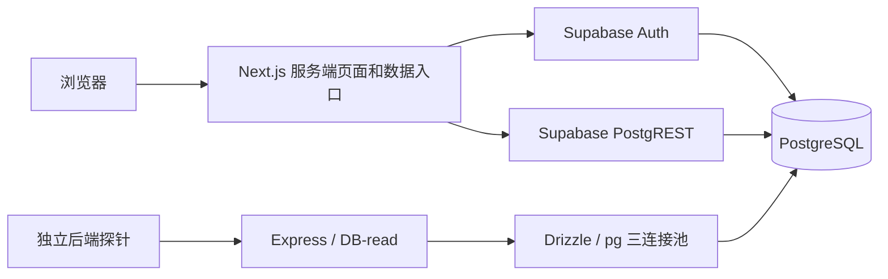

# 100 会话验收后的免费后端优化方案

状态：实施方案，尚未执行产品改动或部署。依据源码 `844ee20a` 与
[完整本地验收](2026-09-07-free-concurrency-review.md#2026-09-11真实网站auth-与业务数据完整本地验收)。
目标是在现有服务和资源预算内，通过减少每次页面读取的工作量，让 100 个
独立会话通过既有持续读取门槛。结果必须由复测证明，方案本身不代表容量达标。

## 为什么失败：事实和证据边界

| 已测事实 | 能确定什么 | 不能由此断定什么 |
| --- | --- | --- |
| Home 完整读取 p95 11,783.94ms；Status p95 11,395.81ms | 验收定义的页面与业务读取耗时超过 1,500ms 门槛 | Home 包含 GET 和两个顺序 action；Status 包含响应体校验，不能直接视为纯 GET 或 SQL 耗时 |
| Dashboard / timeline / status 校验失败 512 / 545 / 984 次，各自分母 1,553 | HTTP 层成功不足以证明业务成功 | 未记录细分原因，不能直接归因为 Auth、SQL、串号或响应解析 |
| Express 三连接池等待峰值 44，334 个采样中 1 个存在等待 | 出现短时排队和池满 | 不能把这一瞬时峰值当作整个五分钟一直排队 |
| Express DB-read 1,553 次、无慢 SQL；全库连接峰值 17/100 | 该探针没有慢 SQL，全库没有达到本地连接上限 | 探针主要执行 SELECT 1，不能代表 PostgREST 业务 SQL 的速度 |
| 100 个会话同时证明时 96 个失败，接口内部 1.5 秒 Auth 超时 | 突发身份检查在该本地条件下失效 | 不是 100 人同时密码登录的测试，也不证明生产失败率相同 |

最终 100 worker 全部完成，稳定阶段 308.79 秒。四类 GET 共 6,212 次，额外
dashboard/timeline POST 共 3,106 次；整体约 27.31 HTTP 请求/秒。100 会话
表示用户会停顿并交错访问，不等于持续每秒 100 个请求。此前测试没有采集
Next 的事件循环、CPU、每次认证/REST 的分段耗时和失败类别，唯一根因尚未闭环。
这次失败是延迟、业务数据断言和连接池门槛未通过；最终运行没有进程崩溃，
原门禁 6,212 个 GET 也没有 HTTP 失败。

普通页面的关键数据路径如下；Express 的三连接池不是所有页面读取共用的池：

## 已确认的代码改点

下列问题是源码中可直接定位的额外开销；它们对本轮 11 秒 p95 各自贡献多少，
仍需 P0 的分段数据验证。路径以仓库根目录为基准，行号对应本方案基线。

| 位置 | 当前行为 | 选定的改动 |
| --- | --- | --- |
| `viza-fe/internal-website/app/api/client/session/route.ts:36-55`；`viza-fe/internal-website/lib/supabase/fetch-with-timeout.ts:228-268` | session fallback 的 1.5 秒限制是每次请求，包装器默认还有 1/2/4 秒重试等待；客户端三秒后放弃时，route 没有传递取消信号；有效 cookie 分支仍同步写 continuity identity | 为认证设置总 deadline、禁用重试并传递取消；成功 fallback 复用既有签名会话机制；continuity 刷新移出普通读请求或设明确冷却 |
| `viza-fe/internal-website/app/client/home/page.tsx:327,398-429`；`viza-fe/internal-website/app/client/status/status-data.ts:1747-1810,1899-2002` | 先读取紧凑 dashboard，再用完整状态 action 生成时间线，重新读取 profile、申请、套餐、支付、文件与详情；dashboard 的 in-flight 标记未覆盖后续时间线工作 | 建立复用已授权申请和已读数据的首页读取服务，只取当前时间线所需信息；dashboard 与 timeline 一起纳入取消及并发控制 |
| `viza-fe/internal-website/app/client/status/status-data.ts:1773-1810,1900-1909` | profile 之后串行读取套餐与 owner applications；取得应用集合后串行读取 live submission 和支付 | 分别并行这两组独立读取，保留 package-linked fallback 的依赖次序和 `partialData` 语义，不额外增加查询 |
| `viza-fe/internal-website/lib/submission-live-status.ts:368-372` | 主流程已经读到申请的 country/visa_type，live helper 再查询相同字段 | 向 helper 传入来自本次授权读取的产品信息，省掉重复查询；不相信客户端提供的产品/owner 信息 |
| `viza-fe/internal-website/app/layout.tsx:21-29` | 向客户端 provider 传入完整翻译 messages | 按路由需要裁剪 namespace，完成语言回归后比较响应大小及序列化耗时 |

以下路径均位于 `viza-fe/internal-website/`：已经存在的优化继续复用，包括
`app/actions/client-home-dashboard.ts:106-117,169-193` 的 profile/application
与 documents/payments 并行；`app/client/home/page.tsx:497-513` 的可见页面
刷新控制；`app/client/status/status-data.ts:1920-2002` 的详情并行。
有效的 `client_session` 已有本地签名校验快路径，不能声称当前每次读取都远程
访问 Auth。上述认证改动针对缺少该 cookie 的 fallback、重试及 continuity
分支；现有压测没有逐请求记录这些分支，尚不能确认其占失败的比例。
仓库根目录下的 `viza-be/agent-backend/drizzle/0131_client_bootstrap_concurrency.sql`
的目的地选择 RPC 已在前端 `app/actions/user-package.ts:186-220` 使用，
它解决的是写入路径，不应当作
Home/Status 已有的聚合读取接口，也不重复添加相同索引。

## 实施顺序

### P0：先补足分段证据和错误分类

这是首个实施批次，用来决定后续优化落点，不添加收费观测服务。

- 在 Next 请求边界和 Supabase fetch 边界记录认证、profile、applications、
  documents、timeline、序列化/响应完成的耗时、调用次数、响应字节数和安全
  错误码；记录缓存命中、取消、重试及降级分支。一个请求内复用独立随机
  request ID，不记录 cookie、token、邮箱、申请内容或原始 SQL 参数。
- 补采 Next 进程的事件循环/CPU/RSS，区分业务进程和负载发生器的资源。
  分别观测 Auth、PostgREST 与 Express 的取连接等待和执行耗时；全库观察
  补充事务年龄与等待事件，不能把瞬时 idle-in-transaction 当作事务泄漏。
- 验收适配器增加有界枚举计数：非预期 HTTP、未认证、上游超时/不可用、
  缺少本人记录、出现他人记录、缺少文件、协议解析失败、响应超限。只保存
  脱敏结构摘要，保留原始 HTTP 结果和所有业务断言。
- 分别记录纯 GET、dashboard action、timeline action、响应体检查与完整
  页面读取耗时。纯 GET 对照是诊断结果，不能替代原有完整业务读取门槛。
- 先观测当前返回分支，确认无登录、无数据、依赖不可用是否被混用；本阶段
  不通过改超时、换测试数据或改变失败响应来改善基线数字。

Express 的 `/ready` 经 Supabase REST HEAD，已有五秒成功缓存和 single-flight；
它不使用 `pg.Pool`，应保留现有优化。另用有界的均匀流量与同步短突发对照，
记录 DB-read 的请求到达、checkout 等待和 SQL 执行时间，解释一次采样中
出现 44 个等待的原因；不能据此推断 PostgREST 业务池也只有三个连接。

验收：每个失败可归入明确阶段/类别；一次正常页面访问的 Auth/REST 调用数
可测；观测开关关闭时保持当前行为，开启时数据有界且不包含用户资料。

### P1：减少一次页面访问的认证与数据库往返

- 优先修复 session fallback：总认证预算必须短于调用方放弃时间；入口有
  `request.signal` 时向下传递，与服务端 deadline 合并；认证调用显式关闭
  包装器的默认重试。当前四次 1.5 秒尝试加 1/2/4 秒等待，理论工作时间可达
  约 13 秒，不能把单次 1.5 秒配置当作请求总预算。Home fallback 也需明确
  deadline，而非使用没有显式截止时间的原始 fetch。
- `/api/client/session` 成功验证 Supabase 身份及客户 scope 后，复用现有
  签名 cookie 的签发流程，防止下一次 Home/Status 再重复执行 fallback；
  直接使用 `lib/client-session.ts:28-47` 的 `createClientSession()`，已有
  fallback 结果包含 profile ID、email、Auth UUID，无需再查一次 profile。
  保持 Auth UUID/profile 冲突检查及七天有效期，不在每次 probe 时滑动续期；
  cookie 保持 HttpOnly、生产 Secure、SameSite=Lax。通用会话不承载申请授权，
  各 loader 继续验证申请归属。
  对 `cacheContinuityIdentity()` 明确新建/刷新时机，保留恢复需要的身份
  数据，但不让每次有效会话 GET 都等待额外 gateway 写入。
- 修正 P0 确认的错误契约：必需读取失败不得变成成功的空数组或新用户状态；
  无登录与依赖不可用分别处理，API 返回适当 401/403/503，Server Action/
  SSR 保留明确错误结果及对应语言的可重试状态。
- 为首页建立一个 server-only 聚合读取函数，统一提供当前身份、申请列表、
  文件摘要及选中申请的进度。优先在现有页面结构中接入一个只读数据入口，
  减少 dashboard 完成后再取 timeline 的浏览器往返。时间线只读取选中申请
  必需的状态；不把完整 Status action 原样搬进聚合函数再执行一次。
- 聚合函数创建一次请求上下文，复用已经确认的身份、Supabase client 和
  本请求内已读取的 profile/application/documents。必须重新检查客户端
  传入的 application ID 属于当前身份；不得用客户端提供的 owner 信息授权。
- 先消除重复查询，再对无依赖的剩余查询做有界并行。复用现有公开元数据
  缓存和既有索引。先完成上表的 Status 两组并行及 live helper 参数复用，
  避免一轮优化同时增加每个用户的查询扇出。
- 首选同一请求内的认证去重。是否采用 `getClaims()` 快路径必须先核对签名
  算法、当前库行为及撤销要求：非对称签名可通过缓存 JWKS 校验；对称签名
  仍可能请求 Auth。敏感写操作、管理员能力及要求实时撤销的入口维持相应
  强校验。不得用 `getSession()` 或未验证的 JWT 内容作为授权依据。
- 普通 GET 不承担创建/修复账户、分配邮箱或刷新持久恢复数据的职责；若审计
  发现这些工作处于读请求路径，应在保持幂等与兼容回退的前提下移至明确的
  登录/初始化流程。申请人数据不加入公共 CDN 或无身份边界的进程缓存。

验收：以 P0 基线证明每次正常读取的调用数和串行等待减少；跨身份、过期/
伪造 token、profile 冲突、管理员与普通客户边界均通过回归；缺少真实数据时
显示明确错误，而非返回伪造的成功结果。首次 fallback 后签名会话确实建立，
后续有效 cookie 的 Home/Status 不再调用远程 `getUser`；认证超时没有默认
1/2/4 秒重试链，调用方取消后不会继续新增尝试。

当前签名 cookie 没有服务端撤销表，不能将本地签名校验描述为实时撤销校验。
保留现用 `app/actions/client-auth.ts:138-148` 的 `userSignOut()`：尝试退出
Supabase 后，无论远程结果如何均清除本地 cookie。需要实时撤销的敏感入口
继续相应强校验；本方案不以扩大该 cookie 的授权范围换取性能。

### P2：控制超时后的工作和连接预算

- 将请求的总体 deadline/取消信号传入内部读取；请求取消后停止新增子查询
  和重试。底层操作实际结束前不能提前释放并发名额，防止超时工作继续占用
  资源而新请求不断进入。
- 审计 SDK、包装器和 UI 的重试叠加。只对幂等且可恢复的读取，在剩余时间
  和总尝试次数内重试；认证无效/权限错误不重试，避免慢请求形成同步重试波次。
- Express 先保持每实例 pool=3。若证据证明取连接等待占主导且 DB 有余量，
  才在隔离环境小步 A/B 调整，同时计入实例数、Auth、PostgREST、Storage、
  后台任务和保留连接。此前生产观察的 max_connections=60 与本地的 100
  不同，发布前必须核对实际预算，不能套用本地数字。
- 对昂贵读取设置有界 admission/等待队列，超预算时明确返回可重试结果。
  该保护用于防止过载蔓延；在 100 会话验收中返回 429/503 仍算失败，不能
  通过拒绝请求、少完成用户或增加用户停顿来冒充容量提升。

验收：取消、超时、异常、迟到成功/失败均释放一次；无持续增长的等待队列；
既有池利用率、等待、慢 SQL 和零错误门槛保持不变。

### P3：按测量结果缩减 SQL 与响应体

- P0 若发现业务 SQL 占主导，仅对相应查询运行隔离数据下的
  `EXPLAIN (ANALYZE, BUFFERS)`；评估字段裁剪、批量读取、聚合或必要索引。
  复用既有 bootstrap/RLS 优化，不批量改策略或加索引。新增 RPC 默认保持
  调用者权限和 RLS，不以 `SECURITY DEFINER` 或 service-role 绕过权限来提速。
- 根布局当前向 `NextIntlClientProvider` 传入完整 messages；实测 Status
  document 为 409,785 bytes。按页面只下发实际使用的翻译 namespace，并
  裁剪数据 DTO；减少服务端序列化和传输成本。只有 P0 证明其耗时明显时，
  才把它提前到更高优先级，不能把 410 KB 单独认定为 11 秒延迟的根因。

验收：改动前后 SQL/业务结果一致、RLS 不退化；响应字节数下降且已有语言
无缺失文案；不以隐藏页面必需信息或取消权限检查换取性能。

## 验证与发布

1. 先用 10/25/50 worker 的明确诊断模式找出开始恶化的负载点；这些结果不
   能判为 100 会话 release gate 通过。保持数据规模、资源、路由、停顿及
   业务断言一致；记录本机负载发生器和 Docker 网络造成的环境限制。
2. 同资源下运行 100 个真实独立 Auth 会话、30 秒 ramp、至少五分钟 steady、
   每周期后五秒 pacing。Home 必须计入获得完整数据的时间；不能将优化后的
   空页面 GET 与原来的完整读取复合耗时直接对比。
3. Home/Status p95 <1,500ms，后端 ready/DB-read p95 <500ms；请求和业务数据
   校验均零失败；两个页面各覆盖 100 个身份。原有连接池、慢 SQL、事件循环
   和内存门槛原样保留。突发身份校验与同时登录另测、另报，不能与持续读取
   的结论混用。
4. 按修改包运行 type-check/lint、鉴权/取消回归和真实浏览器 smoke。保留失败
   结果、源码哈希和清理证明。通过后再发布相关服务；Vercel 继续核对组织
   `nananviza2016-8879` / `viza-gmail-s-projects` / `viza-internal` 身份与项目。
   发布后仅做低流量 smoke，生产不作 100 用户压测；不达标时保留失败结论。

实施范围是现有代码、请求组织和测量，不新增付费 Redis、实例、数据库规格
或常驻 runner。AI、支付和官方门户提交仍需独立容量验证。

## 官方依据

- [Next.js 请求内去重与并行读取](https://nextjs.org/docs/app/getting-started/fetching-data)：
  `React.cache` 在一次请求内复用结果，不跨 HTTP 请求共享用户数据。
- [Supabase getUser](https://supabase.com/docs/reference/javascript/auth-getuser) 与
  [getClaims](https://supabase.com/docs/reference/javascript/auth-getclaims)：网络验证
  和签名算法决定了可用的认证优化，不能简单删除身份验证。
- [Supabase 连接管理](https://supabase.com/docs/guides/database/connection-management)：
  池预算需要为 Auth、PostgREST 和其他服务保留余量。
