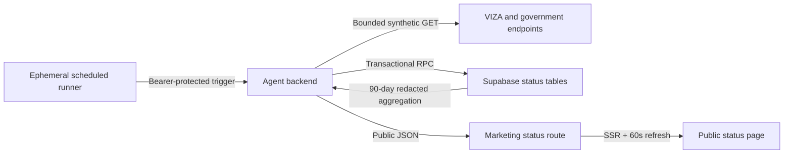

# ADR-0150: Evidence-backed public service status

**Status:** Accepted
**Date:** 2026-08-18
**Deciders:** VIZA engineering and operations

## Context

The public `/status` page previously generated deterministic-looking 90-day
bars, uptime percentages, refresh timestamps, and incidents in the browser.
Those values were not linked to probes or durable observations. An older
`portal_health` table and `scripts/canary.ts` could store one latest row per
portal, but there was no append-only history, incident lifecycle, public-safe
API, or active schedule connecting that row to the marketing site.

The status system must:

- show only recorded evidence and render missing/stale evidence as unknown;
- keep probe URLs, raw errors, credentials, and applicant data out of the
  public response;
- monitor with bounded, low-concurrency synthetic GET requests;
- retain enough history for honest 90-day availability and incidents;
- avoid an always-on monitoring machine;
- keep the public marketing app independent of Supabase and portal auth SDKs.

## Decision

Use `portal_health` as the current-state projection and add two service-only
tables:

- `portal_health_checks`: append-only synthetic observations;
- `status_incidents`: incident lifecycles derived from status transitions.

Migration `0150_public_status_tracking.sql` owns a transactional
`record_portal_health_check` RPC. One call records the observation, updates the
projection, and opens, updates, or resolves the active incident. The
`get_public_portal_status` RPC aggregates 90 days of checks into a redacted JSON
snapshot. Neither RPC is callable by anonymous or authenticated Supabase roles.

The agent backend exposes:

- `GET /api/public/status`: cached, redacted snapshot;
- `POST /api/internal/status/probe`: bearer-secret-protected bounded probe run.

GitHub Actions calls the probe endpoint every five minutes. Its ephemeral
hosted runner runs only `curl`, has a four-minute timeout, and exits after the
request. The backend limits portal requests to five concurrent requests and
caps each request timeout.

The marketing app server fetches the public backend API and exposes a same-site
read-only `/api/status` proxy for 60-second browser refreshes. The UI marks a
monitor unknown after 15 minutes without a check. Missing days are gray; the UI
does not interpolate or backfill them.

## Options Considered

### Option A: External status SaaS

| Dimension | Assessment |
| --- | --- |
| Complexity | Low application complexity; another operational dependency |
| Cost | Recurring per-monitor cost |
| Scalability | High |
| Team familiarity | Medium |

**Pros:** Mature alerting, subscriptions, and hosted pages.

**Cons:** Duplicates existing probe and incident data, makes VIZA dependent on
another vendor, and requires syncing private operational metadata into a public
configuration.

### Option B: Supabase tables plus backend public API (chosen)

| Dimension | Assessment |
| --- | --- |
| Complexity | Medium |
| Cost | Low; uses existing backend/database and ephemeral scheduler |
| Scalability | Sufficient for tens to low hundreds of five-minute monitors |
| Team familiarity | High |

**Pros:** Reuses current infrastructure, preserves a single status source of
truth, and keeps public redaction under VIZA control.

**Cons:** VIZA owns probe classification, history retention, incident UX, and
future notification delivery.

### Option C: Marketing app probes portals directly

| Dimension | Assessment |
| --- | --- |
| Complexity | Low initially, high after history/alerts |
| Cost | Low |
| Scalability | Poor |
| Team familiarity | High |

**Pros:** Few initial components.

**Cons:** Ties page traffic to third-party portal load, has no durable evidence,
leaks operational details into the web tier, and produces inconsistent results
across edge instances.

## Consequences

- Public availability is now derived from durable evidence.
- The page fails honest: unavailable/stale data appears unknown, not green.
- Portal labels and visibility can be managed with the monitor row.
- The status page does not offer email, SMS, RSS, or webhook subscriptions
  until a real delivery service and consent model are implemented.
- HTTP reachability is a synthetic signal, not proof that every authenticated
  form step or applicant-specific action works.
- A future retention job should downsample or delete raw checks older than the
  agreed operational window while preserving daily aggregates if long-term SLO
  reporting is required.

## Deployment and verification

1. Apply migration `0150_public_status_tracking.sql`.
2. Set `STATUS_CRON_SECRET` on the agent backend.
3. Set GitHub secrets `STATUS_CRON_SECRET` and `STATUS_PROBE_URL` (backend base
   URL, without the endpoint suffix).
4. Deploy the backend, then the marketing site with `AGENT_BACKEND_URL` set to
   the backend base URL.
5. Manually dispatch `Portal health canary` and verify it completes.
6. Verify `portal_health_checks` receives rows and `/api/public/status` returns
   only the documented public fields.
7. Verify `/en/status` and `/zh-CN/status` show recorded checks; pause the cron
   in a non-production environment and confirm rows become unknown after 15
   minutes.
