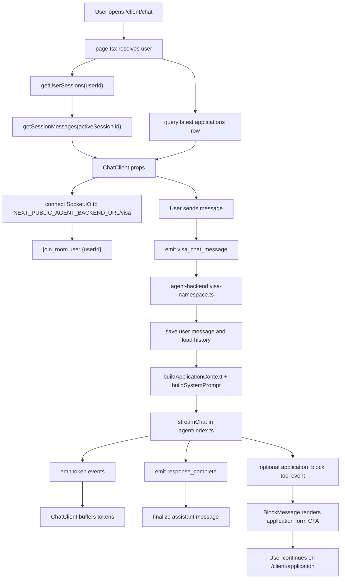

# VIZA AI Chat Development Guide (DG)

## 1. 页面在哪里

截图对应的是客户端门户里的 `/client/chat` 页面。

核心文件：

- `viza-fe/internal-website/app/client/chat/page.tsx`  
  Next.js server route entry。负责拿当前登录用户、读取最近的 `visa_chat_sessions` 列表、加载默认 active session 的消息、查询用户最新 application，然后把数据传给 client component。

- `viza-fe/internal-website/app/client/chat/chat-client.tsx`  
  截图中真正的页面 UI。这里包含 `VIZA AI / Travel AI` 切换、聊天消息列表、底部输入框、Socket.IO 连接、流式输出处理，以及嵌入式 Travel AI。

相关共享组件：

- `viza-fe/internal-website/components/client/companion/chat-input.tsx`  
  底部 `Ask anything...` 输入框。

- `viza-fe/internal-website/components/client/companion/chat-message.tsx`  
  用户气泡和 AI 文本消息的渲染。AI 消息默认纯文本显示，会把常见 Markdown 标记转成普通文字，避免 VIZA 回答呈现为 Markdown 富文本。

- `viza-fe/internal-website/components/client/companion/block-message.tsx`  
  AI 发出 application redirect block 时，渲染跳转到 `/client/application` 的 CTA。VIZA chat 不在对话里收集申请表字段。

- `viza-fe/internal-website/app/client/travel-chat/travel-chat-client.tsx`  
  `Travel AI` tab 嵌入的旅行规划主组件。

## 2. 当前截图对应的 UI 结构

`chat-client.tsx` 里有两个主要状态：

- `showChat`  
  `false` 时显示入口选择页；`true` 时显示截图这种聊天页。它会读取 `sessionStorage.getItem("viza_chat_active")`，所以用户进入过聊天后会保持聊天视图。

- `chatMode`  
  `"viza"` 渲染 VIZA AI 对话；`"travel"` 渲染嵌入式 Travel Chat。

截图里的元素来源：

- 左侧/移动端抽屉 `VIZA chats`：`chat-client.tsx` 读取 `visa_chat_sessions`，允许像 Travel AI 一样维护多个独立 conversation process；默认折叠，桌面以浮层打开，不推动或重排中间的 AI 输出。
- 顶部 `VIZA AI / Travel AI` pills：`chat-client.tsx` 的 chat view tab controls。
- 右侧深蓝色 `hi` 气泡：`ChatMessage` 渲染 user message。
- 左侧大段 `Hi there...`：不是前端固定文案，而是从聊天历史或后端 AI streaming response 进入 `ChatMessage`。
- 底部 `Ask anything...`：`ChatInput` 默认 placeholder。
- `Travel AI` 点击后：同一个页面内渲染 `TravelChatClient applicationId={travelApplicationId} embedded`。

## 3. 高层链路



## 4. 前端逻辑关系

### 4.1 Server route: `page.tsx`

职责很窄：

1. 通过 impersonation session 或 Supabase session 获取 `userId`。
2. 没有登录用户就 redirect 到 `/client/login`。
3. 调用 `getUserSessions(userId)` 读取最近会话列表，默认使用最新一条作为 active session。
4. 如果有 active session，调用 `getSessionMessages(activeSession.id, userId)` 加载该 process 的历史消息。
5. 用 `createAdminClient()` 查当前用户最新 application 的 `id/status`。
6. 渲染 `ChatClient`。

### 4.2 Client route: `chat-client.tsx`

它同时管理 UI、Socket.IO、streaming、scroll 和 Travel tab。

主要状态：

- `sessionId`：来自 `page.tsx` 的初始 session。
- `sessions`：当前用户最近的 `visa_chat_sessions`，用于桌面左侧栏和移动端抽屉。
- `showChat`：入口页或聊天页。
- `chatMode`：`viza` 或 `travel`。
- `sessionPanelCollapsed` / `sessionPanelOpen`：VIZA process panel 默认关闭；桌面展开为左侧浮层，移动端展开为 drawer。它不改变 `VIZA AI / Travel AI` tab 或消息内容的水平位置。
- `status`：Socket 连接状态，用于显示连接中状态和触发 pending messages flush；不要直接用它禁用输入框。
- `socketMessages`：Socket 实时消息暂存。
- `chatMessages`：`useContinuousChat` 维护的最终消息列表。
- `pendingMessages`：断线时暂存，重连后发送。
- `queuedMessageRef`：AI 正在 streaming 时，用户下一条消息排队。
- `blockMessages`：后端返回的 application redirect CTA。聊天页不再渲染行程/护照/日期等 inline form fields。

输入框启用规则：

- `ChatInput` 不能因为 Socket.IO 处于 `connecting` / `disconnected` / `error` 就 disabled。
- 断线或未连接时，`handleSendMessage()` 会把消息放进 `pendingMessages`，等 `status === "connected"` 后自动发送。
- 当前只应在本地 UI 正在切换/加载 session messages 时禁用输入框，避免用户把消息发到正在切换的 session。

消息合并方式：

1. 用户发送后，`socketSendMessage()` 先把 user message 加到 `socketMessages`。
2. 同时插入一个空的 streaming assistant message。
3. 后端 `token` event 到达时先进入 buffer，每 500ms flush 到当前 assistant message。
4. `response_complete` 到达时，用 `fullResponse` 覆盖并结束 streaming。
5. `useEffect` 监听 `socketMessages`，再把变化同步进 `useContinuousChat` 的 `chatMessages`。

多 conversation process：

1. `page.tsx` 不再自动创建空 session；它只读取已有 session 列表。
2. 用户点击 `New chat` 时，前端先把 active `sessionId` 设为 `null` 并清空当前消息。
3. 用户在新 process 里发送第一条消息时，`createSession(userId, applicationId)` 才写入新的 `visa_chat_sessions`。
4. 切换已有 session 时，`getSessionMessages()` 只加载该 session 的消息；`useContinuousChat` 的向上加载也会带 `sessionId`，避免混入其他 process。
5. 新空 VIZA chat 会渲染 `messages/*/chat.newChatGreeting` 作为 display-only assistant greeting；这个 greeting 不写入 `visa_chat_messages`，避免污染历史或重复保存。
6. Process 侧栏只保留一个显式 `New chat` 入口；每个 process 支持 rename 和 delete。Rename 通过隐藏 system marker 持久化，delete 删除 `visa_chat_sessions` 并由数据库 cascade 删除消息。

## 5. 后端逻辑关系

入口：

- `viza-be/agent-backend/src/index.ts`  
  创建 HTTP server 和 Socket.IO server，并注册 namespace `/visa`。

- `viza-be/agent-backend/src/socket/visa-namespace.ts`  
  处理前端发来的 `visa_chat_message`。

`visa_chat_message` 流程：

1. 尝试把用户消息写入 `visa_chat_messages`。
2. 从 `visa_chat_messages` 读取最近 50 条历史作为 LLM 上下文；前端同时会随 `visa_chat_message` 发送最近可见聊天历史，后端在 DB 历史缺失或短于前端历史时用前端历史兜底，避免短答案只带当前一句进入模型。
3. 调用 `buildApplicationContext(user_id)` 从 Supabase 读取 applicant profile 和最新 application。
4. 调用 `buildCompactAnswerInterpretation()`，把 `中国护照，中国，7天，法国，意大利` 或 `2，5` 这类短答案映射回上一轮问题。
5. 调用 `retrieveVisaKnowledge()`，按当前用户问题 + 最近 user-only context + 兼容的 application country/visa type 检索 `visa_chunks`。
6. 调用 `buildSystemPrompt(context, knowledgeContext, conversationInterpretation)` 拼出动态 system prompt。
7. 调用 `streamChat()`，通过 Anthropic streaming 逐 token 返回。
8. 完成后保存 assistant message，并 emit `response_complete`。
9. 当用户明确要开始申请/填表时，后端 emit `application_block`，payload 使用 `blockType="application_redirect"`，前端渲染跳转按钮。

Agent 核心：

- `viza-be/agent-backend/src/agent/index.ts`
  - `BASE_SYSTEM_PROMPT` 定义 VIZA AI 的角色和边界。
  - `buildApplicationContext()` 读取用户资料和 application。
  - `buildSystemPrompt()` 把用户上下文、结构化 conversation state、RAG sources 注入 system prompt。
  - `streamChat()` 调用 Anthropic。VIZA chat 不暴露 inline form-collection tool；申请字段收集交给 `/client/application`。

RAG 检索服务：

- `viza-be/agent-backend/src/services/visa-knowledge.service.ts`
  - `retrieveVisaKnowledge()` 负责把用户问题转成 embedding，并查询 `visa_chunks`。
  - 支持 `intent` 参数：`route_recommendation`、`requirements`、`form_intake`、`fees_timing`、`eligibility`、`source_check`，按任务优先检索对应 `documentType`。
  - 优先调用 Supabase RPC `match_visa_chunks` 做 pgvector 相似度检索。
  - RPC/embedding 不可用时，会 fallback 到按 country / visa type / document type 过滤 `visa_chunks`。
  - 默认 `minSimilarity` 是 `0.03`；原因是当前 Supabase RPC 返回的多语种相似度分数整体偏低，country/visaType 过滤负责控制噪音。
  - `formatKnowledgeContext()` 把检索结果整理成可注入 system prompt 的上下文块。

RAG routing context:

- `viza-be/agent-backend/src/config/visa-destination-registry.ts` 是国家/签证配置源，维护 country key、display name、aliases、Schengen membership、default visitor visa type、RAG document types 和 form intake schema key。
- `visa-namespace.ts` 解析 RAG country / visa type 时优先使用结构化 conversation state，再使用当前用户消息 + 最近 user-only chat context。
- 这样用户按编号压缩回答时，例如 `中国，新加坡，不知道，会去别的国家`，系统仍能沿用上一轮用户提到的 main destination（如 Switzerland），同时不会把 `新加坡` 误当成目的地。
- application `visa_type` 只能在与解析出的 country 兼容时作为 fallback，避免默认 `tourist_b211a` 污染 Schengen/UK/U.S. 问题。
- `buildCompactAnswerInterpretation()` 是独立于 RAG 的上下文解释层：它读取上一轮 assistant 的编号问题或天数分配问题，把当前短答案映射成 slot/day-split note 注入 system prompt。例如瑞士主目的地后回答 `中国护照，中国，7天，法国，意大利` 会保留 Switzerland 并把 France/Italy 识别为 other Schengen countries；法国/意大利天数问题后回答 `2，5` 会映射为 France 2 days / Italy 5 days。
- 当前 supported RAG country 覆盖所有当前 Schengen Area 国家（Austria, Belgium, Bulgaria, Croatia, Czech Republic, Denmark, Estonia, Finland, France, Germany, Greece, Hungary, Iceland, Italy, Latvia, Liechtenstein, Lithuania, Luxembourg, Malta, Netherlands, Norway, Poland, Portugal, Romania, Slovakia, Slovenia, Spain, Sweden, Switzerland）以及 Australia, Cambodia, Canada, Egypt, India, Indonesia, Japan, Laos, Malaysia, Maldives, Mexico, Morocco, Nepal, New Zealand, Philippines, Qatar, Saudi Arabia, Singapore, South Africa, South Korea, Sri Lanka, Thailand, Turkey, UAE, UK, US, Vietnam。Schengen 国家统一走 `schengen_short_stay_tourism`，其他国家当前以 tourism/visitor/entry visa 为主。

Structured conversation state:

- `viza-be/agent-backend/src/services/visa-conversation-state.service.ts` 维护 `VisaConversationState`，字段包括 destination countries、main destination、nationality、residence/apply-from、trip purpose、stay length、Schengen day split、first entry country、recommended visa type、missing slots 和 confidence。
- 每轮 `/visa` 消息会读取最新 state marker、根据当前消息和 history 合并 slot patch、保存新的 hidden marker，然后用 state 驱动 RAG routing 和 system prompt。
- state marker 存在 `visa_chat_messages`：`role='system'` 且 `content` 以 `__viza_conversation_state__:` 开头。它和 session title marker 一样，不应进入用户可见消息或 LLM chat history。
- 用户更正目的地（如“不对，改成韩国”）时，state 会替换旧目的地，而不是继续把旧目的地混在 route 判断里。

RAG migration：

- `viza-be/agent-backend/drizzle/0012_match_visa_chunks.sql`
  - 创建 `match_visa_chunks()` RPC。
  - 支持 `country`、`visa_type`、`document_type[]`、`min_similarity` 过滤。
  - 返回 chunk 内容、source title/url 和 similarity。

RAG 知识源与写入：

- `knowledge-base/visa-rag-seeds/countries/*.json`
  - 国家级独立 RAG seed。每个文件只负责一个国家，当前共 56 个国家。
  - 这是新的 source of truth；旧的 `supported-visa-rag.json`、`us-visa-rag.json`、`indonesia-visa-rag.json` 已移除，避免同一知识被两个文件维护。
  - 设计目标是工业级国家模块：每个国家后续都可以独立挂官方知识、材料规则、字段映射、预约/填表流程和 form-filling workflow。
  - 每个国家 seed 必须保留且只保留一个 `documentType="form_requirements"` 文档，用来描述官方申请入口、填表前应收集的字段、上传材料和提交前 review guardrails。

- `knowledge-base/visa-rag-seeds/README.md`
  - 记录国家 seed 的维护规则和 ingestion 命令。

- `viza-be/agent-backend/scripts/ingest-country-visa-rag.ts`
  - 读取一个或多个国家 seed，写入共享 `visa_documents` / `visa_chunks` 表。
  - 删除同 country / visa type / document type / source URL / title 的旧 RAG 文档后重新写入。
  - 有 `OPENAI_API_KEY` 时写入 `text-embedding-3-small` embedding；没有 key 时仍写入 chunk，供 filtered fallback 使用。
  - 全量入库：`npm run ingest:all-visa-rag`。单国家入库：`npm run ingest:country-visa-rag -- --country japan`。多国家入库：`npm run ingest:country-visa-rag -- --countries japan,us,indonesia`。

## 6. 数据与持久化

相关表：

- `visa_chat_sessions`  
  当前 `/client/chat` 的 session source of truth。一个 applicant 可以有多条 VIZA conversation processes；`ChatClient` 通过 `getUserSessions()` 展示最近会话，通过 `createSession()` 创建新会话。

- `visa_chat_messages`  
  保存用户、assistant、`role='block'` 的 application redirect block 记录，以及隐藏 `role='system'` marker（session title / conversation state）。`session_id` 指向 `visa_chat_sessions.id`。

当前约定：

前端传给 Socket.IO 的 `user_id` 是 `applicant_profiles.id`，`session_id` 是当前 active `visa_chat_sessions.id`。后端 `buildApplicationContext()` 优先按 `applicant_profiles.id` 查 profile，并保留 `auth_user_id` fallback 兼容旧调用。`user_chat_sessions` 仍存在于旧 migration 中，但本页面不再使用它作为 message parent。

Session rename：

- 为避免依赖新的 DB column，rename 目前写入 `visa_chat_messages` 的隐藏 marker：`role='system'` 且 `content` 以 `__viza_session_title__:` 开头。
- `getUserSessions()` 会读取最新 marker 作为 `Session.title`。
- `getSessionMessages()`、history load、search、recent messages、backend `/visa` chat history 都不能把这些 system marker 当作用户可见消息或 LLM 上下文。

## 7. Application redirect 链路

VIZA chat 的职责是解释签证路线、材料、费用/时间和注意事项；真正的申请字段收集放到 `/client/application`。当用户说“开始申请/帮我填表/下一步”时，后端不再在聊天里发可填写表单，而是发一个 redirect CTA。

链路：

1. `visa-namespace.ts` 识别 `form_intake` intent。
2. 如果已经能解析 destination / visa type，后端 emit `application_block`，payload 为 `blockType="application_redirect"`。
3. `chat-client.tsx` 把 payload 存到 `blockMessages`。
4. `BlockMessage` 只渲染跳转按钮，不渲染输入框。
5. 按钮跳转到 `/client/application?country=...&visaType=...`。
6. `/client/application` 读取 query 参数作为当前国家/签证类型上下文，后续字段收集都在专门表单页完成。

## 8. Travel AI 的关系

`Travel AI` 不是这页自己实现的旅行逻辑。它只是由 `chat-client.tsx` 嵌入：

```tsx
<TravelChatClient applicationId={travelApplicationId} embedded />
```

真正的 Travel 流程应看：

- `docs/travel-agent-development-guide.md`
- `viza-fe/internal-website/components/client/travel/AGENTS.md`
- `viza-fe/internal-website/app/client/travel-chat/travel-chat-client.tsx`
- `viza-fe/internal-website/lib/travel/planner.ts`

改 `Travel AI` 业务时，不要在 `chat-client.tsx` 里复制旅行状态机。

## 9. 环境变量

Frontend:

```env
NEXT_PUBLIC_AGENT_BACKEND_URL=http://localhost:3002
```

Agent Backend:

```env
PORT=3002
CORS_ORIGINS=http://localhost:3000
ANTHROPIC_API_KEY=
OPENAI_API_KEY=
SUPABASE_URL=
SUPABASE_SERVICE_ROLE_KEY=
```

如果 `ANTHROPIC_API_KEY` 没配，`streamChat()` 会返回固定 fallback：AI 服务还没配置。`OPENAI_API_KEY` 用于生成 `text-embedding-3-small` embedding；不要把真实 key 提交进 git。

## 10. 做到什么程度了

已经实现的部分：

- `/client/chat` 路由存在，并接入客户端登录态/impersonation。
- 聊天 session 已统一到 `visa_chat_sessions.id`，避免 `visa_chat_messages.session_id` 指向错误的 session 表。
- VIZA AI 已支持多个 conversation processes：页面加载最近 session 列表，左侧/移动端抽屉可以新建和切换；新 session 在第一条消息发送时创建。
- `/client/chat` 保持浅色背景和原有 `VIZA AI / Travel AI` tab 位置；processes 侧栏默认折叠，展开时作为浮层，不挤压中间 AI 输出。
- RAG 检索 helper 已新增，能读取 `visa_chunks` 并格式化知识上下文。
- `match_visa_chunks` RPC migration 已新增；应用 migration 后可启用 pgvector 相似度检索。
- `/visa` Socket chat 已接入 RAG：每条用户消息会先检索 `visa_chunks`，再把知识上下文注入 VIZA AI 的 system prompt。
- VIZA AI 的 system prompt 已改成多目的地签证助手，不再把自己定义为 Indonesia-only，也不会在用户没说目的地时默认查 Indonesia。
- `/visa` 的 knowledge routing 已支持所有当前 Schengen Area 国家、Vietnam、UK、U.S.、Indonesia，以及 Singapore/Malaysia/Thailand/Canada/Australia/New Zealand/Japan/South Korea；多个国家或泛 Schengen 问题不会被旧 application country 拉回 Indonesia。
- Indonesia visa 官方知识源与 ingestion 脚本已新增。RAG 内容覆盖中国游客 7 天赴印尼应优先考虑 VoA/e-VOA，而不是美国 B-2/DS-160。
- Indonesia RAG 已写入 Supabase：`visa_documents` 6 条，`visa_chunks` 12 条，均为 `country=indonesia`、`visa_type=tourist_b211a`。
- 页面 UI 已经有入口选择页和截图里的聊天页。
- `VIZA AI / Travel AI` tab 已经接好。
- VIZA AI 前端已经能连接 `agent-backend` 的 `/visa` namespace。
- 前端已经支持 token streaming、response finalize、断线排队、streaming 时排队下一条用户消息。
- 历史消息 hook `useContinuousChat` 已经存在，支持向上加载、搜索、jump to message 等能力。
- 后端已经有动态 system prompt，能把 profile/application context 注入给 VIZA AI。
- VIZA chat 已改为 application redirect CTA；不再在聊天里渲染 inline form 或保存 chat-driven form intake。

还需要重点确认/补齐的部分：

- 当前 Supabase 已应用 `0012_match_visa_chunks.sql`，`match_visa_chunks` RPC 可用；新环境仍需重新应用该 SQL，否则会走 filtered fallback。
- `OPENAI_API_KEY` 已更新为可调用 `text-embedding-3-small` 的 key；Indonesia RAG 和 U.S. RAG 都已重跑 ingestion，并写入 embeddings。
- 本机直连 Postgres 执行 SQL 时曾遇到 Supabase IPv6 direct host 连接问题；可用 Supabase SQL Editor 或可访问 DB host 的环境应用 migration。应用前 RAG service 会先尝试 RPC，然后 fallback 到 country/visa type filtered query。
- `chat-client.tsx` 文件很大，后续如果继续加功能，建议拆出 Socket hook 和 message list 子组件。
- `travelApplicationStatus` 已传入 `ChatClient`，但当前 VIZA/Travel tab 渲染里基本没有使用。
- Debug panel 状态现在固定为 `false`，实际排查 streaming 时需要临时打开或改成受控入口。

## 11. 修改前检查清单

Frontend:

```powershell
cd viza-fe/internal-website
npm run type-check
```

Backend:

```powershell
cd viza-be/agent-backend
npm run type-check
```

手动验证：

1. 未登录访问 `/client/chat` 会跳登录。
2. 已登录打开 `/client/chat` 能看到 chat 页面。
3. `VIZA AI` tab 发送消息后，后端 streaming 正常。
4. 刷新后历史消息能恢复。
5. `Travel AI` tab 能正常嵌入 Travel planner。
6. 如果 agent 返回 application block，应显示跳转到 `/client/application` 的按钮，而不是聊天内表单。

## 12. 当前验证状态

本轮 RAG 接入按步骤验证：

- Step 1 session persistence：`viza-fe/internal-website npm run type-check` 通过；`viza-be/agent-backend npm run type-check` 通过；Playwright smoke screenshot: `test-results/playwright-step1-chat.png`。
- Step 2 RAG service：`viza-be/agent-backend npm run type-check` 通过；Playwright smoke screenshot: `test-results/playwright-step2-chat.png`。
- Step 3 SQL migration：`viza-be/agent-backend npm run type-check` 通过；`git diff --check` 通过；Playwright smoke screenshot: `test-results/playwright-step3-chat.png`。
- Step 4 `/visa` RAG integration：前后端 type-check 均通过；Playwright 验证 frontend `/client/chat` 未登录 redirect 和 backend `/health`，screenshot: `test-results/playwright-step4-chat.png`。
- Step 5 Indonesia RAG content ingestion：`npm run ingest:indonesia-visa-rag` 成功写入 6 documents / 12 chunks；retrieval smoke test 对“中国护照，印尼旅游7天”返回 5 个 Indonesia chunks；由于 embedding 不可用，结果使用 `embedding_unavailable` fallback。
- Step 6 OpenAI key retest：新 key 调用 `text-embedding-3-small` 成功，返回 1536 维；`npm run ingest:indonesia-visa-rag` 成功写入 12/12 embeddings。Supabase count: 6 Indonesia documents, 12 Indonesia chunks, 12 embedded chunks. Retrieval smoke 目前仍走 `vector_search_failed` fallback，因为 `match_visa_chunks` RPC 尚未应用到 Supabase。
- Step 7 pgvector RPC：`match_visa_chunks` 已应用到 Supabase 并可调用。RAG service 会优先用 vector search；如果 vector 相似度没有命中，会自动回退到 Indonesia filtered chunks，避免空上下文。
- Step 8 vector retrieval verification：对“中国护照，去印尼旅游7天，应该申请什么签证？”的 retrieval smoke 返回 `usedEmbedding=true`，命中 Indonesia chunks；英文同类问题相似度更高并命中 e-VOA/VoA chunks。前后端 type-check 通过；Playwright smoke screenshot: `test-results/playwright-rag-vector-chat.png`。
- Step 9 U.S. RAG source：新增 U.S. B-1/B-2/DS-160/VWP/EVUS 官方知识源与 ingestion 脚本；`/visa` knowledge routing 会在用户明确提到美国/美签/US/United States 时检索 `country=us`。
- Step 10 U.S. RAG ingestion verification：`npm run ingest:us-visa-rag` 成功写入 7 documents / 20 chunks / 20 embeddings。对“中国护照，去美国旅游7天，应该申请什么签证？”的 retrieval smoke 返回 `usedEmbedding=true`、`fallbackReason=null`、`country=us`、`visaType=b1_b2`，Top 1 命中中文桥接 chunk，相似度约 0.708。前后端 type-check 通过；Playwright smoke screenshot: `test-results/playwright-us-rag-final-smoke.png`。
- Step 11 VIZA multi-session processes：参考 Travel AI 的多 conversation 模型，`/client/chat` 改为读取多个 `visa_chat_sessions`，支持左侧/移动端 session panel、新建 VIZA chat、切换历史 VIZA chat；新 process 在第一条消息时创建。切换 session 时会重置 runtime/历史加载状态，避免不同 process 的消息混在一起。`viza-fe/internal-website npm run type-check` 通过；Playwright smoke screenshot: `test-results/playwright-multi-session-history-reset.png`。
- Step 12 light layout rollback：按用户要求回退深色背景和深色颜色，恢复浅色 sidebar/cards/composer/message colors；保留 `VIZA AI / Travel AI` tab 原位置；桌面 VIZA processes 侧栏增加 collapse/expand 控制。`viza-fe/internal-website npm run type-check` 通过；Playwright route smoke screenshot: `test-results/playwright-layout-light-rollback-final.png`。
- Step 13 multi-country VIZA identity and RAG source：VIZA system prompt 和 `/visa` RAG routing 已改为多目的地，不再默认 Indonesia；新增 `knowledge-base/supported-visa-rag.json` 和 `npm run ingest:supported-visa-rag`，覆盖 Vietnam / UK / France / Italy / Switzerland 的官方短期访问签证知识。`npm run ingest:supported-visa-rag` 已成功写入 Supabase：Vietnam 1 docs / 3 chunks，UK 2 docs / 6 chunks，France 2 docs / 5 chunks，Italy 3 docs / 6 chunks，Switzerland 2 docs / 5 chunks，全部 25 chunks 均有 `text-embedding-3-small` embedding。Retrieval smoke 对五个国家和多国 Schengen query 均返回 `usedEmbedding=true`、`fallbackReason=null`；前后端 type-check 通过；Playwright route smoke screenshot: `test-results/playwright-supported-rag-ingestion-step3.png`。
- Step 14 empty new-chat greeting：新建 VIZA chat 或空历史 session 现在会显示本地化 greeting，提醒用户提供目的地、国籍、出行目的和停留时间；该 greeting 仅前端展示，不持久化进 `visa_chat_messages`。
- Step 15 follow-up context fix：修复 VIZA AI 在用户按编号压缩回答时混淆 `国籍 / 居住地 / 目的地 / 其他申根国家` 的问题。System prompt 新增 slot-tracking 规则；RAG country / visa type routing 改为读取最近 user-only context，并阻止 incompatible application visa type fallback。Resolver smoke 已验证：`我想去瑞士旅游` 后回答 `中国，新加坡，不知道多少天，会去别的国家` 会解析为 `country=switzerland`、`visaType=schengen_short_stay_tourism`。
- Step 16 disconnected input fix：修复 `/client/chat` 输入框在 Socket.IO 未连接时被 disabled 导致无法点击/输入的问题。`ChatInput` 现在只在 session messages loading 时禁用；connecting/disconnected/error 状态下仍可输入，发送后走 `pendingMessages` 队列等待重连。
- Step 17 session panel alignment：VIZA process 侧栏现在默认关闭；桌面展开为左侧浮层，不再给主聊天区加左 padding，因此 AI 输出、tab 和输入框不会因为打开侧栏而横向跳动。移动端仍使用 drawer 打开/关闭。`viza-fe/internal-website npm run type-check` 通过；Playwright route smoke 由于无登录态重定向到 `/client/login`。
- Step 18 process management UX：用 Chrome 登录态实测 chatbot，多轮验证瑞士/申根、新加坡居住地、美国 B-2/B-1/B-2 切换都能接住上下文。侧栏移除重复无文字加号，只保留一个 `New chat`；process 支持 inline rename 和 two-step delete。Chrome 复查已验证 disposable session 创建、回复、rename、delete 均成功；`viza-fe/internal-website npm run type-check` 通过。
- Step 19 compact answer context repair：修复用户用短答案回答上一轮问题时模型丢上下文的问题。前端 `VisaChatRequest.history` 会携带最近可见聊天历史；后端在 DB 历史不完整时使用该历史，并新增 `buildCompactAnswerInterpretation()` 给 system prompt 注入短答案映射。Chrome 复查：瑞士 -> `中国护照，中国，7天，法国，意大利` 后保留 `瑞士 + 法国 + 意大利`；继续输入 `2，5` 不再重置，会要求补齐缺失国家天数。法国+意大利场景下 `2，5` 正确映射为法国 2 天、意大利 5 天，并推荐意大利申根签。前后端 type-check 通过。
- Step 20 popular destination RAG expansion：扩展 `supported-visa-rag.json` 到 20 documents / 55 chunks，新增 Norway, Iceland, Singapore, Malaysia, Thailand, Canada, Australia, New Zealand, Japan, South Korea；`visa-namespace.ts` 同步扩展 country aliases、Schengen country set 和 visitor visa type mapping。`npm run ingest:supported-visa-rag` 已成功写入 Supabase：55 chunks / 55 embeddings。Retrieval smoke 对 Norway/Iceland/Singapore/Malaysia/Thailand/Canada/Australia/New Zealand/Japan/South Korea 均返回 `usedEmbedding=true`、`fallbackReason=null`，Top 1 命中对应国家文档。Chrome 复查：日本问题走 Japan eVISA/短期停留，加拿大问题走 Canada TRV，挪威+冰岛同天数时按 Schengen 规则追问首入境国。前后端 type-check 和 `git diff --check` 通过。
- Step 21 full Schengen RAG coverage：补齐所有当前 Schengen Area 国家。`supported-visa-rag.json` 从 20 documents / 55 chunks 扩展到 44 documents / 103 chunks，新增 Austria, Belgium, Bulgaria, Croatia, Czech Republic, Denmark, Estonia, Finland, Germany, Greece, Hungary, Latvia, Liechtenstein, Lithuania, Luxembourg, Malta, Netherlands, Poland, Portugal, Romania, Slovakia, Slovenia, Spain, Sweden。`visa-namespace.ts` 同步新增 country aliases 和完整 Schengen country set；这些国家统一映射到 `schengen_short_stay_tourism`。`npm run ingest:supported-visa-rag` 已成功写入 Supabase：103 chunks / 103 embeddings。Retrieval smoke 覆盖全部 29 个 Schengen countries，均返回 `usedEmbedding=true`、`fallbackReason=null`，Top 1 命中对应国家文档；同时修复 Italy `roma` alias 误伤 Romania 的路由问题。前后端 type-check 与 `git diff --check` 通过。Chrome 复查启动时被未关联的 application-steps dev build error 阻塞：`components/application-steps/index.ts` 仍引用已删除的 `personal-info-step.tsx`。
- Step 22 second popular destination RAG expansion：继续扩展 `supported-visa-rag.json` 到 59 documents / 148 chunks，新增 UAE, Egypt, Turkey, Qatar, Saudi Arabia, Morocco, South Africa, Maldives, Sri Lanka, India, Philippines, Cambodia, Laos, Nepal, Mexico。`visa-namespace.ts` 同步新增 country aliases 和 visitor visa type mapping；新增国家分别映射到 UAE visa-free/tourist visa, Egypt e-Visa, Turkey e-Visa tourism/commerce, Qatar Hayya A1, Saudi tourist eVisa, Morocco visa-free/eVisa, South Africa visitor visa, Maldives visa on arrival, Sri Lanka ETA, India regular tourist visa, Philippines 14-day visa-free/eVisa, Cambodia tourist eVisa, Laos tourist eVisa, Nepal visa on arrival, Mexico visitor visa/exemption。`npm run ingest:supported-visa-rag` 已成功写入 Supabase：148 chunks / 148 embeddings。Retrieval smoke 对上述 15 个新增国家均返回 `usedEmbedding=true`、`fallbackReason=null`，Top 1 命中对应国家文档；同时修复 India/Indonesia alias 冲突，以及 Mexico + valid US visa exemption 场景误判为多国家的问题。前后端 type-check 通过；Playwright smoke 访问现有 `localhost:3000/client/chat`，未登录场景 200 跳转到 `/client/login`，无 console/page errors。
- Step 23 industrial country-level RAG seeds：将旧的 shared/partial seed 架构升级为国家级独立 seed。`knowledge-base/visa-rag-seeds/countries/*.json` 现在包含 56 个国家文件、72 documents、180 chunks；美国和印尼也已纳入同一国家级 seed 目录，不再作为特殊独立脚本。新增 `viza-be/agent-backend/scripts/ingest-country-visa-rag.ts`，支持 `npm run ingest:all-visa-rag` 全量入库、`npm run ingest:country-visa-rag -- --country japan` 单国家入库，以及 `--countries japan,us,indonesia` 多国家入库。旧 `supported-visa-rag.json`、`us-visa-rag.json`、`indonesia-visa-rag.json` 和三套重复 ingestion 脚本已移除，避免双 source of truth。`npm run ingest:all-visa-rag` 已成功写入 Supabase：56 countries / 180 chunks / 180 embeddings；全 56 个国家 retrieval smoke 均 PASS。后端 type-check、前端 type-check、`git diff --check` 通过；Playwright smoke 访问现有 `localhost:3000/client/chat`，未登录场景 200 跳转到 `/client/login`，无 console/page errors。
- Step 24 country form requirements RAG layer：为 56 个国家 seed 全部新增 `documentType="form_requirements"` 文档。每个国家新增 3 个 form-filling chunks：official application channel/scope、fields to collect before filling、supporting documents and review checklist。数据来源优先使用官方 government / immigration / embassy / visa-centre 页面；申根国家统一参考 EU Schengen applying page 和 harmonised Schengen visa application form，非申根国家使用各自官方签证、eVisa、ETA、DS-160、GOV.UK、IRCC、ImmiAccount、INZ、ICA、IMUGA 等入口。当前 country seeds 变为 56 countries / 128 documents / 348 chunks。结构校验确认 56 个国家各有且仅有 1 个 `form_requirements` 文档；`npm run ingest:all-visa-rag` 已成功写入 Supabase：348 chunks / 348 embeddings；全 56 个国家的 form-specific retrieval smoke 均 PASS。
- Step 25 answering agent industrial upgrade：新增 `visa-destination-registry.ts`，把 56 个国家的 aliases、Schengen membership、default visitor visa type、RAG document types 和 form intake schema key 从 namespace 收拢为配置源；新增 `visa-conversation-state.service.ts`，用 hidden system marker 持久化 `VisaConversationState`，每轮先合并 slots 再做 RAG routing；`retrieveVisaKnowledge()` 新增 intent-based document type priority；`/visa` app_log 新增 `intent`、`resolvedStateSummary`、`stateConfidence`；用户触发“开始申请/填表/下一步”时会主动发 application redirect CTA，真实字段收集由 `/client/application` 负责。新增 `npm run test:visa-agent-evals` / `npm run test:visa-agent-robustness`，当前 98 assertions / 98 passed：60 prompt evals 覆盖 20 Schengen route、15 non-Schengen visitor、10 compact answer、10 correction、5 unsupported/high-risk 场景；38 branch assertions 覆盖 intent、RAG document type mapping、country routing、visa type fallback、state merge、compact interpretation、plain-text response guard。
- Step 26 no-Markdown response guard：`BASE_SYSTEM_PROMPT` 现在明确禁止 VIZA AI 面向用户的回答使用 Markdown headings、tables、bold/italic markers、bullet markers、horizontal rules、code fences、raw JSON 或 raw XML，除非用户明确要求。`ChatMessage` 也改为纯文本渲染，把常见 Markdown 标记转成普通文字，避免流式输出期间仍被前端渲染成富文本。`test:visa-agent-robustness` 新增 `formatting_branch`，防止后续 prompt 修改时漏掉纯文本输出规则；`chat-message.test.tsx` 覆盖 bold/italic/link/code/code-block 均不再渲染为 Markdown 元素。
- Step 27 chat-to-form handoff：按产品要求，VIZA chat 不再收集行程、身份、护照或 route-specific 表单字段。`BASE_SYSTEM_PROMPT` 改为先解释路线、要求、处理时间/费用不确定性和官方来源 caveat；`/visa` 的 `form_intake` intent 改为发 `application_redirect` block；`BlockMessage` 只渲染 CTA；`/client/application` 支持读取 `country` / `visaType` query，避免从聊天跳转后被旧 active package 拉回其他国家。

当前 Playwright 复查没有使用登录态测试账号，因此覆盖的是 route-level smoke test。完整对话级验证还需要一个可用 client 测试账号或浏览器登录态。
