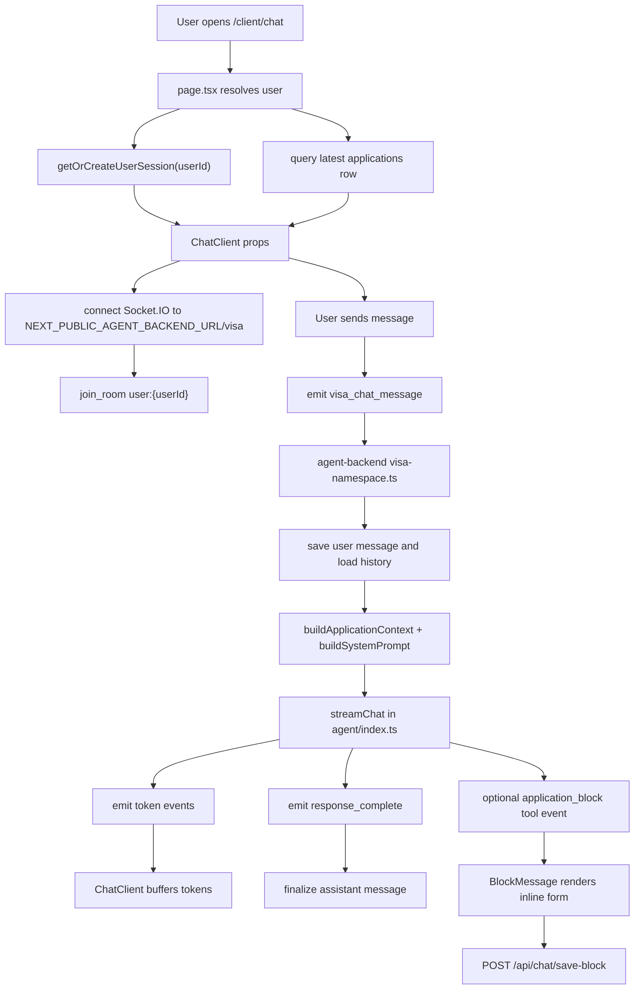

# VIZA AI Chat Development Guide (DG)

## 1. 页面在哪里

截图对应的是客户端门户里的 `/client/chat` 页面。

核心文件：

- `viza-fe/internal-website/app/client/chat/page.tsx`  
  Next.js server route entry。负责拿当前登录用户、创建或读取聊天 session、查询用户最新 application，然后把数据传给 client component。

- `viza-fe/internal-website/app/client/chat/chat-client.tsx`  
  截图中真正的页面 UI。这里包含 `VIZA AI / Travel AI` 切换、聊天消息列表、底部输入框、Socket.IO 连接、流式输出处理，以及嵌入式 Travel AI。

相关共享组件：

- `viza-fe/internal-website/components/client/companion/chat-input.tsx`  
  底部 `Ask anything...` 输入框。

- `viza-fe/internal-website/components/client/companion/chat-message.tsx`  
  用户气泡和 AI 文本消息的渲染。

- `viza-fe/internal-website/components/client/companion/block-message.tsx`  
  AI 工具返回 application block 时，渲染可填写的小表单。

- `viza-fe/internal-website/app/client/travel-chat/travel-chat-client.tsx`  
  `Travel AI` tab 嵌入的旅行规划主组件。

## 2. 当前截图对应的 UI 结构

`chat-client.tsx` 里有两个主要状态：

- `showChat`  
  `false` 时显示入口选择页；`true` 时显示截图这种聊天页。它会读取 `sessionStorage.getItem("viza_chat_active")`，所以用户进入过聊天后会保持聊天视图。

- `chatMode`  
  `"viza"` 渲染 VIZA AI 对话；`"travel"` 渲染嵌入式 Travel Chat。

截图里的元素来源：

- 顶部 `VIZA AI / Travel AI` pills：`chat-client.tsx` 的 chat view tab controls。
- 右侧深蓝色 `hi` 气泡：`ChatMessage` 渲染 user message。
- 左侧大段 `Hi there...`：不是前端固定文案，而是从聊天历史或后端 AI streaming response 进入 `ChatMessage`。
- 底部 `Ask anything...`：`ChatInput` 默认 placeholder。
- `Travel AI` 点击后：同一个页面内渲染 `TravelChatClient applicationId={travelApplicationId} embedded`。

## 3. 高层链路



## 4. 前端逻辑关系

### 4.1 Server route: `page.tsx`

职责很窄：

1. 通过 impersonation session 或 Supabase session 获取 `userId`。
2. 没有登录用户就 redirect 到 `/client/login`。
3. 调用 `getOrCreateUserSession(userId)`，拿到初始 session 和历史消息。
4. 用 `createAdminClient()` 查当前用户最新 application 的 `id/status`。
5. 渲染 `ChatClient`。

### 4.2 Client route: `chat-client.tsx`

它同时管理 UI、Socket.IO、streaming、scroll 和 Travel tab。

主要状态：

- `sessionId`：来自 `page.tsx` 的初始 session。
- `showChat`：入口页或聊天页。
- `chatMode`：`viza` 或 `travel`。
- `status`：Socket 连接状态，控制输入框是否 disabled。
- `socketMessages`：Socket 实时消息暂存。
- `chatMessages`：`useContinuousChat` 维护的最终消息列表。
- `pendingMessages`：断线时暂存，重连后发送。
- `queuedMessageRef`：AI 正在 streaming 时，用户下一条消息排队。
- `blockMessages`：后端工具 `send_application_block` 返回的表单块。

消息合并方式：

1. 用户发送后，`socketSendMessage()` 先把 user message 加到 `socketMessages`。
2. 同时插入一个空的 streaming assistant message。
3. 后端 `token` event 到达时先进入 buffer，每 500ms flush 到当前 assistant message。
4. `response_complete` 到达时，用 `fullResponse` 覆盖并结束 streaming。
5. `useEffect` 监听 `socketMessages`，再把变化同步进 `useContinuousChat` 的 `chatMessages`。

## 5. 后端逻辑关系

入口：

- `viza-be/agent-backend/src/index.ts`  
  创建 HTTP server 和 Socket.IO server，并注册 namespace `/visa`。

- `viza-be/agent-backend/src/socket/visa-namespace.ts`  
  处理前端发来的 `visa_chat_message`。

`visa_chat_message` 流程：

1. 尝试把用户消息写入 `visa_chat_messages`。
2. 从 `visa_chat_messages` 读取最近 50 条历史作为 LLM 上下文。
3. 调用 `buildApplicationContext(user_id)` 从 Supabase 读取 applicant profile 和最新 application。
4. 调用 `buildSystemPrompt(context)` 拼出动态 system prompt。
5. 调用 `streamChat()`，通过 Anthropic streaming 逐 token 返回。
6. 完成后保存 assistant message，并 emit `response_complete`。
7. 如果模型调用 `send_application_block`，后端 emit `application_block`，前端渲染 `BlockMessage`。

Agent 核心：

- `viza-be/agent-backend/src/agent/index.ts`
  - `BASE_SYSTEM_PROMPT` 定义 VIZA AI 的角色和边界。
  - `buildApplicationContext()` 读取用户资料和 application。
  - `buildSystemPrompt()` 把用户上下文注入 system prompt。
  - `streamChat()` 调用 Anthropic，并注册 `send_application_block` tool。

## 6. 数据与持久化

相关表：

- `user_chat_sessions`  
  当前前端 `getOrCreateUserSession()` 用它做“每个 auth user 一个持久 session”。

- `visa_chat_sessions`  
  旧的/另一套 visa chat session 表，`visa_chat_messages` 的历史查询 join 还依赖它。

- `visa_chat_messages`  
  保存用户、assistant，以及 `role='block'` 的 inline application block 记录。

当前需要注意的一点：

`getOrCreateUserSession()` 返回的是 `user_chat_sessions.id`，但多处历史查询仍 join `visa_chat_sessions`，后端 Drizzle schema 里 `visa_chat_messages.session_id` 也属于 visa chat message 语义。这里存在 session 表模型不统一的风险：如果数据库 FK 仍要求 `visa_chat_messages.session_id -> visa_chat_sessions.id`，那么使用 `user_chat_sessions.id` 作为 socket `session_id` 可能导致消息无法持久化，只能短暂 streaming。

## 7. Application block 保存链路

当后端 agent 判断需要收集结构化资料时，会调用 `send_application_block` tool。

链路：

1. `agent/index.ts` 定义 tool schema。
2. `visa-namespace.ts` 收到 tool use 后 emit `application_block`。
3. `chat-client.tsx` 把 payload 存到 `blockMessages`。
4. `BlockMessage` 渲染表单。
5. 用户保存后，前端请求 `POST /api/chat/save-block`。
6. `save-block/route.ts` 根据 `saveTarget` 更新：
   - `applicant_profiles`
   - `applications`

## 8. Travel AI 的关系

`Travel AI` 不是这页自己实现的旅行逻辑。它只是由 `chat-client.tsx` 嵌入：

```tsx
<TravelChatClient applicationId={travelApplicationId} embedded />
```

真正的 Travel 流程应看：

- `docs/travel-agent-development-guide.md`
- `viza-fe/internal-website/components/client/travel/AGENTS.md`
- `viza-fe/internal-website/app/client/travel-chat/travel-chat-client.tsx`
- `viza-fe/internal-website/lib/travel/planner.ts`

改 `Travel AI` 业务时，不要在 `chat-client.tsx` 里复制旅行状态机。

## 9. 环境变量

Frontend:

```env
NEXT_PUBLIC_AGENT_BACKEND_URL=http://localhost:3002
```

Agent Backend:

```env
PORT=3002
CORS_ORIGINS=http://localhost:3000
ANTHROPIC_API_KEY=
SUPABASE_URL=
SUPABASE_SERVICE_ROLE_KEY=
```

如果 `ANTHROPIC_API_KEY` 没配，`streamChat()` 会返回固定 fallback：AI 服务还没配置。

## 10. 做到什么程度了

已经实现的部分：

- `/client/chat` 路由存在，并接入客户端登录态/impersonation。
- 页面 UI 已经有入口选择页和截图里的聊天页。
- `VIZA AI / Travel AI` tab 已经接好。
- VIZA AI 前端已经能连接 `agent-backend` 的 `/visa` namespace。
- 前端已经支持 token streaming、response finalize、断线排队、streaming 时排队下一条用户消息。
- 历史消息 hook `useContinuousChat` 已经存在，支持向上加载、搜索、jump to message 等能力。
- 后端已经有动态 system prompt，能把 profile/application context 注入给 VIZA AI。
- 后端已经有 `send_application_block` tool，前端也有 inline block 渲染和保存 API。

还需要重点确认/补齐的部分：

- Session 持久化模型需要统一：`user_chat_sessions` 和 `visa_chat_sessions` 目前在链路里混用。
- `chat-client.tsx` 文件很大，后续如果继续加功能，建议拆出 Socket hook 和 message list 子组件。
- `travelApplicationStatus` 已传入 `ChatClient`，但当前 VIZA/Travel tab 渲染里基本没有使用。
- Debug panel 状态现在固定为 `false`，实际排查 streaming 时需要临时打开或改成受控入口。

## 11. 修改前检查清单

Frontend:

```powershell
cd viza-fe/internal-website
npm run type-check
```

Backend:

```powershell
cd viza-be/agent-backend
npm run type-check
```

手动验证：

1. 未登录访问 `/client/chat` 会跳登录。
2. 已登录打开 `/client/chat` 能看到 chat 页面。
3. `VIZA AI` tab 发送消息后，后端 streaming 正常。
4. 刷新后历史消息能恢复。
5. `Travel AI` tab 能正常嵌入 Travel planner。
6. 如果 agent 返回 application block，表单能保存到目标表。
