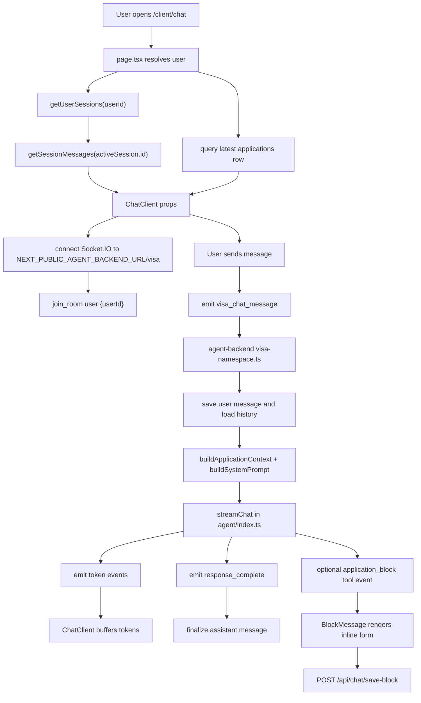

# VIZA AI Chat Development Guide (DG)

## 1. 页面在哪里

截图对应的是客户端门户里的 `/client/chat` 页面。

核心文件：

- `viza-fe/internal-website/app/client/chat/page.tsx`  
  Next.js server route entry。负责拿当前登录用户、读取最近的 `visa_chat_sessions` 列表、加载默认 active session 的消息、查询用户最新 application，然后把数据传给 client component。

- `viza-fe/internal-website/app/client/chat/chat-client.tsx`  
  截图中真正的页面 UI。这里包含 `VIZA AI / Travel AI` 切换、聊天消息列表、底部输入框、Socket.IO 连接、流式输出处理，以及嵌入式 Travel AI。

相关共享组件：

- `viza-fe/internal-website/components/client/companion/chat-input.tsx`  
  底部 `Ask anything...` 输入框。

- `viza-fe/internal-website/components/client/companion/chat-message.tsx`  
  用户气泡和 AI 文本消息的渲染。

- `viza-fe/internal-website/components/client/companion/block-message.tsx`  
  AI 工具返回 application block 时，渲染可填写的小表单。

- `viza-fe/internal-website/app/client/travel-chat/travel-chat-client.tsx`  
  `Travel AI` tab 嵌入的旅行规划主组件。

## 2. 当前截图对应的 UI 结构

`chat-client.tsx` 里有两个主要状态：

- `showChat`  
  `false` 时显示入口选择页；`true` 时显示截图这种聊天页。它会读取 `sessionStorage.getItem("viza_chat_active")`，所以用户进入过聊天后会保持聊天视图。

- `chatMode`  
  `"viza"` 渲染 VIZA AI 对话；`"travel"` 渲染嵌入式 Travel Chat。

截图里的元素来源：

- 左侧/移动端抽屉 `VIZA chats`：`chat-client.tsx` 读取 `visa_chat_sessions`，允许像 Travel AI 一样维护多个独立 conversation process；桌面侧栏可折叠。
- 顶部 `VIZA AI / Travel AI` pills：`chat-client.tsx` 的 chat view tab controls。
- 右侧深蓝色 `hi` 气泡：`ChatMessage` 渲染 user message。
- 左侧大段 `Hi there...`：不是前端固定文案，而是从聊天历史或后端 AI streaming response 进入 `ChatMessage`。
- 底部 `Ask anything...`：`ChatInput` 默认 placeholder。
- `Travel AI` 点击后：同一个页面内渲染 `TravelChatClient applicationId={travelApplicationId} embedded`。

## 3. 高层链路



## 4. 前端逻辑关系

### 4.1 Server route: `page.tsx`

职责很窄：

1. 通过 impersonation session 或 Supabase session 获取 `userId`。
2. 没有登录用户就 redirect 到 `/client/login`。
3. 调用 `getUserSessions(userId)` 读取最近会话列表，默认使用最新一条作为 active session。
4. 如果有 active session，调用 `getSessionMessages(activeSession.id, userId)` 加载该 process 的历史消息。
5. 用 `createAdminClient()` 查当前用户最新 application 的 `id/status`。
6. 渲染 `ChatClient`。

### 4.2 Client route: `chat-client.tsx`

它同时管理 UI、Socket.IO、streaming、scroll 和 Travel tab。

主要状态：

- `sessionId`：来自 `page.tsx` 的初始 session。
- `sessions`：当前用户最近的 `visa_chat_sessions`，用于桌面左侧栏和移动端抽屉。
- `showChat`：入口页或聊天页。
- `chatMode`：`viza` 或 `travel`。
- `status`：Socket 连接状态，控制输入框是否 disabled。
- `socketMessages`：Socket 实时消息暂存。
- `chatMessages`：`useContinuousChat` 维护的最终消息列表。
- `pendingMessages`：断线时暂存，重连后发送。
- `queuedMessageRef`：AI 正在 streaming 时，用户下一条消息排队。
- `blockMessages`：后端工具 `send_application_block` 返回的表单块。

消息合并方式：

1. 用户发送后，`socketSendMessage()` 先把 user message 加到 `socketMessages`。
2. 同时插入一个空的 streaming assistant message。
3. 后端 `token` event 到达时先进入 buffer，每 500ms flush 到当前 assistant message。
4. `response_complete` 到达时，用 `fullResponse` 覆盖并结束 streaming。
5. `useEffect` 监听 `socketMessages`，再把变化同步进 `useContinuousChat` 的 `chatMessages`。

多 conversation process：

1. `page.tsx` 不再自动创建空 session；它只读取已有 session 列表。
2. 用户点击 `New chat` 时，前端先把 active `sessionId` 设为 `null` 并清空当前消息。
3. 用户在新 process 里发送第一条消息时，`createSession(userId, applicationId)` 才写入新的 `visa_chat_sessions`。
4. 切换已有 session 时，`getSessionMessages()` 只加载该 session 的消息；`useContinuousChat` 的向上加载也会带 `sessionId`，避免混入其他 process。

## 5. 后端逻辑关系

入口：

- `viza-be/agent-backend/src/index.ts`  
  创建 HTTP server 和 Socket.IO server，并注册 namespace `/visa`。

- `viza-be/agent-backend/src/socket/visa-namespace.ts`  
  处理前端发来的 `visa_chat_message`。

`visa_chat_message` 流程：

1. 尝试把用户消息写入 `visa_chat_messages`。
2. 从 `visa_chat_messages` 读取最近 50 条历史作为 LLM 上下文。
3. 调用 `buildApplicationContext(user_id)` 从 Supabase 读取 applicant profile 和最新 application。
4. 调用 `retrieveVisaKnowledge()`，按用户问题 + application country/visa type 检索 `visa_chunks`。
5. 调用 `buildSystemPrompt(context, knowledgeContext)` 拼出动态 system prompt。
6. 调用 `streamChat()`，通过 Anthropic streaming 逐 token 返回。
7. 完成后保存 assistant message，并 emit `response_complete`。
8. 如果模型调用 `send_application_block`，后端 emit `application_block`，前端渲染 `BlockMessage`。

Agent 核心：

- `viza-be/agent-backend/src/agent/index.ts`
  - `BASE_SYSTEM_PROMPT` 定义 VIZA AI 的角色和边界。
  - `buildApplicationContext()` 读取用户资料和 application。
  - `buildSystemPrompt()` 把用户上下文注入 system prompt。
  - `streamChat()` 调用 Anthropic，并注册 `send_application_block` tool。

RAG 检索服务：

- `viza-be/agent-backend/src/services/visa-knowledge.service.ts`
  - `retrieveVisaKnowledge()` 负责把用户问题转成 embedding，并查询 `visa_chunks`。
  - 优先调用 Supabase RPC `match_visa_chunks` 做 pgvector 相似度检索。
  - RPC/embedding 不可用时，会 fallback 到按 country / visa type / document type 过滤 `visa_chunks`。
  - 默认 `minSimilarity` 是 `0.03`；原因是当前 Supabase RPC 返回的多语种相似度分数整体偏低，country/visaType 过滤负责控制噪音。
  - `formatKnowledgeContext()` 把检索结果整理成可注入 system prompt 的上下文块。

RAG migration：

- `viza-be/agent-backend/drizzle/0012_match_visa_chunks.sql`
  - 创建 `match_visa_chunks()` RPC。
  - 支持 `country`、`visa_type`、`document_type[]`、`min_similarity` 过滤。
  - 返回 chunk 内容、source title/url 和 similarity。

RAG 知识源与写入：

- `knowledge-base/indonesia-visa-rag.json`
  - 官方来源整理后的 Indonesia visa chunks。
  - 当前覆盖 e-Visa portal、Arrival Card、VoA/e-VOA、中国游客短期旅游、C1 旅游访问签、延期规则、禁止活动与 sponsor 注意事项。

- `viza-be/agent-backend/scripts/ingest-indonesia-visa-rag.ts`
  - 读取上面的 JSON。
  - 删除同 country / visa type / document type / source URL / title 的旧 Indonesia RAG 文档后重新写入。
  - 有 `OPENAI_API_KEY` 时写入 `text-embedding-3-small` embedding；没有 key 时仍写入 chunk，供 filtered fallback 使用。

- `knowledge-base/us-visa-rag.json`
  - 官方来源整理后的 U.S. visitor visa chunks。
  - 当前覆盖 B-1/B-2 适用目的、禁止活动、DS-160、申请流程、费用、材料、面签、VWP/ESTA、预约等待时间、行政审理、以及中国公民 10 年 B 类签证 EVUS。

- `viza-be/agent-backend/scripts/ingest-us-visa-rag.ts`
  - 读取上面的 JSON。
  - 删除同 country / visa type / document type / source URL / title 的旧 U.S. RAG 文档后重新写入，避免多个知识文档共用同一个官方页面时互相覆盖。
  - 有 `OPENAI_API_KEY` 时写入 `text-embedding-3-small` embedding；没有 key 时仍写入 chunk，供 filtered fallback 使用。

- `knowledge-base/supported-visa-rag.json`
  - 官方来源整理后的 Vietnam / UK / France / Italy / Switzerland 短期访问签证 chunks。
  - 当前覆盖越南 e-visa、英国 Standard Visitor、法国 tourism/private stay、意大利 Uniform Schengen Visa、瑞士 90 天内 Schengen route，以及 France/Italy/Switzerland 共用的 Schengen 申请规则。

- `viza-be/agent-backend/scripts/ingest-supported-visa-rag.ts`
  - 读取上面的 JSON。
  - 删除同 country / visa type / document type / source URL / title 的旧 supported-country RAG 文档后重新写入。
  - 有 `OPENAI_API_KEY` 时写入 `text-embedding-3-small` embedding；没有 key 时仍写入 chunk，供 filtered fallback 使用。

## 6. 数据与持久化

相关表：

- `visa_chat_sessions`  
  当前 `/client/chat` 的 session source of truth。一个 applicant 可以有多条 VIZA conversation processes；`ChatClient` 通过 `getUserSessions()` 展示最近会话，通过 `createSession()` 创建新会话。

- `visa_chat_messages`  
  保存用户、assistant，以及 `role='block'` 的 inline application block 记录。`session_id` 指向 `visa_chat_sessions.id`。

当前约定：

前端传给 Socket.IO 的 `user_id` 是 `applicant_profiles.id`，`session_id` 是当前 active `visa_chat_sessions.id`。后端 `buildApplicationContext()` 优先按 `applicant_profiles.id` 查 profile，并保留 `auth_user_id` fallback 兼容旧调用。`user_chat_sessions` 仍存在于旧 migration 中，但本页面不再使用它作为 message parent。

## 7. Application block 保存链路

当后端 agent 判断需要收集结构化资料时，会调用 `send_application_block` tool。

链路：

1. `agent/index.ts` 定义 tool schema。
2. `visa-namespace.ts` 收到 tool use 后 emit `application_block`。
3. `chat-client.tsx` 把 payload 存到 `blockMessages`。
4. `BlockMessage` 渲染表单。
5. 用户保存后，前端请求 `POST /api/chat/save-block`。
6. `save-block/route.ts` 根据 `saveTarget` 更新：
   - `applicant_profiles`
   - `applications`

## 8. Travel AI 的关系

`Travel AI` 不是这页自己实现的旅行逻辑。它只是由 `chat-client.tsx` 嵌入：

```tsx
<TravelChatClient applicationId={travelApplicationId} embedded />
```

真正的 Travel 流程应看：

- `docs/travel-agent-development-guide.md`
- `viza-fe/internal-website/components/client/travel/AGENTS.md`
- `viza-fe/internal-website/app/client/travel-chat/travel-chat-client.tsx`
- `viza-fe/internal-website/lib/travel/planner.ts`

改 `Travel AI` 业务时，不要在 `chat-client.tsx` 里复制旅行状态机。

## 9. 环境变量

Frontend:

```env
NEXT_PUBLIC_AGENT_BACKEND_URL=http://localhost:3002
```

Agent Backend:

```env
PORT=3002
CORS_ORIGINS=http://localhost:3000
ANTHROPIC_API_KEY=
OPENAI_API_KEY=
SUPABASE_URL=
SUPABASE_SERVICE_ROLE_KEY=
```

如果 `ANTHROPIC_API_KEY` 没配，`streamChat()` 会返回固定 fallback：AI 服务还没配置。`OPENAI_API_KEY` 用于生成 `text-embedding-3-small` embedding；不要把真实 key 提交进 git。

## 10. 做到什么程度了

已经实现的部分：

- `/client/chat` 路由存在，并接入客户端登录态/impersonation。
- 聊天 session 已统一到 `visa_chat_sessions.id`，避免 `visa_chat_messages.session_id` 指向错误的 session 表。
- VIZA AI 已支持多个 conversation processes：页面加载最近 session 列表，左侧/移动端抽屉可以新建和切换；新 session 在第一条消息发送时创建。
- `/client/chat` 保持浅色背景和原有 `VIZA AI / Travel AI` tab 位置；processes 侧栏可折叠。
- RAG 检索 helper 已新增，能读取 `visa_chunks` 并格式化知识上下文。
- `match_visa_chunks` RPC migration 已新增；应用 migration 后可启用 pgvector 相似度检索。
- `/visa` Socket chat 已接入 RAG：每条用户消息会先检索 `visa_chunks`，再把知识上下文注入 VIZA AI 的 system prompt。
- VIZA AI 的 system prompt 已改成多目的地签证助手，不再把自己定义为 Indonesia-only，也不会在用户没说目的地时默认查 Indonesia。
- `/visa` 的 knowledge routing 已支持 Vietnam、UK、France、Italy、Switzerland、U.S.、Indonesia；多个国家或泛 Schengen 问题不会被旧 application country 拉回 Indonesia。
- Indonesia visa 官方知识源与 ingestion 脚本已新增。RAG 内容覆盖中国游客 7 天赴印尼应优先考虑 VoA/e-VOA，而不是美国 B-2/DS-160。
- Indonesia RAG 已写入 Supabase：`visa_documents` 6 条，`visa_chunks` 12 条，均为 `country=indonesia`、`visa_type=tourist_b211a`。
- 页面 UI 已经有入口选择页和截图里的聊天页。
- `VIZA AI / Travel AI` tab 已经接好。
- VIZA AI 前端已经能连接 `agent-backend` 的 `/visa` namespace。
- 前端已经支持 token streaming、response finalize、断线排队、streaming 时排队下一条用户消息。
- 历史消息 hook `useContinuousChat` 已经存在，支持向上加载、搜索、jump to message 等能力。
- 后端已经有动态 system prompt，能把 profile/application context 注入给 VIZA AI。
- 后端已经有 `send_application_block` tool，前端也有 inline block 渲染和保存 API。

还需要重点确认/补齐的部分：

- 当前 Supabase 已应用 `0012_match_visa_chunks.sql`，`match_visa_chunks` RPC 可用；新环境仍需重新应用该 SQL，否则会走 filtered fallback。
- `OPENAI_API_KEY` 已更新为可调用 `text-embedding-3-small` 的 key；Indonesia RAG 和 U.S. RAG 都已重跑 ingestion，并写入 embeddings。
- 本机直连 Postgres 执行 SQL 时曾遇到 Supabase IPv6 direct host 连接问题；可用 Supabase SQL Editor 或可访问 DB host 的环境应用 migration。应用前 RAG service 会先尝试 RPC，然后 fallback 到 country/visa type filtered query。
- `chat-client.tsx` 文件很大，后续如果继续加功能，建议拆出 Socket hook 和 message list 子组件。
- `travelApplicationStatus` 已传入 `ChatClient`，但当前 VIZA/Travel tab 渲染里基本没有使用。
- Debug panel 状态现在固定为 `false`，实际排查 streaming 时需要临时打开或改成受控入口。

## 11. 修改前检查清单

Frontend:

```powershell
cd viza-fe/internal-website
npm run type-check
```

Backend:

```powershell
cd viza-be/agent-backend
npm run type-check
```

手动验证：

1. 未登录访问 `/client/chat` 会跳登录。
2. 已登录打开 `/client/chat` 能看到 chat 页面。
3. `VIZA AI` tab 发送消息后，后端 streaming 正常。
4. 刷新后历史消息能恢复。
5. `Travel AI` tab 能正常嵌入 Travel planner。
6. 如果 agent 返回 application block，表单能保存到目标表。

## 12. 当前验证状态

本轮 RAG 接入按步骤验证：

- Step 1 session persistence：`viza-fe/internal-website npm run type-check` 通过；`viza-be/agent-backend npm run type-check` 通过；Playwright smoke screenshot: `test-results/playwright-step1-chat.png`。
- Step 2 RAG service：`viza-be/agent-backend npm run type-check` 通过；Playwright smoke screenshot: `test-results/playwright-step2-chat.png`。
- Step 3 SQL migration：`viza-be/agent-backend npm run type-check` 通过；`git diff --check` 通过；Playwright smoke screenshot: `test-results/playwright-step3-chat.png`。
- Step 4 `/visa` RAG integration：前后端 type-check 均通过；Playwright 验证 frontend `/client/chat` 未登录 redirect 和 backend `/health`，screenshot: `test-results/playwright-step4-chat.png`。
- Step 5 Indonesia RAG content ingestion：`npm run ingest:indonesia-visa-rag` 成功写入 6 documents / 12 chunks；retrieval smoke test 对“中国护照，印尼旅游7天”返回 5 个 Indonesia chunks；由于 embedding 不可用，结果使用 `embedding_unavailable` fallback。
- Step 6 OpenAI key retest：新 key 调用 `text-embedding-3-small` 成功，返回 1536 维；`npm run ingest:indonesia-visa-rag` 成功写入 12/12 embeddings。Supabase count: 6 Indonesia documents, 12 Indonesia chunks, 12 embedded chunks. Retrieval smoke 目前仍走 `vector_search_failed` fallback，因为 `match_visa_chunks` RPC 尚未应用到 Supabase。
- Step 7 pgvector RPC：`match_visa_chunks` 已应用到 Supabase 并可调用。RAG service 会优先用 vector search；如果 vector 相似度没有命中，会自动回退到 Indonesia filtered chunks，避免空上下文。
- Step 8 vector retrieval verification：对“中国护照，去印尼旅游7天，应该申请什么签证？”的 retrieval smoke 返回 `usedEmbedding=true`，命中 Indonesia chunks；英文同类问题相似度更高并命中 e-VOA/VoA chunks。前后端 type-check 通过；Playwright smoke screenshot: `test-results/playwright-rag-vector-chat.png`。
- Step 9 U.S. RAG source：新增 U.S. B-1/B-2/DS-160/VWP/EVUS 官方知识源与 ingestion 脚本；`/visa` knowledge routing 会在用户明确提到美国/美签/US/United States 时检索 `country=us`。
- Step 10 U.S. RAG ingestion verification：`npm run ingest:us-visa-rag` 成功写入 7 documents / 20 chunks / 20 embeddings。对“中国护照，去美国旅游7天，应该申请什么签证？”的 retrieval smoke 返回 `usedEmbedding=true`、`fallbackReason=null`、`country=us`、`visaType=b1_b2`，Top 1 命中中文桥接 chunk，相似度约 0.708。前后端 type-check 通过；Playwright smoke screenshot: `test-results/playwright-us-rag-final-smoke.png`。
- Step 11 VIZA multi-session processes：参考 Travel AI 的多 conversation 模型，`/client/chat` 改为读取多个 `visa_chat_sessions`，支持左侧/移动端 session panel、新建 VIZA chat、切换历史 VIZA chat；新 process 在第一条消息时创建。切换 session 时会重置 runtime/历史加载状态，避免不同 process 的消息混在一起。`viza-fe/internal-website npm run type-check` 通过；Playwright smoke screenshot: `test-results/playwright-multi-session-history-reset.png`。
- Step 12 light layout rollback：按用户要求回退深色背景和深色颜色，恢复浅色 sidebar/cards/composer/message colors；保留 `VIZA AI / Travel AI` tab 原位置；桌面 VIZA processes 侧栏增加 collapse/expand 控制。`viza-fe/internal-website npm run type-check` 通过；Playwright route smoke screenshot: `test-results/playwright-layout-light-rollback-final.png`。
- Step 13 multi-country VIZA identity and RAG source：VIZA system prompt 和 `/visa` RAG routing 已改为多目的地，不再默认 Indonesia；新增 `knowledge-base/supported-visa-rag.json` 和 `npm run ingest:supported-visa-rag`，覆盖 Vietnam / UK / France / Italy / Switzerland 的官方短期访问签证知识。`npm run ingest:supported-visa-rag` 已成功写入 Supabase：Vietnam 1 docs / 3 chunks，UK 2 docs / 6 chunks，France 2 docs / 5 chunks，Italy 3 docs / 6 chunks，Switzerland 2 docs / 5 chunks，全部 25 chunks 均有 `text-embedding-3-small` embedding。Retrieval smoke 对五个国家和多国 Schengen query 均返回 `usedEmbedding=true`、`fallbackReason=null`；前后端 type-check 通过；Playwright route smoke screenshot: `test-results/playwright-supported-rag-ingestion-step3.png`。

当前 Playwright 复查没有使用登录态测试账号，因此覆盖的是 route-level smoke test。完整对话级验证还需要一个可用 client 测试账号或浏览器登录态。
