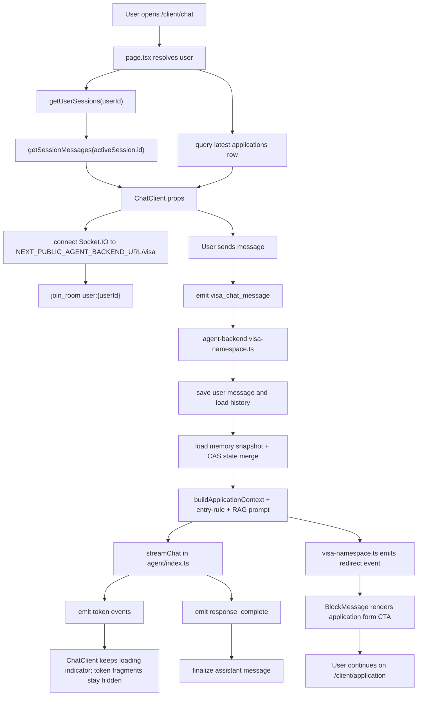

# VIZA AI Chat Development Guide (DG)

## 1. 页面在哪里

截图对应的是客户端门户里的 `/client/chat` 页面。

核心文件：

- `viza-fe/internal-website/app/client/chat/page.tsx`  
  Next.js server route entry。负责拿当前登录用户、读取最近的 `visa_chat_sessions` 列表、加载默认 active session 的消息、查询用户最新 application，然后把数据传给 client component。

- `viza-fe/internal-website/app/client/chat/chat-client.tsx`  
  截图中真正的页面 UI。这里包含 `VIZA AI / Travel AI` 切换、聊天消息列表、底部输入框、Socket.IO 连接、流式输出处理，以及嵌入式 Travel AI。

相关共享组件：

- `viza-fe/internal-website/components/client/companion/chat-input.tsx`  
  底部 `Ask anything...` 输入框。

- `viza-fe/internal-website/components/client/companion/chat-message.tsx`  
  用户气泡和 AI 文本消息的渲染。AI 消息默认纯文本显示，会把常见 Markdown 标记转成普通文字，避免 VIZA 回答呈现为 Markdown 富文本。

- `viza-fe/internal-website/components/client/companion/block-message.tsx`  
  AI 发出 application redirect block 时，渲染跳转到 `/client/application` 的 CTA。VIZA chat 不在对话里收集申请表字段。

- `viza-fe/internal-website/app/client/chat/legacy-application-blocks.ts`
  兼容早期只保存文字申请链接、没有保存 `role='block'` 的历史消息；识别到旧的新加坡电子入境卡办理链接时，补成 VIZA 表单卡片并去重。

- `viza-fe/internal-website/app/client/travel-chat/travel-chat-client.tsx`  
  `Travel AI` tab 嵌入的旅行规划主组件。

## 2. 当前截图对应的 UI 结构

`chat-client.tsx` 里有两个主要状态：

- `showChat`  
  `false` 时显示入口选择页；`true` 时显示截图这种聊天页。它会读取 `sessionStorage.getItem("viza_chat_active")`，所以用户进入过聊天后会保持聊天视图。

- `chatMode`  
  `"viza"` 渲染 VIZA AI 对话；`"travel"` 渲染嵌入式 Travel Chat。

截图里的元素来源：

- 左侧/移动端抽屉 `VIZA chats`：`chat-client.tsx` 读取 `visa_chat_sessions`，允许像 Travel AI 一样维护多个独立 conversation process；桌面默认显示为与页面融合的无边框 rail，收起或展开都不推动或重排中间的 AI 输出。
- 顶部 `VIZA AI / Travel AI` pills：`chat-client.tsx` 的 chat view tab controls。
- 右侧深蓝色 `hi` 气泡：`ChatMessage` 渲染 user message。
- 左侧大段 `Hi there...`：不是前端固定文案，而是从聊天历史或后端 AI 完整响应进入 `ChatMessage`；生成期间仅显示加载动画。
- 底部 `Ask anything...`：`ChatInput` 默认 placeholder。
- `Travel AI` 点击后：同一个页面内渲染 `TravelChatClient applicationId={travelApplicationId} embedded`。

## 3. 高层链路


```mermaid
flowchart TD
  A["User opens /client/chat"] --> B["page.tsx resolves user"]
  B --> C["getUserSessions(userId)"]
  C --> C2["getSessionMessages(activeSession.id)"]
  B --> D["query latest applications row"]
  C2 --> E["ChatClient props"]
  D --> E
  E --> F["connect Socket.IO to NEXT_PUBLIC_AGENT_BACKEND_URL/visa"]
  F --> G["join_room user:{userId}"]
  E --> H["User sends message"]
  H --> I["emit visa_chat_message"]
  I --> J["agent-backend visa-namespace.ts"]
  J --> K["save user message and load history"]
  K --> K2["load memory snapshot + CAS state merge"]
  K2 --> L["buildApplicationContext + entry-rule + RAG prompt"]
  L --> M["streamChat in agent/index.ts"]
  L --> P["visa-namespace.ts emits redirect event"]
  M --> N["emit token events"]
  M --> O["emit response_complete"]
  N --> Q["ChatClient keeps loading indicator; token fragments stay hidden"]
  O --> R["finalize assistant message"]
  P --> S["BlockMessage renders application form CTA"]
  S --> T["User continues on /client/application"]
```

## 4. 前端逻辑关系

### 4.1 Server route: `page.tsx`

职责很窄：

1. 通过 impersonation session 或 Supabase session 获取 `userId`。
2. 没有登录用户就 redirect 到 `/client/login`。
3. 调用 `getUserSessions(userId)` 读取最近会话列表，默认使用最新一条作为 active session。
4. 如果有 active session，调用 `getSessionMessages(activeSession.id, userId)` 加载该 process 的历史消息。
5. 用 `createAdminClient()` 查当前用户最新 application 的 `id/status`。
6. 渲染 `ChatClient`。

`getUserSessions()` 先读取当前用户最近 30 条 session 的必要字段，再通过一次
嵌套读取为这些已授权 session 各取最早一条 `role='user'` 消息；别名
`first_user_message` 的排序与 limit 作用于每个 session，不是整批只取一条。
标题 marker 仍单独读取，跳过无效/空白的新 marker 后使用最近的有效标题。
首消息查询失败时标题仍可用；标题失败时预览仍可用。最终过滤空会话并返回
最多 10 条。保持左关联、身份校验和每次请求的数据隔离，不添加跨用户缓存。
测试见 `app/actions/companion-sessions.test.ts` 与
`lib/supabase/companion-session-preview.integration.test.ts`。

开页与会话切换的 `getSessionMessages()` 将会话归属和消息读取合并为一次
数据库请求：消息关联 `visa_chat_sessions!inner(applicant_id)`，同时筛选当前
已鉴权 applicant 和请求的 session ID。保留最近 50 条非 system 消息、返回
时的时间正序和 `block_data`；不属于本人、会话不存在或查询错误均返回空列表。
相关覆盖见 `app/actions/companion-session-messages.test.ts` 和
`lib/supabase/companion-session-messages.integration.test.ts`。

### 4.2 Client route: `chat-client.tsx`

它同时管理 UI、Socket.IO、streaming、scroll 和 Travel tab。

主要状态：

- `sessionId`：来自 `page.tsx` 的初始 session。
- `sessions`：当前用户最近的 `visa_chat_sessions`，用于桌面左侧栏和移动端抽屉。
- `showChat`：入口页或聊天页。
- `chatMode`：`viza` 或 `travel`。
- `sessionPanelCollapsed` / `sessionPanelOpen`：VIZA process rail 桌面默认打开，移动端按需展开为 drawer。它不改变 `VIZA AI / Travel AI` tab 或消息内容的水平位置。
- `status`：Socket 连接状态，用于显示连接中状态和触发 pending messages flush；不要直接用它禁用输入框。
- `socketMessages`：Socket 实时消息暂存。
- `chatMessages`：`useContinuousChat` 维护的最终消息列表。
- `pendingMessages`：断线时暂存，重连后发送。
- `queuedMessageRef`：AI 正在 streaming 时，用户下一条消息排队。
- `blockMessages`：后端返回的 application redirect CTA。聊天页不再渲染行程/护照/日期等 inline form fields。

输入框启用规则：

- `ChatInput` 不能因为 Socket.IO 处于 `connecting` / `disconnected` / `error` 就 disabled。
- 断线或未连接时，`handleSendMessage()` 会把消息放进 `pendingMessages`，等 `status === "connected"` 后自动发送。
- 当前只应在本地 UI 正在切换/加载 session messages 时禁用输入框，避免用户把消息发到正在切换的 session。

消息合并方式：

1. 用户发送后，`socketSendMessage()` 先把 user message 加到 `socketMessages`。
2. 同时插入一个空的 streaming assistant message。
3. 生成期间仅显示 `ThinkingIndicator`，不消费或逐字显示 `token` event 中尚未完成解析的片段，避免空格丢失和半成品格式直接暴露给用户。
4. `response_complete` 到达时，立即用完整、已清理的 `fullResponse` 替换占位消息并结束 streaming，再交给 `ChatMessage` 做纯文本显示；不等待逐字动画。错误事件将占位消息替换为本地化的失败提示，不显示残缺回复。
5. `useEffect` 监听 `socketMessages`，再把变化同步进 `useContinuousChat` 的 `chatMessages`。

`app/client/chat/chat-client.test.tsx` 验证生成期间隐藏片段、完成后立即显示、失败提示和下一条消息排队的 Socket.IO 生命周期。

多 conversation process：

1. `page.tsx` 不再自动创建空 session；它只读取已有 session 列表。
2. 用户点击 `New chat` 时，前端先把 active `sessionId` 设为 `null` 并清空当前消息。
3. 用户在新 process 里发送第一条消息时，`createSession(userId, applicationId)` 才写入新的 `visa_chat_sessions`。
4. 切换已有 session 时，`getSessionMessages()` 只加载该 session 的消息；`useContinuousChat` 的向上加载也会带 `sessionId`，避免混入其他 process。当前 active process 会保存到 `sessionStorage["viza_chat_session_id"]`，刷新后客户端会自动恢复到用户上次选中的 process。
5. 新空 VIZA chat 会渲染 `messages/*/chat.emptyPromptTitle` 和本地化 starter prompts 组成的居中 start state；这些 display-only 内容不写入 `visa_chat_messages`，避免污染历史或重复保存。
6. Process 侧栏只保留一个显式 `New chat` 入口；每个 process 支持 rename 和 delete。Rename 使用明确的 Save / Cancel 操作，并通过隐藏 system marker 持久化；delete 删除 `visa_chat_sessions` 并由数据库 cascade 删除消息。
7. `getUserSessions()` 只返回有 title 或首条用户消息的非空 process；空白 draft session 不应抢占最新历史。前端会在发送 user message 和收到 `response_complete` 时调用 `ensureSessionMessage()` 做 Supabase-side 幂等保存，作为 agent-backend Socket 持久化失败时的兜底。
8. `role='block'` 的 application redirect 记录必须从 `block_data` 恢复为 `BlockMessage` CTA 卡片；历史会话、刷新后页面和实时 Socket 事件都应该显示同一个直达表单按钮。

## 5. 后端逻辑关系

入口：

- `viza-be/agent-backend/src/index.ts`  
  创建 HTTP server 和 Socket.IO server，并注册 namespace `/visa`。

- `viza-be/agent-backend/src/socket/visa-namespace.ts`  
  处理前端发来的 `visa_chat_message`。

`visa_chat_message` 流程：

1. 尝试把用户消息写入 `visa_chat_messages`。
2. 从 `visa_chat_messages` 读取最近 50 条历史作为 LLM 上下文；前端同时会随 `visa_chat_message` 发送最近可见聊天历史，后端在 DB 历史缺失或短于前端历史时用前端历史兜底，避免短答案只带当前一句进入模型。
3. 调用 `buildApplicationContext(user_id)` 从 Supabase 读取 applicant profile 和最新 application。
4. 调用 `buildCompactAnswerInterpretation()`，把 `中国护照，中国，7天，法国，意大利` 或 `2，5` 这类短答案映射回上一轮问题。
5. 调用 `retrieveVisaKnowledge()`，按当前用户问题 + 最近 user-only context + 兼容的 application country/visa type 检索 `visa_chunks`。
6. 调用 `buildSystemPrompt(context, knowledgeContext, conversationInterpretation)` 拼出动态 system prompt。
7. 调用 `streamChat()`，通过 OpenAI streaming 逐 token 返回。
8. 完成后保存 assistant message，并 emit `response_complete`。
9. 当用户明确要开始申请/填表时，后端 emit `application_block`，payload 使用 `blockType="application_redirect"`，前端渲染跳转按钮。

Agent 核心：

- `viza-be/agent-backend/src/agent/index.ts`
  - `BASE_SYSTEM_PROMPT` 定义 VIZA AI 的角色和边界。
  - `buildApplicationContext()` 读取用户资料和 application。
  - `buildSystemPrompt()` 把用户上下文、结构化 conversation state、RAG sources 注入 system prompt。
  - `streamChat()` 调用 OpenAI，模型默认 `gpt-4o-mini`，每轮最多输出 1024 tokens，stream deadline 默认 75 秒。没有显式 temperature、function tools 或 tool loop；`application_block` 是后端生成的 redirect event，不是模型 tool call。申请字段收集交给 `/client/application`。

RAG 检索服务：

- `viza-be/agent-backend/src/services/visa-knowledge.service.ts`
  - `retrieveVisaKnowledge()` 负责把用户问题转成 embedding，并查询 `visa_chunks`。
  - 支持 `intent` 参数：`route_recommendation`、`requirements`、`form_intake`、`fees_timing`、`eligibility`、`source_check`，按任务优先检索对应 `documentType`。
  - 优先调用 Supabase RPC `match_visa_chunks` 做 pgvector 相似度检索。
  - RPC/embedding 不可用时，会 fallback 到按 country / visa type / document type 过滤 `visa_chunks`。
  - 默认 top-k 是 5，代码把它限制在 1..12；runtime `minSimilarity` 默认是 `0.03`。SQL RPC 的独立默认值为 0.5，但服务会显式传入 0.03。向量为 `text-embedding-3-small` 的 1536 维 embedding。
  - 检索先按 intent 过滤 document type，未命中时再做 broad vector search；vector/embedding 失败后走 active-release 的 filtered REST fallback。REST fallback 没有相似度排序或 reranker，只返回过滤查询的 limit 行。
  - seed chunk 在入库时原样保留；runtime 没有统一 token chunker 或 overlap，embedding 输入最多取 8,000 字符。
  - `formatKnowledgeContext()` 把检索结果整理成可注入 system prompt 的上下文块。

RAG routing context:

- `viza-be/agent-backend/src/config/visa-destination-registry.ts` 是国家/签证配置源，维护 country key、display name、aliases、Schengen membership、default visitor visa type、RAG document types 和 form intake schema key。
- `visa-namespace.ts` 解析 RAG country / visa type 时优先使用结构化 conversation state，再使用当前用户消息 + 最近 user-only chat context。
- 这样用户按编号压缩回答时，例如 `中国，新加坡，不知道，会去别的国家`，系统仍能沿用上一轮用户提到的 main destination（如 Switzerland），同时不会把 `新加坡` 误当成目的地。
- application `visa_type` 只能在与解析出的 country 兼容时作为 fallback，避免默认 `tourist_b211a` 污染 Schengen/UK/U.S. 问题。
- `buildCompactAnswerInterpretation()` 是独立于 RAG 的上下文解释层：它读取上一轮 assistant 的编号问题或天数分配问题，把当前短答案映射成 slot/day-split note 注入 system prompt。例如瑞士主目的地后回答 `中国护照，中国，7天，法国，意大利` 会保留 Switzerland 并把 France/Italy 识别为 other Schengen countries；法国/意大利天数问题后回答 `2，5` 会映射为 France 2 days / Italy 5 days。
- 当前 RAG routing 以 `visa-destination-registry.ts` 和 `VISA_SERVICE_COUNTRIES` 为边界。registry 有 61 个 destination，当前 service set 有 56 个；`mexico`、`morocco`、`nepal`、`qatar`、`russia` 虽有 seed，但属于 dormant reference，不应生成申请 CTA 或详细 service answer。registry 中的 Schengen destination 统一使用 `EU_SCHENGEN_C_SHORT_STAY`，其他 canonical product 以及 legacy alias 由 registry 的 country-scoped mapping 决定。识别到未开通服务的目的地时，VIZA 应明确说明暂未开通，不做详细 RAG requirements 回答，也不提供申请表链接。

Structured conversation state:

- `viza-be/agent-backend/src/services/visa-conversation-state.service.ts` 维护 `VisaConversationState`，字段包括 destination countries、main destination、nationality、residence/apply-from、trip purpose、stay length、Schengen day split、first entry country、recommended visa type、missing slots 和 confidence。
- 每轮 `/visa` 消息先从 `visa_chat_sessions.memory_json` 和 `memory_revision` 读取 snapshot，再根据当前消息和 history 合并 slot patch；保存使用 CAS，之后用 state 驱动 RAG routing 和 system prompt。
- 若 snapshot 尚未存在或不可用，才从 `visa_chat_messages` 中 `role='system'` 且 `content` 以 `__viza_conversation_state__:` 开头的 legacy marker 恢复。该 marker 和 session title marker 一样，不应进入用户可见消息或 LLM chat history；新路径以 session memory 为首选。
- 用户更正目的地（如“不对，改成韩国”）时，state 会替换旧目的地，而不是继续把旧目的地混在 route 判断里。
- 显式 schema 还包含 `passportCountryIso3`、`passportType`、`residenceCity`、`fieldSources`、`updatedAt`。`saveVisaConversationState()` 用 `WHERE id=? AND memory_revision=expectedRevision` 的 CAS 更新，冲突后 namespace reload/rebase 并最多重试一次。

RAG migration：

- `viza-be/agent-backend/drizzle/0012_match_visa_chunks.sql`
  - 创建 `match_visa_chunks()` RPC。
  - 支持 `country`、`visa_type`、`document_type[]`、`min_similarity` 过滤。
  - 返回 chunk 内容、source title/url 和 similarity。
- `viza-be/agent-backend/drizzle/0123_viza_knowledge_releases_and_chat_memory.sql`
  - 将 RPC 限制到 active document/active release，并提供 staged release promotion gate。
  - promotion 要求 source metadata、chunks、embeddings 和 configured entry-rule matrix 完整。

RAG 知识源与写入：

- `knowledge-base/visa-rag-seeds/countries/*.json`
  - 国家级独立 RAG seed。每个文件只负责一个国家，当前共 61 个国家文件；当前 service set 仍由 backend registry 单独控制为 56 个。
  - 这是当前 country knowledge source of truth；历史的 `supported-visa-rag.json`、`us-visa-rag.json`、`indonesia-visa-rag.json` 不属于当前入口。
  - 当前 checked-in inventory 为 159 documents / 559 chunks，其中 70 个 `form_requirements` documents；这些是 source-file 统计，不是部署数据库计数。
  - 每个国家 seed 必须保留且只保留一个 `documentType="form_requirements"` 文档，用来描述官方申请入口、填表前应收集的字段、上传材料和提交前 review guardrails。

- `knowledge-base/visa-rag-seeds/README.md`
  - 记录国家 seed 的维护规则和 ingestion 命令。

- `viza-be/agent-backend/scripts/ingest-country-visa-rag.ts`
  - 读取一个或多个国家 seed，写入共享 `visa_documents` / `visa_chunks` 表。
  - 为 staged release 按 source key upsert document，替换该 document 的 chunks。
  - 需要 `OPENAI_API_KEY` 才能完成 country release；每个 embedding 最多 4 次总尝试（初始调用加 3 次 retry），每次 30 秒，退避 1s/2s/4s；响应维度必须是 1536。
  - 当前主命令没有 URL/PDF/FAQ 通用 crawler，也没有固定 chunk size/overlap；没有 embedding 时不能把该 staged release 当作可 promotion 的 active release。
  - 全量入库：`npm run ingest:all-visa-rag`。单国家入库：`npm run ingest:country-visa-rag -- --country japan`。多国家入库：`npm run ingest:country-visa-rag -- --countries japan,us,indonesia`。

`enrich:field-answer-norms-rag` 是独立的 official-URL enrichment：每国最多抓 10 个 URL，每个 topic 最多 3 个 360 字符 snippet；`ingest:photo-requirements-rag` 是独立 photo supplement，每个 excerpt 最多 700 字符，PDF 返回 `pdf_not_parsed`。两者都不由 country seed ingestion 自动调用；当前仓库也没有可执行的 `scripts/ingest-faqs.ts`，尽管 package.json 仍保留历史 `ingest:faqs` script。

## 6. 数据与持久化

相关表：

- `visa_chat_sessions`  
  当前 `/client/chat` 的 session source of truth。一个 applicant 可以有多条 VIZA conversation processes；`ChatClient` 通过 `getUserSessions()` 展示最近会话，通过 `createSession()` 创建新会话。

- `visa_chat_messages`  
  保存用户、assistant、`role='block'` 的 application redirect block 记录，以及隐藏 `role='system'` marker（session title / conversation state）。`session_id` 指向 `visa_chat_sessions.id`。

当前约定：

前端传给 Socket.IO 的 `user_id` 是 `applicant_profiles.id`，`session_id` 是当前 active `visa_chat_sessions.id`。后端 `buildApplicationContext()` 优先按 `applicant_profiles.id` 查 profile，并保留 `auth_user_id` fallback 兼容旧调用。`user_chat_sessions` 仍存在于旧 migration 中，但本页面不再使用它作为 message parent。

Session rename：

- 为避免依赖新的 DB column，rename 目前写入 `visa_chat_messages` 的隐藏 marker：`role='system'` 且 `content` 以 `__viza_session_title__:` 开头。
- `getUserSessions()` 会跳过无效/空白 marker，读取最近的有效 marker 作为 `Session.title`。
- `getSessionMessages()`、history load、search、recent messages、backend `/visa` chat history 都不能把这些 system marker 当作用户可见消息或 LLM 上下文。

## 7. Application redirect 链路

VIZA chat 的职责是解释签证路线、材料、费用/时间和注意事项；真正的申请字段收集放到 `/client/application`。当用户说“开始申请/帮我填表/下一步”时，后端不再在聊天里发可填写表单，而是发一个 redirect CTA。

链路：

1. `visa-namespace.ts` 识别 `form_intake` intent。
2. 如果已经能解析 destination / visa type，后端 emit `application_block`，payload 为 `blockType="application_redirect"`。
3. `chat-client.tsx` 把 payload 存到 `blockMessages`。
4. `BlockMessage` 只渲染跳转按钮，不渲染输入框。
5. 按钮跳转到 `/client/application?country=...&visaType=...`。
6. `/client/application` 读取 query 参数作为当前国家/签证类型上下文，后续字段收集都在专门表单页完成。

## 8. Travel AI 的关系

`Travel AI` 不是这页自己实现的旅行逻辑。它只是由 `chat-client.tsx` 嵌入：

```tsx
<TravelChatClient applicationId={travelApplicationId} embedded />
```

真正的 Travel 流程应看：

- `docs/travel-agent-development-guide.md`
- `viza-fe/internal-website/components/client/travel/AGENTS.md`
- `viza-fe/internal-website/app/client/travel-chat/travel-chat-client.tsx`
- `viza-fe/internal-website/lib/travel/planner.ts`

改 `Travel AI` 业务时，不要在 `chat-client.tsx` 里复制旅行状态机。

## 9. 环境变量

Frontend:

```env
NEXT_PUBLIC_AGENT_BACKEND_URL=http://localhost:3002
NEXT_PUBLIC_SOCKET_IO_MULTI_REPLICA_ENABLED=false
```

Agent Backend:

```env
PORT=3002
CORS_ORIGINS=http://localhost:3000
SOCKET_IO_MULTI_REPLICA_ENABLED=false
# Required only for multi-replica mode; production must use a private rediss:// URL.
SOCKET_IO_REDIS_URL=
OPENAI_API_KEY=
OPENAI_MODEL=
OPENAI_CHAT_MODEL=
OPENAI_FIELD_GUIDANCE_MODEL=
OPENAI_VALIDATION_MODEL=
OPENAI_REQUEST_TIMEOUT_MS=
OPENAI_STREAM_DEADLINE_MS=
VIZA_PROVIDER_MAX_CONCURRENCY=
VIZA_PROVIDER_MAX_QUEUE=
VIZA_PROVIDER_QUEUE_TIMEOUT_MS=
VIZA_PROVIDER_EXECUTION_TIMEOUT_MS=
VISA_CHAT_MAX_CONCURRENCY=
VISA_CHAT_MAX_QUEUE=
VISA_CHAT_QUEUE_TIMEOUT_MS=
GOOGLE_AI_API_KEY=
GOOGLE_TRANSLATE_API_KEY=
SUPABASE_URL=
SUPABASE_SERVICE_ROLE_KEY=
SENTRY_DSN=
SENTRY_ENV=
SENTRY_RELEASE=
LANGSMITH_API_KEY=
CAPACITY_STATUS_SECRET=
```

单实例继续使用 Socket.IO 内存 adapter，并保留 polling 到 WebSocket 的兼容升级。
只有在后端与前端两个 multi-replica flag 同时为 `true`、且共享 Redis adapter
已经通过 `/ready` 后，才可以增加后端副本。多副本模式固定为 WebSocket-only，
避免无粘性负载均衡把同一 polling 会话分配到不同实例。经典 Redis Pub/Sub
adapter 不持久化聊天事件；Redis/Valkey 必须专用、私有、认证并使用 TLS。
客户端同时启用 `tryAllTransports`，因此部署期间即使前后端 flag 短暂不一致，
polling 被多副本后端拒绝后仍会尝试 WebSocket。多副本运行时若 adapter 失联，
`/health` 返回 503，Render 会停止把该实例视为健康；单副本仍保留原有 200
健康检查契约。

如果 `OPENAI_API_KEY` 没配，`streamChat()` 会按请求的界面语言返回 fallback：中文为“抱歉，AI 服务尚未配置。请联系支持团队。”，英文为“I’m sorry, the AI service is not configured yet. Please contact support.”。未传 `locale` 时保留英文 fallback 兼容行为。`OPENAI_API_KEY` 用于 VIZA chat 生成、field guidance、application validation、passport OCR 和 `text-embedding-3-small` embedding；不要把真实 key 提交进 git。

模型和可靠性配置来自代码默认值，环境变量只能在代码限制内覆盖：chat 默认 `gpt-4o-mini`、每轮 `max_tokens=1024`、OpenAI 请求 timeout 60 秒（上限 120 秒），stream deadline 75 秒（上限 180 秒），且 chat OpenAI client `maxRetries=0`；代码没有显式 temperature、function tools 或模型 tool loop。field guidance 的模型优先级为 `OPENAI_FIELD_GUIDANCE_MODEL`、`OPENAI_CHAT_MODEL`、`OPENAI_MODEL`、`gpt-5.5`，validation 的优先级相同但默认 `gpt-4o-mini`；这两个 route 创建 OpenAI client 时没有显式 retry/timeout 选项，采用 SDK 默认值。RAG embedding 使用 direct fetch，没有 application-level retry。非 chat provider gate 默认 8 个并发、32 个排队、5 秒排队超时、60 秒执行超时（上限分别为 64、512、60 秒、180 秒）；chat 使用独立的 16 个并发、64 个排队、8 秒 turn gate（上限 100、1,000、60 秒）。field guidance 进程内 cache 最多 256 项、15 分钟 TTL，并用 single-flight 合并相同请求。

中文/英文由请求的 `locale` 归一化为 `zh` 或 `en`，system prompt 强制使用所选界面语言；chat、field guidance 和 validation 的回答不是翻译链路。申请翻译是独立的 Google Cloud Translation v2 `zh` 到 `en` 批量调用，只处理含中文的文本并跳过日期、证件号、枚举等字段；当前 route 没有显式 provider retry/timeout 配置。

`src/index.ts` 启动时调用 `initSentry()`；`SENTRY_DSN` 存在时才尝试动态加载 `@sentry/node`，trace sample rate 为 0.1，加载失败只记录错误。LangSmith 只有配置 helper 和 client，当前 chat/RAG 路径没有导入或创建 LangSmith run，配置中的旧 `model_name` 不能当作实际运行模型。容量统计通过聚合状态接口暴露，`/api/internal/status/capacity` 需要 `CAPACITY_STATUS_SECRET`。

这里的后端 Express app 没有全局 Supabase bearer-token middleware；`/api/validate-application`、`/api/field-guidance`、`/api/applications` translation routes 直接挂载，`/visa` handler 也按 payload 接受 `user_id` 和 `session_id`。生产部署必须由可信的服务端代理或外部边界同时完成 caller authentication 和 applicant/session ownership 校验后再转发；前端登录状态本身不能保护直连 backend，也不能把一次本地 `/health` 成功当作 route ownership 验证。

## 10. 当前实现与边界

当前可从源码确认的行为包括：

- `/client/chat` 通过 Supabase/impersonation 页面逻辑加载已授权的 session，Socket.IO 连接到 agent-backend 的 `/visa` namespace；消息完成后保存 assistant message，application 申请动作发出 redirect CTA。
- 后端每轮先写入或恢复最近 50 条可见消息，再合并 `VisaConversationState`、entry-rule 结果和 RAG context。结构化 state 位于 `visa_chat_sessions.memory_json`，通过 `memory_revision` 做 CAS；冲突时 namespace reload/rebase，最多重试一次。
- RAG 的运行时参数是 `text-embedding-3-small`、1536 维、默认 top-k 5（clamp 1..12）和 `minSimilarity=0.03`。检索顺序是 intent-filtered vector、broad vector、active-release filtered REST；REST fallback 没有相似度排序或 reranker。seed chunk 原样入库，运行时没有固定 chunk size 或 overlap，embedding 输入最多 8,000 字符。
- country seed 当前是 61 个文件、159 个 documents、559 个 chunks，其中 70 个 `form_requirements` documents；backend registry 有 61 个 destination，`VISA_SERVICE_COUNTRIES` 开放 56 个，`mexico`、`morocco`、`nepal`、`qatar`、`russia` 仍是 dormant reference。上述是 checked-in 文件统计，不是部署数据库计数。
- `/api/field-guidance` 将字段元数据检查、public RAG 和可选的结构化 OpenAI guidance 组合起来；其 field-level cache 最多 256 项、TTL 15 分钟。`/api/validate-application` 仍是 Indonesia B211A/C1 的 hard rules + optional OpenAI semantic review + fixed Indonesia knowledge context，不能描述为跨国家通用 validator。中文输入到英文提交的持久化翻译由独立 Google `zh` 到 `en` route 负责。
- 代码已有本地 unit/contract tests、VIZA agent eval/robustness scripts，以及 `load:concurrency`、`load:online-capacity`、`load:local-rls` 等容量 harness；这些结果用于本地回归和失败诊断，不能替代生产 provider、鉴权、RAG release 或多副本 SLO 验证。

需要在部署和运营时确认的边界：

- country ingestion 只读取 JSON seed；URL enrichment、photo supplement 和过时的 FAQ script 是独立或不可用路径。staged release 只有在 metadata、chunks、embeddings 和 entry-rule coverage 完整后才能 promotion 到 active。
- Express app 没有全局 Supabase token middleware；AI routes 直接挂载，Socket `/visa` 当前信任 payload 中的 `user_id`/`session_id`，源码没有 bearer-token/session-ownership 校验。生产必须由可信的服务端代理或外部边界完成 caller authentication 和 applicant/session ownership 校验后再转发；前端登录状态本身不足以保护这些入口。
- Sentry 是 DSN 存在时的 best-effort lazy initialization，`@sentry/node` 还需在运行环境可加载；LangSmith 只有未接入 runtime 的配置 helper。两者都不能从依赖项存在推导出已采集到 traces。
- `/api/internal/status/capacity` 只返回聚合 capacity/RAG/runtime metrics 并要求 `CAPACITY_STATUS_SECRET`。单进程 gate、cache 和 Socket adapter 都是实例级状态；多副本需先通过共享 Redis adapter 的 `/ready` 和 `/health` 契约。

## 11. 修改前检查清单

Frontend:

```powershell
cd viza-fe/internal-website
npm run type-check
```

Backend:

```powershell
cd viza-be/agent-backend
npm run type-check
```

手动验证：

1. 未登录访问 `/client/chat` 会跳登录。
2. 已登录打开 `/client/chat` 能看到 chat 页面。
3. `VIZA AI` tab 发送消息后，后端 streaming 正常。
4. 刷新后历史消息能恢复。
5. `Travel AI` tab 能正常嵌入 Travel planner。
6. 如果 agent 返回 application block，应显示跳转到 `/client/application` 的按钮，而不是聊天内表单。

## 12. 当前验证状态

本节描述可重复的源码级检查，不把历史开发日志当作当前部署状态：

- 后端已有针对 RAG、conversation state snapshot/persistence、chat bootstrap/completion/concurrency、field-guidance cache、validation knowledge cache 和 capacity status 的 unit/contract tests，例如 src/services/visa-knowledge.service.test.ts、src/services/visa-conversation-state.persistence.test.ts、src/socket/chat-turn-bootstrap.test.ts、src/socket/chat-concurrency.test.ts、src/routes/field-guidance-cache.test.ts、src/routes/validate-application-knowledge-cache.test.ts 和 src/routes/capacity-status.routes.test.ts。
- Agent eval/robustness 与 field copilot 脚本分别是 npm run test:visa-agent-evals、npm run test:visa-agent-robustness 和 npm run test:field-guidance-copilot；本地容量 harness 包括 npm run load:concurrency、npm run load:online-capacity、npm run load:local-rls。本地容量脚本和失败报告依赖各自的 fixture、Supabase 目标或 secret 配置，不能证明生产 provider、鉴权、active RAG release 或多副本容量已经验证。
- 修改后按范围运行 frontend/backend type-check 与 lint；对 chat 变更还要做 /client/chat route smoke，对 agent-backend 至少检查 /health。未登录 /client/chat 重定向只证明前端页面 guard，不能证明 backend Socket 或 REST route 的 Supabase token/session ownership。
- 要验证真实 RAG，必须在目标环境确认当前 61 个 JSON seed、staged release、1536 维 embeddings、match_visa_chunks RPC 和 promotion gate 均可用；否则运行时可能走 filtered REST fallback。seed 文件计数不等于 Supabase 表计数。
- 要验证生产容量，必须用受保护的 /api/internal/status/capacity 和目标部署的 provider、Socket、Redis 配置检查聚合指标；本地 gate、field cache 和单实例 Socket adapter 都不能外推成多副本生产结果。

## Taiwan entry-permit route

Taiwan is supported only for `TW_OVERSEAS_CN_TOURISM_ENTRY_PERMIT`: Chinese mainland passport holders resident in Singapore who seek tourism entry. VIZA AI must state this boundary, avoid collecting form fields in chat, and redirect eligible users to `/client/application?country=taiwan&visaType=TW_OVERSEAS_CN_TOURISM_ENTRY_PERMIT`.

## Versioned knowledge and durable chat memory

VIZA chat now uses two independent persisted layers:

- `visa_chat_sessions.memory_json` stores versioned per-chat passport and trip
  state. `memory_revision` is required for optimistic concurrency; user edits
  and streamed assistant updates must emit/consume `visa_memory_updated`.
- The authenticated chat page no longer renders or loads the editable memory
  summary. Structured state remains backend-only context and ordinary chat
  history is unchanged.
- Confirmed account identity remains in `applicant_profiles`. A new chat may
  initialize passport nationality from the profile, but trip destination,
  purpose, days and Schengen routing are never copied from an old chat.

Knowledge ingestion writes stable `source_key` records into a staged
`visa_knowledge_releases` release. `match_visa_chunks` and its fallback read
active documents in the active release only. Promotion is atomic and fails
when governance metadata, chunks, embeddings, official-source reachability, or
the configured entry-rule matrix is incomplete. Visa eligibility comes from
`visa_entry_rules` before product routing and RAG; arrival-card products remain
separate from visas.

History queries must order newest-first, limit to the latest 50 rows, and then
reverse the result before model use. The browser retains 24 recent turns only
as a database-failure fallback.

### 2026-08-04 Singapore handoff and memory reliability

- Chinese VIZA responses call `SG_ARRIVAL_CARD` “新加坡电子入境卡”. The
  product remains an arrival declaration, not a visa, and stays separate from
  `SG_VISITOR_VISA`.
- Once the Singapore route is explicit or destination, passport, purpose and
  stay are known, the backend emits a locale-aware `application_redirect` CTA
  to `/client/application?country=singapore&visaType=SG_ARRIVAL_CARD`. Chat
  never collects the detailed declaration fields.
- The Singapore RAG seed contains a VIZA product-capability chunk with the
  supported product boundary and exact chat handoff URL. It must pass dry-run
  ingestion and enter a staged knowledge release before promotion.
- Session memory load/save uses the backend Supabase service client rather
  than the optional direct Postgres connection. This preserves optimistic
  `memory_revision` updates when the deployment cannot resolve the database
  direct host, and successful saves continue to emit `visa_memory_updated`.
- The frontend reveals streamed text at a steady character cadence and waits
  for the reveal queue to drain before finalizing `response_complete`.
